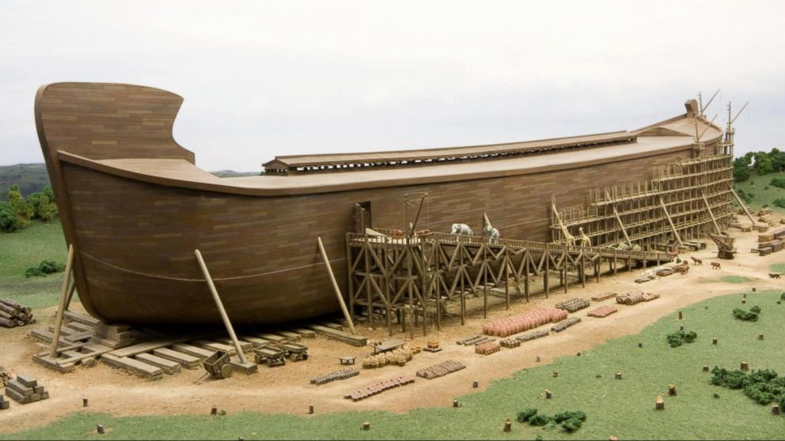
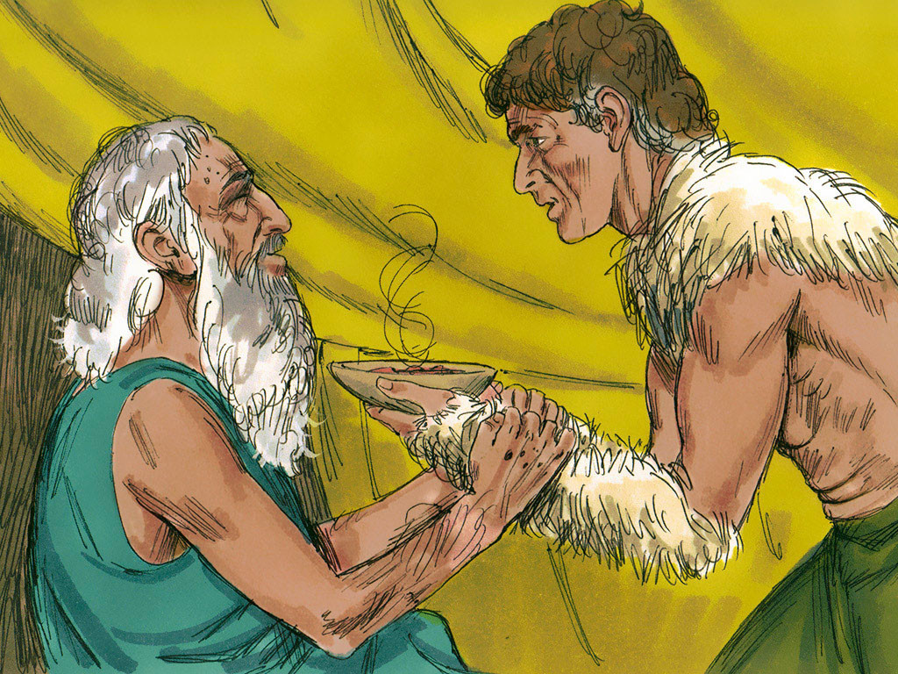
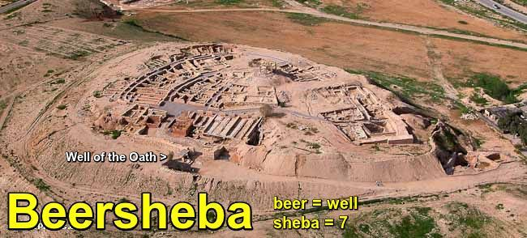
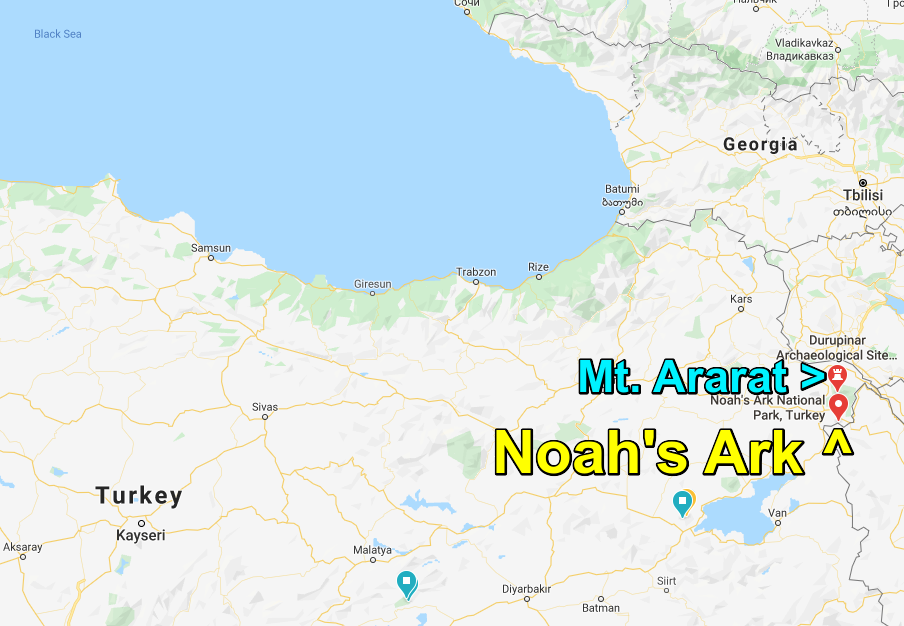
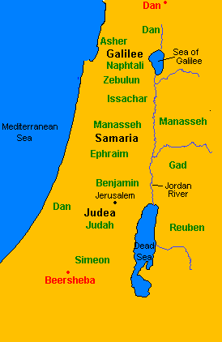
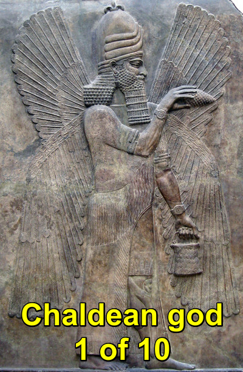
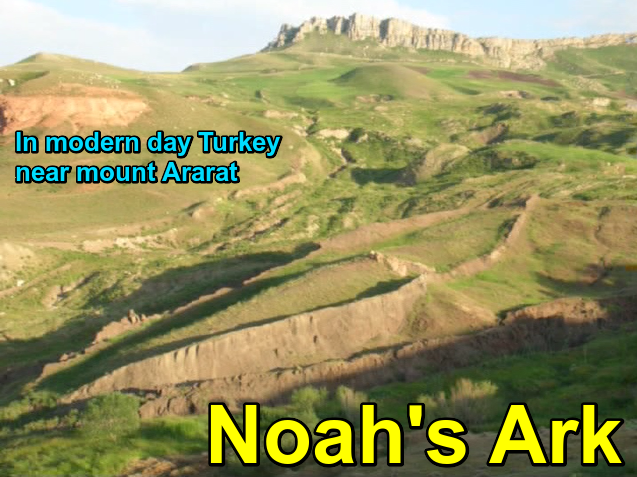
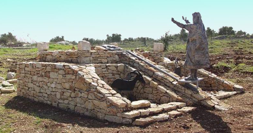

[**[Link to Table of Contents of Other
Books]{.underline}**](https://docs.google.com/document/d/1bLMEcwjYFBcv3yXyJceLF7NdRks2bUqjdyqLf9jRLKE/edit?usp=sharing)

**Genesis**

**Bereshit - the beginning**


+-----------------------------------+-----------------------------------+
| **[Format Key                     |                                   |
| Table]{.underline}**              |                                   |
+===================================+===================================+
| **Chapters**                      |                                   |
|                                   |                                   |
| **Subject Headers \[verse         |                                   |
| numbers\]**                       |                                   |
|                                   |                                   |
| {notes, commentary, inserted      |                                   |
| context}                          |                                   |
|                                   |                                   |
| \[Meaning of Names or alternate   |                                   |
| translating or other term\]       |                                   |
|                                   |                                   |
| \[Alternate Text\]                |                                   |
|                                   |                                   |
| \[Extended Text from other        |                                   |
| source\]                          |                                   |
|                                   |                                   |
| \[Missing Text from other         |                                   |
| source\]                          |                                   |
|                                   |                                   |
| **➤ Name of who's speaking:**     |                                   |
|                                   |                                   |
| -   Dialog '*Speaker quoting      |                                   |
|     > someone else*'              |                                   |
|                                   |                                   |
| **Names**, **Places**, **Numbers  |                                   |
| of things in Bold**               |                                   |
|                                   |                                   |
| **[Mulit-word names and           |                                   |
| titles]{.underline}**             |                                   |
|                                   |                                   |
| **Female Names**                  |                                   |
|                                   |                                   |
| Keyword that are directing to     |                                   |
| table with text and/or photo      |                                   |
|                                   |                                   |
| [Important parts]{.mark}          |                                   |
|                                   |                                   |
| **Messengers/Angels**             |                                   |
|                                   |                                   |
| Giants/Nephilim                   |                                   |
|                                   |                                   |
| **Satan, Demons**                 |                                   |
+-----------------------------------+-----------------------------------+
| **50 Chapters**                   |                                   |
|                                   |                                   |
|   ----------------                |                                   |
| --------------------------------- |                                   |
| --------------------------------- |                                   |
| --------------------------------- |                                   |
| --------------------------------- |                                   |
| --------------------------------- |                                   |
| --------------------------------- |                                   |
| --------------------------------- |                                   |
| --------------------------------- |                                   |
| --------------------------------- |                                   |
| --------------------------------- |                                   |
| --------------------------------- |                                   |
|   [**[1]{.underl                  |                                   |
| ine}**](#genesis-1)     [**[2]{.u |                                   |
| nderline}**](#genesis-2)     [**[ |                                   |
| 3]{.underline}**](#genesis-3)     |                                   |
|  [**[4]{.underline}**](#genesis-4 |                                   |
| )     [**[5]{.underline}**](#gene |                                   |
| sis-5)     [**[6]{.underline}**]( |                                   |
| #genesis-6)     [**[7]{.underline |                                   |
| }**](#genesis-7)     [**[8]{.unde |                                   |
| rline}**](#genesis-8)     [**[9]{ |                                   |
| .underline}**](#genesis-9)     [* |                                   |
| *[10]{.underline}**](Genesis.md##genesis-10) |                                   |
|   ----------------                |                                   |
| --------------------- ----------- |                                   |
| -------------------------- ------ |                                   |
| ------------------------------- - |                                   |
| --------------------------------- |                                   |
| --- ----------------------------- |                                   |
| -------- ------------------------ |                                   |
| ------------- ------------------- |                                   |
| ------------------ -------------- |                                   |
| ----------------------- --------- |                                   |
| ---------------------------- ---- |                                   |
| --------------------------------- |                                   |
|   [**[11]{.under                  |                                   |
| line}**](#genesis-11)   [**[12]{. |                                   |
| underline}**](#genesis-12)   [**[ |                                   |
| 13]{.underline}**](#genesis-13)   |                                   |
|  [**[14]{.underline}**](#genesis- |                                   |
| 14)   [**[15]{.underline}**](#gen |                                   |
| esis-15)   [**[16]{.underline}**] |                                   |
| (#genesis-16)   [**[17]{.underlin |                                   |
| e}**](#genesis-17)   [**[18]{.und |                                   |
| erline}**](#genesis-18)   [**[19] |                                   |
| {.underline}**](#genesis-19)   [* |                                   |
| *[20]{.underline}**](Genesis.md##chapter-20) |                                   |
|                                   |                                   |
|   [**[21]{.under                  |                                   |
| line}**](#genesis-21)   [**[22]{. |                                   |
| underline}**](#genesis-22)   [**[ |                                   |
| 23]{.underline}**](#genesis-23)   |                                   |
|  [**[24]{.underline}**](#genesis- |                                   |
| 24)   [**[25]{.underline}**](#gen |                                   |
| esis-25)   [**[26]{.underline}**] |                                   |
| (#genesis-26)   [**[27]{.underlin |                                   |
| e}**](#genesis-27)   [**[28]{.und |                                   |
| erline}**](#genesis-28)   [**[29] |                                   |
| {.underline}**](#genesis-29)   [* |                                   |
| *[30]{.underline}**](Genesis.md##genesis-30) |                                   |
|                                   |                                   |
|   [**[31]{.under                  |                                   |
| line}**](#genesis-31)   [**[32]{. |                                   |
| underline}**](#genesis-32)   [**[ |                                   |
| 33]{.underline}**](#genesis-33)   |                                   |
|  [**[34]{.underline}**](#genesis- |                                   |
| 34)   [**[35]{.underline}**](#gen |                                   |
| esis-35)   [**[36]{.underline}**] |                                   |
| (#genesis-36)   [**[37]{.underlin |                                   |
| e}**](#genesis-37)   [**[38]{.und |                                   |
| erline}**](#genesis-38)   [**[39] |                                   |
| {.underline}**](#genesis-39)   [* |                                   |
| *[40]{.underline}**](Genesis.md##genesis-40) |                                   |
|                                   |                                   |
|   [**[41]{.under                  |                                   |
| line}**](#genesis-41)   [**[42]{. |                                   |
| underline}**](#genesis-42)   [**[ |                                   |
| 43]{.underline}**](#genesis-43)   |                                   |
|  [**[44]{.underline}**](#genesis- |                                   |
| 44)   [**[45]{.underline}**](#gen |                                   |
| esis-45)   [**[46]{.underline}**] |                                   |
| (#genesis-46)   [**[47]{.underlin |                                   |
| e}**](#genesis-47)   [**[48]{.und |                                   |
| erline}**](#genesis-48)   [**[49] |                                   |
| {.underline}**](#genesis-49)   [* |                                   |
| *[50]{.underline}**](Genesis.md##genesis-50) |                                   |
|   ----------------                |                                   |
| --------------------------------- |                                   |
| --------------------------------- |                                   |
| --------------------------------- |                                   |
| --------------------------------- |                                   |
| --------------------------------- |                                   |
| --------------------------------- |                                   |
| --------------------------------- |                                   |
| --------------------------------- |                                   |
| --------------------------------- |                                   |
| --------------------------------- |                                   |
| --------------------------------- |                                   |
+-----------------------------------+-----------------------------------+


#  Genesis 1

{width="1.6614588801399826in"
height="1.6614588801399826in"}

**Day 1: Land, Water, Light, Torah, All Spirits \[1\]**

In the beginning **Elohim** created the
**[[Heavens]{.underline}](https://biblehub.com/hebrew/8064.htm)**
\[lofty/sky-waters\] and the
**[[Earth]{.underline}](https://biblehub.com/hebrew/776.htm)** \[land\].

The **Earth** was unformed and void, darkness was on the face of the
deep, and the
[**[Spirit]{.underline}**](https://biblehub.com/hebrew/7307.htm)
\[breath\] of **Elohim** hovered over the surface of the water.

**➤ Yahuah:**

-   Let there be light

Then there was light.

**Elohim** saw that the light was good, and **Elohim** divided the light
from the darkness.

**Elohim** called the light **Day**, and the darkness he called
**Night**.

So there was evening, and there was morning, the **1st day**.

**Day 2: Firmaments**

**➤ Yahuah:**

-   Let there be a
    > [**[dome]{.underline}**](https://biblehub.com/hebrew/7549.htm)
    > \[firmament\] in the middle of the water; let it divide the water
    > from the water

**Elohim** made the **dome** and divided the water under the **dome**
from the water above the **dome**; that is how it was, and **Elohim**
called the **dome**, **Heaven**.

So there was evening, and there was morning, the **2nd day**.

**Day 3: Plants**

**➤ Yahuah:**

-   Let the water under the sky be gathered together into one place, and
    > let the dry land appear

So it was. {width="3.0026181102362206in"
height="1.5052088801399826in"}

**Elohim** called the dry land **Earth**, the gathering together of the
water he called **Seas**, and **Elohim** saw that it was good.

**➤ Yahuah:**

-   Let the earth bring forth grass, seed yielding plants, and fruit
    > trees, each yielding its own kind of seed-bearing fruit, on the
    > earth

So it was.

The earth brought forth grass, plants each yielding its own kind of
seed, and trees each producing its own kind of seed-bearing fruit; and
**Elohim** saw that it was good.

So there was evening, and there was morning, the **3rd day**.

**Day 4: Sun, Moon, Stars** (Enoch/ Zadok calendar starts day 1 of month
1)

**➤ Yahuah:**

-   Let there be lights in the **Dome** of the **Heavens** to divide the
    > day from the night; let them be for signs, seasons, days and
    > years; and let them be for lights in the dome of the sky to give
    > light to the earth

So it was.

**Elohim** made the [**2** great lights]{.underline}, the [greater
light]{.underline} \[sun\] to rule the day and the [smaller
light]{.underline} \[moon\] to rule the night, and the **stars**.

**Elohim** put them in the **Dome** of the **Heavens** to give light to
the **Earth**, to rule over the day and over the night, and to divide
the light from the darkness

**Elohim** saw that it was good.

So there was evening, and there was morning, the **4th** **day**.

**Day 5: Leviathan & Behemoth, Sea creatures and Birds**

**➤ Yahuah:**

-   Let the water swarm with swarms of living creatures, and let birds
    > fly above the earth in the open dome of the sky

**Elohim** created the [Great Sea Creatures]{.underline} \[**Leviathan**
and **Behemoth**\] and every living thing that creeps, so that the water
swarmed with all kinds of them, and there was every kind of winged bird;
and **Elohim** saw that it was good.

**➤ Yahuah:**

> Be fruitful, multiply and fill the water of the seas, and let birds
> multiply on the earth

So there was evening, and there was morning, the **5th day**.

**Day 6: Land Creatures, Garden of Eden, Adam**

**➤ Yahuah:**

> Let the earth bring forth each kind of living creature: each kind of
> livestock, crawling animal and wild beast

and that is how it was.

**Elohim** made each kind of wild beast, each kind of livestock and
every kind of animal that crawls along the ground; and **Elohim** saw
that it was good.

**➤ Yahuah:**

> Let us make humankind in our image, in the likeness of ourselves; and
> let them rule over the fish in the sea, the birds in the air, the
> animals, and over all the earth, and over every crawling creature that
> crawls on the earth

So **Elohim** created mankind in his own image; in the image of
**Elohim** he created him: male and female he created them.

**➤ Yahuah:**

-   Be fruitful, multiply, fill the earth and subdue it. Rule over the
    > fish in the sea, the birds in the air and every living creature
    > that crawls on the earth. Here!

-   Throughout the whole earth I am giving you as food:

    -   Every [seed-bearing plant]{.underline}

    -   Every [tree with seed-bearing fruit]{.underline}

    -   Every [wild animal]{.underline}, [bird in the air]{.underline}
        > and [creature crawling on the earth]{.underline}, in which
        > there is a living soul,

    -   I am giving as food every kind of green plant

And that is how it was.

**Elohim** saw everything that He had made, and indeed it was very good.

So there was evening, and there was morning, the **6th** **day**.

# Genesis 2

Thus the **Heavens** and the **Earth** were finished, along with
everything in them. On the **7th day** **Elohim** was finished with his
work which he had made, so he rested on the **7th day** from all his
work which he had made. **Elohim** blessed the **7th day** \[Sabbath\]
and made it holy \[set-apart\]; because on that day **Elohim** rested
from all his work which he had created, so that it itself could produce.
Here is the history of the **Heavens** and the **Earth** when they were
created. {width="3.869792213473316in"
height="4.1008234908136485in"}

On the day when [**Yahuah** **Elohim**]{.underline}, made **Earth** and
the **Heavens**, there was as yet no wild bush on the **Earth**, and no
wild plant had as yet sprung up; for **Yahuah** **Elohim**, had not
caused it to rain on the **Earth**, and there was no one to cultivate
the ground.

[Rather, a mist \[AP, LXX: spring\] went up from the **Earth** which
watered the entire surface of the **Earth**.]{.mark}

*Then* **[Yahuah Elohim]{.underline}**, formed
[[man]{.underline}](https://biblehub.com/hebrew/strongs_120.htm) from
the dust of the
[[ground]{.underline}](https://biblehub.com/hebrew/strongs_127.htm) and
breathed into his nostrils the **[breath of life]{.underline}**, so that
he became a living being.

**[Yahuah Elohim]{.underline}**, planted a **Garden** \[AP: Paradise\]
toward the **East**, in
**[[Eden]{.underline}](https://biblehub.com/hebrew/5731.htm)** \[LXX:
Delight\], and there he put the man whom he had formed. Out of the
ground **[Yahuah Elohim]{.underline}**, caused to grow every tree
pleasing in appearance and good for food, including the **[Tree of
Life]{.underline}** in the middle of the garden and the **[Tree of
Knowledge of Good and Evil]{.underline}.**

A river went out of **Eden** to water the **Garden**, and from there it
divided into **4 streams**.

1.  The
    > **[[Pishon]{.underline}](https://biblehub.com/hebrew/strongs_6376.htm)**
    > \[[[to
    > shake]{.underline}](https://www.abarim-publications.com/Meaning/Pishon.html)\]
    > **river**; it
    > [[surrounds]{.underline}](https://biblehub.com/hebrew/strongs_5437.htm)
    > the [land of **Havilah**]{.underline}
    > \[[[circle]{.underline}](https://www.abarim-publications.com/Meaning/Havilah.html).
    > AP: Khaweela, LXX: Evilat\], where there is gold. The gold of that
    > land is good; [[aromatic
    > resin]{.underline}](https://biblehub.com/hebrew/strongs_916.htm)
    > \[AP: Beryl, LXX: carbuncle\] and [[onyx
    > stone]{.underline}](https://biblehub.com/hebrew/strongs_7718.htm)
    > \[AP: stones of Beryl, LXX: emerald\] are also found there.

2.  The
    > **[[Gichon]{.underline}](https://biblehub.com/hebrew/strongs_1521.htm)**
    > \[[[gusher]{.underline}](https://www.abarim-publications.com/Meaning/Gihon.html)\]
    > **river**; it
    > [[surrounds]{.underline}](https://biblehub.com/hebrew/strongs_5437.htm)
    > the [land of **Kush**]{.underline}.

3.  The
    > [**[Hiddekel]{.underline}**](https://biblehub.com/hebrew/strongs_2313.htm)
    > \[[[rapid]{.underline}](https://www.abarim-publications.com/Meaning/Haddakel.html)\]
    > \[i.e Tigris, AP: Deqlath\] **river**; it is the one that flows
    > toward the **East** of **Ashur**
    > \[[[level/just]{.underline}](https://www.abarim-publications.com/Meaning/Asshur.html)\].

4.  The
    > **[[Perath]{.underline}](https://biblehub.com/hebrew/strongs_6578.htm)**
    > \[[[fruitful]{.underline}](https://www.abarim-publications.com/Meaning/Parat.html)\]
    > \[i.e Euphrates\] **river**

**[Yahuah Elohim]{.underline}**, took the man and put him in the
[**Garden** of **Eden**]{.underline} to cultivate and care for it.

**[Yahuah Elohim]{.underline}** \[Messenger of the Presence\], gave the
man this order:

**➤ \[Messenger of the Presence\]:**

> You may freely eat from every tree in the garden except the **[Tree of
> Knowledge of Good and Evil]{.underline}**. You are not to eat from it,
> because on the day that you eat from it, it will become certain that
> you will die. It isn't good that man should be alone. I will make for
> him a companion suitable for helping him

So from the ground **[Yahuah Elohim]{.underline}**, formed every wild
animal and every bird that flies in the air, and he brought them to
**Adam** to see what he would call them. Whatever **Adam** would call
each living creature, that was to be its name. So **Adam** gave names to
all the livestock, to the birds in the air and to every wild animal
\[over 5 days\]. But for **Adam** there was not found a companion
suitable for helping him.

Then \[on the 6th day\] **Elohim** caused a deep sleep to fall upon the
man; and while he was sleeping, he took one of his ribs and closed up
the place from which he took it with flesh.

The rib which **[Yahuah Elohim]{.underline}**, had taken from the man,
he made a woman; and he brought her to the man.

**➤ Adam:**

-   At last! This is bone of my bones and flesh of my flesh. She is to
    > be called woman, because she was taken out of man

This is why a man is to leave his father and mother and stick with his
wife, and they are to be one flesh.

They were both naked, the man and his wife, and they were not ashamed.

# Genesis 3

{width="2.90625in" height="1.9372200349956255in"}

**Serpent deceived Eve**

Now the **Serpent** was more crafty than any wild animal which **Yahuah
Elohim**, had made.

{a Serpent under the influence of Gadiel/Satan or Satan himself being a
Seraphim: see [**[Enoch
69]{.underline}**](https://docs.google.com/document/d/1-RlHYxYFlUAEnr1zYrhdrybi-vaJqzX0T4nicFoi9lU/edit#bookmark=id.ljyqzf4xccrq)}

**Serpent** said to **Eve**,

**➤ Serpent:**

-   Did **Elohim** really say,

    -   'You are not to eat from any tree in the garden?'

**➤ Eve:**

-   We may eat from the fruit of the trees of the garden, but about the
    > fruit of the tree in the middle of the garden **Elohim** said,

    -   'You are neither to eat from it nor touch it, or you will die.\'

**➤ Serpent:**

-   It is not true that you will surely die; because **Elohim** knows
    > that on the day you eat from it, your eyes will be opened, and you
    > will be like **Elohim**, knowing good and evil

When **Eve** saw that the tree was good for food, that it had a pleasing
appearance and that the tree was desirable for making one wise, she took
some of its fruit and ate. She also gave some to her husband, who was
with her; and he ate.

Then the eyes of both of them were opened, and they realized that they
were naked. So they sewed fig leaves together to make themselves
loincloths. They heard the voice of **[Yahuah Elohim]{.underline}**,
walking in the garden at the time of the evening breeze, so **Adam** and
**Eve** hid themselves from the presence of **[Yahuah
Elohim]{.underline}** \[Messenger of the Presence\], among the trees in
the garden.

**Elohim** said to **Adam**,

**➤ \[Messenger of the Presence\]:**

-   Where are you?

**➤ Adam:**

-   I heard your voice in the garden, and I was afraid, because I was
    > naked, so I hid myself

**➤ \[Messenger of the Presence\]:**

-   Who told you that you were naked? Have you eaten from the tree from
    > which I ordered you not to eat from?

**➤ Adam:**

-   The woman you gave to be with me, she gave me fruit from the tree,
    > and I ate

**Elohim** said to **Eve**,

**➤ Elohim:**

-   What have you done?

**➤ Eve:**

-   The **Serpent** tricked me, so I ate

**Elohim** said to **Serpent**,

**➤ \[Messenger of the Presence\]:**

-   Because you have done this, you are cursed more than all livestock
    > and wild animals. You will crawl on your belly and eat dust as
    > long as you live. I will put animosity between you and the woman,
    > and between your seed \[teaching\] and her \[Mother Jerusalem/New
    > Jerusalem\] seed \[teaching\]; he will bruise your head, and you
    > will bruise his heel

**Elohim** said to **Eve**,

**➤ \[Messenger of the Presence\]:**

+-----------------------------------------------------------------------+
| **childbearing**                                                      |
|                                                                       |
| referring to conception, but troubles and pain and sorrows from       |
| conception to birth                                                   |
+=======================================================================+
+-----------------------------------------------------------------------+

-   I will greatly increase your trouble in childbearing. Your desire
    > will be toward your husband, but he will rule over you.

**Elohim** said to **Adam**,

**➤ \[Messenger of the Presence\]:**

-   Because you listened to what your wife said and ate from the tree
    > about which I gave you the order,

    -   'You are not to eat from it,'

-   the ground is cursed on your account; you will work hard to eat from
    > it as long as you live. It will produce thorns and thistles for
    > you, and you will eat plants of the field. You will make bread by
    > the sweat of your forehead, until you return to the ground,
    > because you were made from dust, so then you will return to dust

+-----------------------------------------------------------------------+
| **Eve**                                                               |
|                                                                       |
| Eve or Havah/Hauah means life                                         |
+=======================================================================+
+-----------------------------------------------------------------------+

**Adam** called his wife **Eve**, because she was the mother of all
living.

**[Yahuah Elohim]{.underline}** \[Messenger of the Presence\], made
garments of skin for **Adam** and his wife and clothed them.

**➤ \[Messenger of the Presence\]:**

-   See, **Adam** has become like one of us, knowing good and evil. Now,
    > to prevent his putting out his hand and taking also from the
    > **[Tree of Life]{.underline}**, eating, and living forever

Therefore **[Yahuah Elohim]{.underline}** \[Messenger of the Presence\],
sent him out of the [**Garden** of **Eden**]{.underline} {theorized to
return as Zion/New Jerusalem} to cultivate the ground from which he was
taken.

So he \[Messenger of the Presence\] drove **Adam** out, and he placed at
the east of the [**Garden** of **Eden**]{.underline} the **Cherubim**
and a flaming sword which turned in every direction to guard the way to
the **[Tree of Life]{.underline}**.

# Genesis 4

+-----------------------------------------------------------------------+
| **Cain**                                                              |
|                                                                       |
| Cain or Qayin                                                         |
|                                                                       |
| means: to Acquire                                                     |
|                                                                       |
| **Able**                                                              |
|                                                                       |
| Abel or Hebel                                                         |
|                                                                       |
| means: Vanity, Breath                                                 |
+=======================================================================+
+-----------------------------------------------------------------------+

**Adam** knew **Eve** his wife; she gave birth to **Cain** and said

**➤ Adam**:

-   I have acquired a man from **Yahuah**

In addition, she gave birth to his brother **Abel**.

**Cain and Abel attend Firstfruits**

**Abel** kept sheep, while **Cain** worked the soil. In the course of
time, **Cain** brought an offering \[Firstfruits, bread and wine\] to
**Yahuah** from the produce of the soil; and **Abel** too brought from
the firstborn of his **sheep** \[a male lamb a year old without
blemish\], including their fat.

**Yahuah** \[Messenger of the Presence\] accepted **Abel** and his
offering but did not accept **Cain** and his offering \[because he
didn't bring the best of his crop nor enough\]. **Cain** was very angry,
and his face fell.

**Yahuah** said to **Cain**

**➤ \[Messenger of the Presence\]:**

-   Why are you angry? Why so downcast? If you are doing what is good
    > \[lawful\], shouldn't you hold your head high? And if you don't do
    > what is good, sin is crouching at the door, it wants you, but you
    > can rule over it.

**Cain kills Abel**

**Cain** had words with **Abel** his brother; then one time, when they
were in the field, **Cain** turned on **Abel** his brother and killed
him.

**Yahuah** said to **Cain**

**➤ \[Messenger of the Presence\]:**

-   Where is **Abel** your brother?

**➤ Cain**:

-   I don't know; am I my brother's guardian?

**➤ \[Messenger of the Presence\]:**

-   What have you done? The voice of your brother's blood is crying out
    > to me from the ground! Now you are cursed from the ground, which
    > has opened its mouth to receive your brother's blood at your
    > hands. When you farm the ground it will no longer yield its
    > strength to you. You will be a fugitive, wandering the **Earth**

**➤ Cain**:

-   My punishment is greater than I can bear. You are banning me today
    > from the land and from your presence. I will be a fugitive
    > wandering the **Earth**, and whoever finds me will kill me

**➤ \[Messenger of the Presence\]:**

-   Therefore, whoever kills **Cain** will receive vengeance
    > **sevenfold**

So **Yahuah** put a sign on **Cain**, so that no one who found him would
kill him.

So **Cain** left the presence of **Yahuah** and lived in the [land of
**Nod**]{.underline} \[wandering\], east of **Eden** \[Delight\].

**Cain** knew his wife; she gave birth to **Enoch**.

**Cain** built a city and named the city after his son **Enoch**.

-   **Enoch**

    -   **Irad**

        -   **Mehujael** (Mechuya\'el)

            -   **Methusael** (Metusha\'el)

                -   **Lamech** (Lemekh)

**Lemekh** took himself **2** **wives**:

1.  **Adah**

2.  **Zillah**

**Adah** gave birth to **Jabal**; he was the ancestor of those who live
in tents and have cattle.

His brother's name was **Jubal**; and he was the ancestor of all who
play **lyre** and **flute**.

**Zillah** gave birth to **Tubal-Cain**, who forged all kinds of tools
from brass and iron; the sister of **Tubal-Cain** was **Na'amah**.

\-**Lemekh** & **Adah**. -**Lemekh** & **Zillah**

\-**Jabal** & **Jubal**. -**Tubal-Cain** & **Na\'amah**

**Lemekh** said to his wives

**➤ Lemekh**:

-   **Adah** and **Zillah**, listen to me; wives of **Lemekh**, hear
    > what I say: I killed a man for wounding me, a young man who
    > injured me. If **Cain** will be avenged **sevenfold**, then
    > **Lemekh** **seventy-sevenfold**!

**Adam** again knew **Eve**, and she gave birth to **Seth**
\[[[Appointed]{.underline}](https://www.abarim-publications.com/Meaning/Seth.html)\],

**➤ Adam**:

-   For **Elohim** has granted me another seed in place of **Abel**,
    > since **Cain** killed him

**Seth** also had a son, **Enosh**. [That is when people began to call
on the name of **Yahuah**.]{.mark}

# 

# Genesis 5

This is the book of the generations of **Adam**.

In the day that **Elohim** created man, in the likeness of **Elohim**;
he made them male and female; and blessed them, and called their name
**Adam**.

**Adam** lived **130** years, and had **Seth**

**Adam** died at **930** years, and had sons and
daughters.{width="2.3775448381452318in"
height="2.5987117235345583in"}

**Seth** lived **105** years, and had **Enosh**

**Seth** died at **912** years, and had sons and daughters.

**Enosh** lived **90** years, and had **Cainan**

**Enosh** died at **905** years, and had sons and daughters.

**Cainan** lived **70** years, and had **Mahalaleel**

**Cainan** died at **910** years, and had sons and daughters.

**Mahalaleel** lived **65** years, and had **Jared**:

**Mahalaleel** died at **895**, and had sons and daughters

**Jared** lived **162** years, and had **Enoch**

**Jared** died at **962**, and had sons and daughters.

**Enoch** lived **65** years, and had **Methuselah**

**Enoch** [walked with **Elohim**]{.underline} \[did the Law\] for
**365** years, and had sons and daughters.

[**Enoch** walked with **Elohim** and he was not \[seen by people\], for
**Elohim** took him \[to the Garden for 294 years and died\].]{.mark}

**Methuselah** lived **187** years, and had **Lamech**

**Methuselah** died at **969** years, and had sons and daughters.

**Lamech** lived **182** years, and had **Noah**, saying, This same
shall comfort us concerning our work and toil of our hands, because of
the ground which **Yahuah** has cursed.

**Lamech** died at **777** years, and begat sons and daughters

**Noah** lived **500** years, and had **Shem**, **Ham**, and
**Japheth**.

# 

# Genesis 6

See also: [[Dead Sea Scroll Fragment
​​4Q252]{.underline}](https://docs.google.com/document/d/1fdXG-fDyxbRps0li_8qLlYsyymDbXzdhUyJfX1rpB3k/edit?usp=sharing)

{width="1.2338790463692038in"
height="2.0729166666666665in"}

## Messengers create Giants through Women

And it came to pass, when men began to multiply on the face of the
earth, and daughters were born unto them, that the [sons of
**Elohim**]{.underline} {the 200 Watchers} saw the daughters of men that
they were beautiful; and they took them wives of all which they chose.

**Yahuah** said,

**➤ Yahuah:**

-   My spirit will not always strive with man, because he also is flesh:
    > yet his days shall be **120** years {until the flood and the
    > Garden leaves}.

There were **Nephilim** {Watchers children of the daughters of men,
demons to be} in the earth in those days {days of Jared} and also after
that {days of Noah}, when the [sons of **Elohim**]{.underline} {the 200
Watchers} came in unto the daughters of men, and they had children with
them, [they became the mighty men of old, men of renown]{.mark}
{Giants/Titans}. **Elohim** saw that the wickedness of man was great in
the earth, and that every imagination of the thoughts of his heart was
only evil continually. **Yahuah** regretted that he had made man, and it
grieved him at his heart.

**Yahuah** said,

**➤ Yahuah:**

-   I will destroy man which I created from the face of the earth; both
    > man, beast, the creeping thing, and the birds of the air; because
    > of my regret that I have made them. But **Noah** found grace in
    > the eyes of **Yahuah**.

[These are the generations of **Noah**:]{.underline}

**Noah** was a righteous man and perfect in his generations, and
**Noah** walked with **Elohim**.

**Noah** had **3** sons,

1.  **Shem**

2.  **Ham**

3.  **Japheth**

{width="2.7359787839020124in"
height="1.5451388888888888in"}

The earth also was corrupt before **Elohim**, and the earth was filled
with violence. **Elohim** looked upon the earth, and, behold, it was
corrupt; for all flesh had corrupted his way upon the earth.

**Elohim** said to **Noah**,

**➤ \[Messenger of the Presence\]:**

-   The end of all flesh is come before me; for the earth is filled with
    > violence through them; and behold, I will destroy them with the
    > earth.

+-----------------------------------------------------------------------+
| **Gopher Wood**                                                       |
|                                                                       |
| laminated boards according to the finds of Ron Wyatt                  |
+=======================================================================+
+-----------------------------------------------------------------------+

-   Make an **Ark** of gopher wood; make rooms in the **Ark**, and pitch
    > it inside and outside with pitch. Make the **Ark** **^a^300 x 50 x
    > 30 cubits**. Make a window on the **Ark** above **^b^1 cubit**,
    > the door on the side, with **3 floors**. Behold, I bring a flood
    > of waters upon the earth, to destroy all flesh, wherein is the
    > breath of life, from under heaven; and every thing that is in the
    > earth shall die. But with you I will establish my covenant; and
    > come into the **Ark** with your sons, wife, and your sons\' wives.
    > Of every living thing of all flesh, **2** of every kind you will
    > bring into the **Ark**, to keep them alive; they will be male and
    > female. Of birds after their kind, and of cattle after their kind,
    > of every creeping thing of the earth after its kind, **2** of
    > every kind will come to you, to keep them alive. Take with all
    > food that is eaten and it will be for food for you, and for them.
    > **Noah** did all these things **Elohim** commanded him.

**a**. 450-515ft x 76-86ft x 45.5-51.5ft

**b**. 18-20.62in according to the standard Cubit and Egyptian Royal
Cubit

# Genesis 7

**Yahuah** said to **Noah**,

**➤ \[Messenger of the Presence\]:**

-   Go into the **Ark**, take with you **7** **pairs** of all clean
    > animals, male and female, and a pair of the animals that are
    > unclean, the male and female, and **7 pairs** of the birds of the
    > heavens also, male and female, to keep their offspring alive on
    > the face of all the earth. For in **7** **days** I will send water
    > on the earth for **40** **days** and **40** **nights**, and [every
    > living thing that I have made]{.mark} I will blot out from the
    > face of the ground.

**Noah** did all that **Yahuah** had commanded him.

**Noah** was **600** **years old** when the flood of waters came upon
the earth. **Noah**, his sons, his wife, and his sons\' wives went into
the **Ark** to escape the waters of the flood. Of clean and unclean
animals, of birds, and of everything that creeps on the ground, two by
two, male and female, went into the **Ark** with **Noah**, as **Elohim**
had commanded **Noah**.

After **7** **days** the waters of the flood came upon the earth.

In the **600th** year of **Noah**\'s life, on the **17th day** of the
**2nd month** \[early May\], all the fountains of the great deep burst
open, and the windows of the **Heavens** \[firmament\] were opened.
Water fell upon the earth **40** **days** and **40** **nights**. On the
very same day **Noah**, **Shem**, **Ham,** **Japheth**, **Noah\'s** wife
and the **3 wives** of his sons, entered the **Ark**. They and every
beast, all the livestock, every creeping thing that creeps on the earth,
every bird, every winged creature according to its kind went into the
**Ark** with **Noah**, two by two, all flesh which had the breath of
life. Those that entered, male and female, of all flesh, went in as
**Elohim** had commanded him. **Yahuah** \[Messenger of the Presence\]
shut him in.

The flood continued **40** **days** on the earth. The waters increased
and lifted up the **Ark**, and it rose high above the earth. The waters
prevailed and increased greatly on the earth, and the **Ark** floated on
the face of the waters. The waters prevailed so mightily on the earth
that all the high mountains under the whole heaven were covered. The
waters prevailed above the mountains, covering them **15** **cubits**
deep.

All flesh died that moved on the earth, birds, livestock, beasts, all
swarming creatures that swarm on the earth, and all mankind. Everything
on the dry land in whose nostrils was the breath of life died. He
blotted out every living thing that was on the face of the ground, man
and animals and creeping things and birds of the heavens. They were
blotted out from the earth. Only **Noah** was left, and those who were
with him in the **Ark**. The waters prevailed on the earth **150**
**days**.

# 

# Genesis 8

{width="3.5468755468066493in"
height="2.484709098862642in"}

But **Elohim** remembered **Noah** and all the beasts and all the
livestock that were with him in the **Ark**. **Elohim** made a wind blow
over the earth, and the waters subsided. The fountains of the deep and
the windows of the heavens were closed, the waters from the heavens was
restrained, and the waters receded from the earth continually.

After **150 days** the waters had reduced, on the **17th day** of the
**7th month** \[3rd day of Tabernacles\] {early October}, the **Ark**
came to rest on the mountains of **Ararat**. The waters continued to
reduce until the **10th month**.

[[\[Ark location\|\[Ark location\]]{.underline}](https://goo.gl/maps/GnJiCvdg2ZamLt2FA)

{width="3.342270341207349in"
height="2.5104166666666665in"}

On the **1st day** of the **10th month** \[4th New Moon festival\] {late
December}, the tops of the mountains were seen. At the end of **40
days**, **Noah** opened the window of the **Ark** that he had made and
sent a raven. It went back and forth until the waters were dried up from
the earth. Then he sent a dove to see if the waters had subsided from
the face of the ground. But the dove found no place to set her foot, and
she returned to him to the **Ark**, for the waters were still on the
face of the whole earth. So he put out his hand and took her and brought
her into the **Ark** with him. He waited another **7 days**, and again
he sent the dove out of the **Ark**. The dove came back to him in the
evening, and behold, in her mouth was a freshly plucked olive leaf. So
**Noah** knew that the waters had subsided from the earth. Then he
waited another **7** **days** and sent forth the dove, and she did not
return to him anymore.

In the **601st** **year**, the **1st day** of the **1st month** \[1st
New Moon festival\] {late March}, the waters were dried from off the
earth. **Noah** removed the covering of the **Ark** and looked, and
behold, the face of the ground was dry.

On the **27th day** of the **2nd month** {late May}, the earth had dried
out.

**Elohim** said to
**Noah**,{width="2.4208333333333334in"
height="1.2731791338582676in"}

**➤ \[Messenger of the Presence\]:**

> Go out from the **Ark**, you and your wife, and your sons and your
> sons\' wives with you. Bring out with you every living thing that is
> with you of all flesh, birds and animals and every creeping thing that
> creeps on the earth, that they may swarm on the earth, and be fruitful
> and multiply on the earth.

So **Noah** went out, and his sons and his wife and his sons\' wives
with him. Every beast, every creeping thing, and every bird, everything
that moves on the earth, went out by families from the **Ark**. Then
**Noah** built an **[Altar]{.mark}** to **Yahuah** and took some of
every clean animal and some of every clean bird and offered [burnt
offerings]{.underline} on the **[Altar]{.mark}**.

When **Yahuah** smelled the pleasing aroma, **Yahuah** said in his heart

**➤ Yahuah:**

-   *I will never again curse the ground because of man, for the
    > intention of man\'s heart is evil from his youth. Neither will I
    > ever again strike down every living creature as I have done. While
    > the earth remains \[meaning forever\], seedtime and harvest, cold
    > and heat, summer and winter, day and night, shall not cease*

# Genesis 9

**Elohim** blessed **Noah** and his sons and said to them,

**➤ \[Messenger of the Presence\]:**

-   Be fruitful and multiply and fill the earth. The fear of you and the
    > dread of you will be upon every beast of the earth and upon every
    > bird of the heavens, upon everything that creeps on the ground and
    > all the fish of the sea. Into your hand they are delivered. Every
    > moving thing \[clean animal\] that lives will be food for you
    > \[instead of just stored crops while on the Ark\]. And as I gave
    > you the green plants, I give you everything. But you shall not eat
    > flesh with its life, that is, its blood. And for your lifeblood I
    > will require a reckoning: from every beast I will require it and
    > from man. From his fellow man I will require a reckoning for the
    > life of man. Whoever sheds the blood of man, by man shall his
    > blood be shed, for **Elohim** made man in his own image. And you,
    > be fruitful and multiply, increase greatly on the earth and
    > multiply in it.

**Elohim** said to **Noah** and his sons,

**➤ \[Messenger of the Presence\]:**

-   Behold, I establish my covenant with you and your offspring after
    > you, and with every living creature that is with you, the birds,
    > the livestock, and every beast of the earth with you, as many as
    > came out of the **Ark**; it is for every beast of the earth. I
    > establish my covenant with you, that never again shall all flesh
    > be cut off by the waters of the flood, and never again shall there
    > be a flood to destroy the earth.

**Elohim** said,

**➤ \[Messenger of the Presence\]:**

-   This is the sign of the covenant that I make between me and you and
    > every living creature that is with you, for all future
    > generations: I have set my bow in the cloud, and it will be a sign
    > of the covenant between me and the earth. When I bring clouds over
    > the earth and the bow is seen in the clouds, I will remember my
    > covenant that is between me and you and every living creature of
    > all flesh. And the waters will never again become a flood to
    > destroy all flesh. When the \[rain\]bow is in the clouds, I will
    > see it and remember the everlasting covenant between **Elohim**
    > and every living creature of all flesh that is on the earth

**Elohim** said to **Noah**,

**➤ \[Messenger of the Presence\]:**

-   This is the sign of the covenant that I have established between me
    > and all flesh that is on the earth.

The sons of **Noah** who went forth from the **Ark** were **Shem**,
**Ham**, and **Japheth**. These **3** were the sons of **Noah**, and
from these the people of the whole earth were dispersed.

**Noah Gets Drunk on New Years When Ham Finds Him Asleep Naked**
[[\[Jubilees
7\]]{.underline}](https://docs.google.com/document/d/1-gQrt6SL9E4Qbv_wyKCLEfn5ZpLVPAYqfypfcVf08gM/edit#bookmark=id.szwbh1tg6qas)

**Noah** began to be a man of the soil, and he planted a vineyard. He
drank wine and became drunk and lay uncovered in his tent.

{at night, from celebrating New Years feast on the 5th year since Noah
saw dry land after the Flood}

[**Ham**, the father of **Canaan**]{.underline}, saw the nakedness of
his father and told his **2 brothers** outside. Then **Shem** and
**Japheth** took a garment, laid it on both their shoulders, and walked
backward and covered the nakedness of their father. Their faces were
turned backward, and they did not see their father\'s nakedness.

When **Noah** awoke from his wine and knew what his youngest son had
done to him, he said

**➤ Noah:**

-   Cursed be **Canaan**; a servant of servants shall he be to his
    > brothers. Blessed be **Yahuah**, the **Elohim** of **Shem**; and
    > let **Canaan** be his servant. May **Elohim** enlarge **Japheth**,
    > and let him live in the tents of **Shem**, and let **Canaan** be
    > his servant

After the flood **Noah** lived **350** years and died at **950 years
old**.

# Genesis 10

[These are the generations of the sons of **Noah**, **Shem**, **Ham**,
and **Japheth**.]{.underline}

Sons were born to them after the flood.

The sons of **Japheth**:

1.  **Gomer**

> The sons of **Gomer**:

1.  **Ashkenaz** \[A fire that spreads\] \[i.e. Ashkenazi\]

2.  **Riphath**

3.  **Togarmah**

```{=html}
<!-- -->
```
2.  **Magog**

3.  **Madai**

4.  **Javan**

> The sons of **Javan**: From these the coastland peoples spread in
> their lands, each with his own language, by their clans, in their
> nations.

1.  **Elishah**

2.  **Tarshish**

3.  **Kittim**

4.  **Dodanim**

```{=html}
<!-- -->
```
5.  **Tubal**

6.  **Meshech**

7.  **Tiras**

The sons of **Ham**:

1.  **Cush**

```{=html}
<!-- -->
```
1.  **Seba**

2.  **Havilah**

3.  **Sabtah**

4.  **Raamah**

```{=html}
<!-- -->
```
1.  **Sheba**

2.  **Dedan**

```{=html}
<!-- -->
```
5.  **Sabteca**

```{=html}
<!-- -->
```
2.  **Misraim** \[2 nations \[aka Egypt\]

3.  **Put**

4.  **Canaan**.

**Cush** fathered [**Nimrod** {1st Beast to come in Revelation}]{.mark};
he was the **1st** on earth to be a mighty man.

He was a mighty hunter before **Yahuah**.

Therefore it is said,

-   \"Like **Nimrod**, a mighty hunter before **Yahuah**.\"

The beginning of his kingdom was **Babel**, **Erech**, **Accad**, and
**Calneh**, in the **Land of Shinar**.

From that land {Shinar} [he went into]{.underline} \[LXX: came forth\]
**Assyria** \[LXX: Asshur\] and \[LXX: he\] built **Nineveh**,
**Rehoboth-Ir** \[LXX: in the midst of\], **Calah**, \[missing from LXX:
and **Resen** \[bridle\] between **Nineveh** and **Calah**\]; that is
the great city.

**Misraim** fathered:

1.  **Ludim**

2.  **Anamim** \[LXX: Naphtuhim\]

3.  **Lehabim** \[LXX: Anamim\]

4.  **Naphtuhim** \[LXX: Lehabim\]

5.  **Pathrusim**

6.  **Casluhim** (where the ***Philistine*s** come from)

7.  **Caphtorim**

**Canaan** fathered:

1.  **Sidon**

2.  **Heth** \[LXX: Hittite\]

3.  the **Jebusites**

4.  the **Amorites**

5.  the **Girgashites**

6.  the **Hivites**

7.  the **Arkites**

8.  the **Sinites**

9.  the **Arvadites**

10. the **Zemarites**

11. the **Hamathites**

Afterward the clans of the **Canaanites** dispersed {into the "land of
Canaan" which he stole from Shem}. And the territory of the
**Canaanites** extended from
[**[Sidon]{.underline}**](https://maps.app.goo.gl/1ScktLshTZFMtAD9A) in
the direction of
[**[Gerar]{.underline}**](https://goo.gl/maps/PBDMHTYRCcd1iy7j8) as far
as **Gaza**, and in the direction of **Sodom**, **Gomorrah**, **Admah**,
and **Zeboiim**, as far as **Lasha**.

These are the [sons of **Ham**]{.underline}, by their clans, their
languages, their lands, and their nations.

To **Shem** also, the father of all the children of **Eber**, the elder
brother of **Japheth**, children were born.

The sons of **Shem** \[name/breath\]:

1.  **Elam**

2.  **Asshur**

3.  **Arpachshad**

```{=html}
<!-- -->
```
1.  **Cainan** \[LXX, Jubilees, Luke\]

> **Shelah**

1.  **Eber** {the Hebrews/Ibrim}

```{=html}
<!-- -->
```
1.  **Peleg**, [for in his days the earth was divided \[the people were
    > split into 3 territories of Shem, Ham, and Japheth\]]{.mark}

2.  **Joktan**

> **Joktan** fathered: The territory in which they lived extended from
> **Mesha** in the direction of **Sephar** to the [hill country of the
> east]{.underline}.

1.  **Almodad**

2.  **Sheleph**

3.  **Hazarmaveth**

4.  **Jerah**

5.  **Hadoram**

6.  **Uzal**

7.  **Diklah**

8.  **Obal**

9.  **Abimael**

10. **Sheba**

11. **Ophir**

12. **Havilah**

13. **Jobab**

```{=html}
<!-- -->
```
4.  **Lud**

5.  **Aram**

```{=html}
<!-- -->
```
1.  **Uz**

2.  **Hul**

3.  **Gether**

4.  **Mash**

These are the [sons of **Shem**]{.underline}, by their clans, their
languages, their lands, and their nations. These are the clans of the
[sons of **Noah**]{.underline}, according to their genealogies, in their
nations, and from these the nations spread abroad on the earth after the
flood.

# Genesis 11

**The Tower of Babel**

Now the whole earth had [[one language]{.underline}]{.mark} \[Hebrew\]
and the same words. As people migrated from the east, they found a plain
in the [land of **Shinar**]{.underline} and settled there.

They said to one another, *'Come, let us make bricks, and burn them
thoroughly*'

They had brick for stone, and bitumen for mortar.

Then they said, *'Come, let us build ourselves a city and a tower with
its top in the **Heavens**, and let us make a name \[authority\] for
ourselves, lest we be dispersed over the face of the whole earth'*

**Yahuah** came down to see the **city** and the **tower**, which the
[children of men]{.underline} had built.

**➤ Yahuah:**

-   Behold, they are one people, and they have all one language, and
    > this is only the beginning of what they will do. Nothing that they
    > propose to do will now be impossible for them.

-   Come, let [us]{.underline} go down there and confuse their language,
    > so that they may not understand one another\'s speech.

So **Yahuah** dispersed them from there over the face of all the earth,
and they left off building the **city**. Therefore its name was called
**Babel**, because there **Yahuah** confused the language of all the
earth. From there **Yahuah** dispersed them over the face of all the
earth.

These are the generations of **Shem** \[name/breath\]**:**

1.  When **Shem** was **100 years old**, he fathered **Arpachshad**,
    > **2** years after the flood.

-   **Shem** lived **600 years** and had other sons and daughters.

2.  When **Arpachshad** was **35 years old**, he fathered **Shelah**.

-   **Arpachshad** lived **438 years** and had other sons and daughters.

3.  When **Shelah** was **30 years old**, he fathered **Eber**.

-   **Shelah** lived **433 years** and had other sons and daughters.

4.  When **Eber** was **34 years old**, he fathered **Peleg**.

-   **Eber** lived **464** years and had other sons and daughters.

5.  When **Peleg** was **30 years old**, he fathered **Reu**.

-   **Peleg** lived **239** years and had other sons and daughters.

6.  When **Reu** was **32 years old**, he fathered **Serug**.

-   **Reu** lived **239** years and had other sons and daughters.

7.  When **Serug** was **30 years old**, he fathered **Nahor**.

-   **Serug** lived **230** years and had other sons and daughters.

8.  When **Nahor** was **29 years old**, he fathered **Terah**.

-   **Nahor** lived **148** years and had other sons and daughters.

9.  When **Terah** was **70 years old**, he fathered **Abram**,
    > **Nahor**, and **Haran**.

+-----------------------------------------------------------------------+
| **Ur of the Chaldeans**                                               |
|                                                                       |
| \[Ur Kasdim\] Ur just means city, so city of the people that          |
| worshiped the 10 Chaldean gods \[Kal-Dee-ens\] possibly made by       |
| Nimrod                                                                |
|                                                                       |
| The city is generally thought to be [[Tell                            |
| el-Muqayyar]{.underline}](https://maps.app.goo.gl/S97DbUNMq8gMvvx2A)  |
| in Iraq, but from further research it seems to be                     |
| [[Şanlıurfa]{.underline}](https://maps.app.goo.gl/rg9qhKeYZdKYdA4s8)  |
| in Turkey.                                                            |
|                                                                       |
| There is also a connection to Şanlıurfa being associated to the name  |
| Arpachshad, Shem's son                                                |
+=======================================================================+
+-----------------------------------------------------------------------+

Now these are the generations of **Terah**:

**Terah** fathered:

1.  **Abram** \[high, exalted father. later became Abraham: father of
    > multitudes\]

2.  **Nahor**

3.  **Haran** \[mountaineer\] fathered:

    1.  **Lot**.

**Haran** died in the presence of his father **Terah** in the land of
his kindred, in [[**Ur**](https://maps.app.goo.gl/rg9qhKeYZdKYdA4s8) of
the **Chaldeans**]{.underline}.

{**Haran** died in the fire of idols he tried to put out #Jubilees}

{**Haran** died in the fire **Nimrod** threw him and **Abram** into but
**Abram** survived #Jasher}

**Abram** and **Nahor** took wives.

The name of **Abram\'s** wife was **Sarai**.

**Nahor\'s** wife was [**Milcah**, the daughter of **Haran,** the father
of **Milcah** and
[**Iscah**](https://biblehub.com/hebrew/3252.htm)]{.underline}
\[Sarai\]. {width="1.2015649606299212in"
height="1.8715277777777777in"}

[[\[Josephus
1\]]{.underline}](https://docs.google.com/document/d/1gFE_MJovXPyfBxXFZbF_LNsp1KIiH7nrwP_p5KA3Sls/edit#bookmark=id.sq2bfxj15i97)

Now **Sarai** was barren; she had no child.

**Terah** took **Abram**, his son and [**Lot**, the son of
**Haran**]{.underline}, his grandson, and **Sarai** his bride , his son
**Abram\'s** wife, and they went forth together from [**Ur** of the
**Chaldeans**]{.underline} to go into the [land of
**Canaan**]{.underline}, but when they came to **Haran**, they settled
there.

The days of **Terah** were **205** **years**, and **Terah** died in
**Haran**.

# Genesis 12

**Yahuah** said to **Abram**,

**➤ \[Messenger of the Presence\]:**

-   Go from your country and your kindred and your father\'s house to
    > the land that I will show you. And I will make of you a great
    > nation, and I will bless you and make your name great, so that you
    > will be a blessing. I will bless those who bless you, and him who
    > dishonors you I will curse, and in you all the families of the
    > earth shall be blessed

So **Abram** went, as **Yahuah** had told him, and **Lot** went with
him. [**Abram** was **75** years old when he departed from
**Haran**]{.mark}. **Abram** took **Sarai** his wife, and **Lot** his
brother\'s son, and all their possessions that they had gathered, and
the people that they had acquired in **Haran**, and they set out to go
to the [land of **Canaan**]{.underline}. When they came to the [land of
**Canaan**]{.underline}, **Abram** passed through the land to the place
at **Shechem**, to the oak of **Moreh**. At that time the **Canaanites**
were in the land.

**Yahuah** appeared to **Abram** and said,

**➤ \[Messenger of the Presence\]:**

-   To your offspring I will give this land

+-----------------------------------------------------------------------+
| **Bethel**                                                            |
|                                                                       |
| Beit-El means: House of El/God                                        |
|                                                                       |
| previously known as Luz, renamed to Bethel by Jacob                   |
|                                                                       |
| Deborah, Rebekah's nurse, died here and was buried under an oak tree  |
| here and named it Allon Bacuth \[oak of weeping\]                     |
|                                                                       |
| [[bibleplaces.com]{.underline}](https://www.bibleplaces.com/bethel/)  |
|                                                                       |
| An [[Alternate                                                        |
| Location]{.underline}](https://goo.gl/maps/J1r8PPUmFDfpAyV39) \[right |
| next to Beitin\]                                                      |
|                                                                       |
| David Livingston has argued that Bethel should be identified with     |
| el-Bireh instead of Beitin based on the counting of the Roman miles.  |
| Several milestones have been found on the road, some of which have    |
| numbers. Livingston argues that 12 Roman miles (just over 11 miles    |
| \[17.6 km\]) from Jerusalem is el-Bireh.                              |
+=======================================================================+
+-----------------------------------------------------------------------+

So he built there, an **[Altar]{.mark}** to **Yahuah**, who had appeared
to him. From there he moved to the hill country on the east of
**[[Bethel]{.underline}](https://goo.gl/maps/AY99orYu2sZA2zZr7)**
\[house of God \[aka Luz\] and pitched his tent, with **Bethel** on the
west and
**[[Ai]{.underline}](https://maps.app.goo.gl/CTZK1HRK4CJHrJC66)**
\[ruin\] on the east. And there he built an **[Altar]{.mark}** to
**Yahuah** and called upon the name \[authority\] of **Yahuah**.

And **Abram** journeyed on, still going toward the **Negeb** \[dry
{southern desert}\]. Now there was a famine in the land. So **Abram**
went down to **Egypt**, for the famine was severe in the land.

When he was about to enter **Egypt**, he said to **Sarai** his wife

**➤ Abram**:

-   I know that you are a woman, beautiful in appearance, and when the
    > **Egyptians** see you, they will say, \'This is his wife.\' Then
    > they will kill me, but they will let you live. Say you are my
    > sister, that it may go well with me because of you, and that my
    > life may be spared for your sake

When **Abram** entered **Egypt**, the **Egyptians** saw that the woman
was very beautiful. And when the **Princes of Pharaoh** noticed her and
told **Pharaoh** how beautiful she was and took her into **Pharaoh\'s**
house.

**Pharaoh** was kind to **Abram** because he thought **Abram** was
**Sarai**'s brother.

He gave **Abram**:

1.  sheep

2.  cattle

3.  donkeys

4.  camels

5.  men and women servants

But **Yahuah** afflicted **Pharaoh** and those in his house with great
plagues because of **Sarai**.

**Pharaoh** called to **Abram** and said,

**➤ Pharaoh:**

-   What have you done to me? Why did you not tell me that she was your
    > wife? Why did you say, \'She is my sister,\' so that I took her
    > for my wife? Now then, here is your wife. Take her, and go.

**Pharaoh** gave men orders concerning him, and they sent him away with
his wife and all that he had.

# Genesis 13

So **Abram** went up from **Egypt**, he and his wife and all that he
had, and **Lot** with him, into the **Negeb** \[dry {southern desert}\].
Now **Abram** was very rich in livestock, silver and gold. And he
journeyed on from the **Negeb** as far as
[**[Bethel]{.underline}**](https://goo.gl/maps/AY99orYu2sZA2zZr7)
\[house of God\] to the place where his tent had been at the beginning,
between **Bethel** and
**[[Ai]{.underline}](https://maps.app.goo.gl/CTZK1HRK4CJHrJC66)**
\[ruin\], to the place where he had made an **[Altar]{.mark}** at the
first. There **Abram** called upon the name of **Yahuah**.

**Lot**, who went with **Abram**, also had flocks and herds and tents,
so that the land could not support both of them living together; for
their possessions were so great that they could not live together, and
there was strife between the herdsmen of **Abram**\'s livestock and the
herdsmen of **Lot**\'s livestock. At that time the **Canaanites** and
the **Perizzites** were living in the land.

**Abram** said to **Lot**,

**➤ Abram**:

-   There should be no arguing between you and me or between your people
    > and my people. We are all brothers. We should separate. You can
    > choose any place you want. If you go to the left, I will go to the
    > right. If you go to the right, I will go to the left.

And **Lot** lifted up his eyes and saw that the **[Jordan
Valley]{.underline}** was well watered everywhere like the [[Garden of
**Yahuah**]{.underline}]{.mark}, like the [land of
**Egypt**]{.underline}, in the direction of **Zoar**. (*This was before
**Yahuah** destroyed **Sodom** and **Gomorrah***.)

So **Lot** chose for himself all the **[Jordan Valley]{.underline}**,
and **Lot** journeyed east. So they separated from each other. **Abram**
settled in the [land of **Canaan**]{.underline}, while **Lot** settled
among the cities of the valley and moved his tent as far as **Sodom**.
Now the men of **Sodom** were wicked, great sinners against **Yahuah**.

**Yahuah** said to **Abram**, after **Lot** had separated from him,

**➤ \[Messenger of the Presence\]:**

-   Lift up your eyes and look from the place where you are, northward
    > and southward and eastward and westward, for all the land that you
    > see I will give to you and to your offspring forever. I will make
    > your offspring as the dust of the earth, so that if one can count
    > the dust of the earth, your offspring also can be counted. Arise,
    > walk through the length and the breadth of the land, for I will
    > give it to you.

So **Abram** moved his tent and came and settled by the [oaks of
**Mamre**]{.underline}, which are at **Hebron**, and there he built an
**[Altar]{.mark}** to **Yahuah**.

# Genesis 14

**Nephilim War**

+------------------------------------------+---------------------------+
| In the days of these kings,              | war was made against      |
|                                          | these groups              |
+==========================================+===========================+
| **Amraphel** \[Dark Command/Talking\]    | **Bera** king of          |
| king of **Shinar**                       | **Sodom**,                |
|                                          |                           |
| {**Amraphel** name has associations with | **Birsha** king of        |
| **Nimrod**}                              | **Gomorrah**,             |
|                                          |                           |
| **Arioch** king of **Ellasar**           | **Shinab** king of        |
|                                          | **Admah**,                |
| **Chedorlaomer** king of **Elam**        |                           |
|                                          | **Shemeber** king of      |
| **Tidal** king of **Goyim** \[Nations\], | **Zeboiim**,              |
|                                          |                           |
|                                          | and the king of **Bela**  |
|                                          | (that is, Zoar).          |
+------------------------------------------+---------------------------+

+-----------------------------------------------------------------------+
| **Rephaim**                                                           |
|                                                                       |
| Meaning Royalty.                                                      |
|                                                                       |
| the Nephilim were often made royal due to their strength and          |
| intelligence                                                          |
+=======================================================================+
+-----------------------------------------------------------------------+

And all these joined forces in the [Valley of **Siddim**]{.underline}
(*that is, the Salt Sea* \[Dead Sea\]). **12** years they had served
**Chedorlaomer**, but in the **13th** **year** they rebelled.

In the **14th year** **Chedorlaomer** and the kings who were with him
came and defeated:

1.  the **Rephaim** \[Nephilim tribe\] in **Ashteroth-karnaim**
    > \[Ashtaroth (Ishtar) of the Horns (referring to the crescent
    > moon)\]

2.  the **Zuzim** \[Nephilim tribe\] in **Ham**

3.  the **Emim** \[Nephilim tribe\] in **Shaveh-kiriathaim** \[Flat
    > Plain of the Double City\]

4.  the **Horites** \[Nephilim tribe of Esau\] in their hill country of
    > **Seir** \[Nephilim mountain city\] as far as **El-paran** on the
    > border of the wilderness.

+-----------------------------------------------------------------------+
| **En-mishpat**                                                        |
|                                                                       |
| Meaning: Eye Of Judgment or                                           |
|                                                                       |
| Fountain of Governance                                                |
|                                                                       |
| Also called Kadesh Barnea which is possibly the city of               |
| [[Petra]{.underline}](https://maps.app.goo.gl/ycUoHNqiQ2FQokS37)      |
| according to                                                          |
| [[bible.ca]{.underline}](https                                        |
| ://www.bible.ca/archeology/bible-archeology-exodus-kadesh-barnea.htm) |
|                                                                       |
| As opposed to the commonly accepted site [[Nitzanei                   |
| Sinai]{.underline}](https://goo.gl/maps/tHhawx6Pmp9Nhgvr6)            |
+=======================================================================+
+-----------------------------------------------------------------------+

Then they turned back and came to
[**[En-mishpat]{.underline}**](https://maps.app.goo.gl/ycUoHNqiQ2FQokS37)
(*that is, **Kadesh*** \[Holy\]) and defeated all the country of the
**Amalekites**, and also the **Amorites** who were living in
**Hazazon-Tamar** \[Split Palm Tree\].

Then the king of **Sodom**, **Gomorrah**, **Admah**, **Zeboiim**, and
**Bela** (*that is, Zoar*) went out, and they joined battle in the
[Valley of **Siddim**]{.underline} with:

1.  [**Chedorlaomer** king of **Elam**]{.underline}

2.  [**Tidal** king of **Goiim**]{.underline}

3.  [[**Amraphel** \[Dark Command/Talking, Nimrod\|**Amraphel** \[Dark Command/Talking, Nimrod\]]{.mark} king of
    > **Shinar**]{.underline}

4.  [**Arioch** king of **Ellasar**]{.underline}

**4** kings against **5**.

Now the [Valley of **Siddim**]{.underline} \[Dead Sea Valley\] was full
of bitumen pits, and as the kings of **Sodom** and **Gomorrah** fled,
some fell into them, and the rest fled to the hill country. So the enemy
took all the possessions of **Sodom** and **Gomorrah**, and all their
provisions, and went their way. They also took [**Lot**, the son of
**Abram\'s** brother \[Haran\]]{.underline}, who was living in
**Sodom**, and his possessions, and went their way. Then one who had
escaped came and told [**Abram** the **Hebrew**]{.underline}, who was
living by the [oaks of **Mamre**]{.underline} [the **Amorite**, brother
of **Eshcol** and of **Aner**]{.underline}. These were allies of
**Abram**.

When **Abram** heard that his kinsman had been taken captive, he led
forth his trained men, born in his house, **318** of them, and went in
pursuit as far as
[**[Dan]{.underline}**](https://goo.gl/maps/Qf2W9MEEkquvmTwi7). He
divided his forces against them by night, he and his servants, and
defeated them and pursued them to **Hobah** \[hiding place\], north of
[**[Damascus]{.underline}**](https://maps.app.goo.gl/cFZdFREcLyA2htHm8).

Then he brought back all the possessions, and also brought back his
kinsman **Lot** with his possessions, and the women and the people.
After his return from the defeat of **Chedorlaomer** and the kings who
were with him, the [king of **Sodom**]{.underline} went out to meet him
at the [Valley of **Shaveh**]{.underline} (*that is, the King\'s Valley*
\[westside of Jerusalem\]). And [[**Melchi-zedek** \[King of
Righteousness\] king of **Salem**]{.underline}]{.mark} \[peace\] brought
out bread and wine. (*[He was priest of **[Elohim Most
High]{.underline}**]{.mark}*.)

He blessed him and said,

-   Blessed be **Abram** by [**Elohim Most High**, Possessor of the
    > **Heavens** and **Earth**]{.underline}; and blessed be **El
    > 'Elyon**, who has delivered your enemies into your hand!

**Abram** gave him **1/10th** of everything \[i.e. firstfruits\].

The [king of **Sodom**]{.underline} said to **Abram**,

-   Give me the persons, but take the goods for yourself.

**Abram** said to the [king of **Sodom**]{.underline},

-   I have lifted my hand to [**Yahuah**, **Elohim Most High**,
    > Possessor of the **Heavens** and **Earth**]{.underline}, that I
    > would not take a thread or a sandal strap or anything that is
    > yours, for fear that you should say, \'*I have made **Abram**
    > rich.*\' I will take nothing but what the young men have eaten,
    > and the share of the men who went with me. Let **Aner**,
    > **Eshcol**, and **Mamre** take their share.

# Genesis 15

**Elohim Covenant \[agreement\] With Abram**

After all these things happened, the word of **Yahuah** \[Messenger of
the Presence\] came to **Abram** in a [vision]{.mark} and said.

**➤ \[Messenger of the Presence\]:**

-   **Abram**, don't be afraid. I will defend you and give you a great
    > reward.

**➤ Abram**:

-   **Yahuah** **Elohim**, there is nothing you can give me that will
    > make me happy, because I have no son. My slave [**Eliezer** from
    > **Damascus**]{.underline} will get everything I own after I die.

**➤ Abram**:

-   You have given me no son, so a slave born in my house will get
    > everything I have.

**➤ \[Messenger of the Presence\]:**

-   That slave will not be the one to get what you have. You will have a
    > son who will get everything you own.

**Elohim** led **Abram** outside and said

**➤ \[Messenger of the Presence\]:**

-   Look at the sky. See the many stars. There are so many you cannot
    > count them. Your family will be like that. Believed **Yahuah**,
    > and because of this faith **Yahuah** accepted him as one who has
    > done what is right. I am **Yahuah** who led you from [[**Ur** of
    > **Babylonia**]{.underline}]{.mark}. I did this so that I could
    > give you this land. You will own this land.

**➤ Abram**:

-   **Yahuah** **Elohim**, how can I be sure that I will get this land?

**➤ \[Messenger of the Presence\]:**

-   We will make a covenant \[agreement\].

-   Bring me:

    -   a **3** **year old cow**

    -   a **3 year old goat**

    -   a **3 year old ram**

    -   a **dove**

    -   a **young pigeon**

[[\[Jubilees
14:9-11\]]{.underline}](https://docs.google.com/document/d/1-gQrt6SL9E4Qbv_wyKCLEfn5ZpLVPAYqfypfcVf08gM/edit#bookmark=id.46miyxwvw4y3)
[[\[Leviticus
1:10-13\]]{.underline}](https://docs.google.com/document/d/15PhdesabRJc--QXn0A2lhzeo-xxjY4aE0IC2rYDbabg/edit#bookmark=id.4ryvo5bs7i0x){width="1.2037521872265966in"
height="0.7951388888888888in"}

And **Abram** brought him all these, cut them in half \[into pieces\],
and laid each half \[piece\] over against the other \[arranged evenly\].
But he did not cut the birds in half.

{he "butterflied" them}

{in the middle of the 3rd month, Shavuot: Feast of
Weeks/Firstfruits/Pentecost - [[Jubilees
14:9-11]{.underline}](https://docs.google.com/document/d/1-gQrt6SL9E4Qbv_wyKCLEfn5ZpLVPAYqfypfcVf08gM/edit#bookmark=id.46miyxwvw4y3)}

Later, large birds flew down to eat the animals, but **Abram** chased
them away. The sun began to go down and **Abram** got very sleepy. While
he was asleep, a very terrible darkness came over him.

**Yahuah** said to **Abram**,

**➤ \[Messenger of the Presence\]:**

> You should know this: Your descendants will live in a country that is
> not their own. They will be strangers there. The people there will
> make them [slaves and be cruel to them for **400** **years**]{.mark}.
> But then I will punish the nation that made them slaves. Your people
> will leave that land, and they will take many good things with them.
> You yourself will live to be very old. You will die in peace and will
> be buried with your family. After **4** **generations** your people
> will come to this land again and defeat the **Amorites**. That will
> happen in the future because the **Amorites** are not yet guilty
> enough to lose their land.

After the **sun** went down, it got very dark. The dead animals were
still on the ground, each animal cut into **2 pieces**. Then a smoking
firepot and a flaming torch passed between the halves of the dead
animals.

So on that day **Yahuah** made a promise and an agreement with
**Abram**.

**Yahuah** said,

**➤ \[Messenger of the Presence\]:**

-   I will give this land to your descendants. I will give them the land
    > between the [River of **Egypt** (Nile)]{.underline} and the [great
    > river **Euphrates**]{.underline}.

-   This is the Land of the:

    -   **Kenites** \[meaning: Spear Crafter - Keni - Bible does not
        > give their origin - where Jethro is from\]

    -   **Kenizzites** \[meaning: Hunter- an Edomitish tribe - where
        > Caleb is from\]

    -   **Kadmonites**

    -   **Hittites**

    -   **Perizzites**

    -   **Rephaites**

    -   **Amorites**

    -   **Canaanites**

    -   **Girgashites**

    -   **Jebusites**

# Genesis 16

## Hagar the Servant Girl

**Sarai** was **Abram's** wife, but she did not have any children. She
had an **Egyptian** servant named **Hagar**.

### **Sarai** told **Abram**,

**➤ Sarai:**

-   **Yahuah** has not allowed me to have children, so sleep with my
    > servant. Maybe she can have a son, and I will accept him as my
    > own.

**Abram** did what **Sarai** said.

So after living **10** **years** in the [Land of
**Canaan**]{.underline}, **Sarai** gave her **Egyptian** servant to
**Abram** as a **2nd wife**. **Abram** slept with **Hagar**, and she
became pregnant. When **Hagar** realized this, she became very proud and
began to feel that she was better than **Sarai** her master.

### **Sarai** said to **Abram**,

**➤ Sarai:**

-   My servant girl now hates me, and I blame you for this. I gave her
    > to you, and she became pregnant. Then she began to feel that she
    > is better than I am. I want **Yahuah** to judge which of us is
    > right.

### **Abram** said to **Sarai**,

**➤ Abram:**

-   She is your servant. You can do anything you want to her.

So **Sarai** was cruel to **Hagar**, and **Hagar** ran away.

## Hagar's Son Ishmael

The [**Messenger** of **Yahuah**]{.underline} found **Hagar** near a
spring of water in the desert. The spring was by the road to **Shur**.

The **Messenger** said,

**➤ \[Messenger of the Presence\]:**

-   **Hagar**, **Sarai**'s servant girl, why are you here? Where are you
    > going?

**➤ Hagar:**

-   I am running away from **Sarai**.

**➤ \[Messenger of the Presence\]:**

-   **Sarai** is your owner. Go home to her and obey her. From you will
    > come many people, too many people to count.

```{=html}
<!-- -->
```
-   **Hagar**, you are now pregnant, and you will have a son. You will
    > name him **Ishmael**, because **Yahuah** has heard that you were
    > treated badly. **Ishmael** will be wild and free like a wild
    > donkey. He will be against everyone, and everyone will be against
    > him. He will move from place to place and camp near his brothers.

**Yahuah** talked to **Hagar**. She began to use a new name for
**Elohim**.

### **Hagar** said to **Yahuah**,

**➤ Hagar:**

-   You are '***Elohim** Who Sees Me.*'

### 

### **Hagar** said this because she thought, "*I see that even in this place **Elohim** sees me and cares for me!*"

So the well there was called **[Beer Lahai Roi]{.underline}** \[Well Of
The Living One Who Sees\]. It is between
[**[Kadesh]{.underline}**](https://goo.gl/maps/8QodVVANb3J1Aioy8)
\[holy\] and
[**[Bered]{.underline}**](https://goo.gl/maps/icBGiCyWmSQnNnnN9).
**Hagar** gave birth to **Abram**'s son, and **Abram** named his son,
**Ishmael** \[God Hears\].

**Abram** was **86** years old when **Ishmael** was born from **Hagar**.

# Genesis 17

**Circumcision, Proof of the Agreement**

When **Abram** was **99 years old**, **Yahuah** appeared to him.

**➤ \[Messenger of the Presence\]:**

-   I am **Elohim** **Almighty**. Obey me and live the right way. If you
    > do this, I will prepare an agreement between us. I will promise to
    > make your people a great nation

Then **Abram** bowed down before **Elohim**.

**➤ \[Messenger of the Presence\]:**

-   [This is my part of our agreement:]{.underline} I will make you the
    > father of many nations. I will change your name from **Abram** to
    > **Abraham**, because I am making you the father of many nations. I
    > will give you many descendants. New nations and kings will come
    > from you. And I will prepare an agreement between me and you. This
    > agreement will also be for all your descendants. It will continue
    > forever. I will be your **Elohim** and the **Elohim** of all your
    > descendants. And I will give this land to you and to all your
    > descendants. I will give you the land you are traveling through
    > the [land of **Elohim**]{.underline}. I will give you this land
    > forever, and I will be your **Elohim**.

> [Now, this is your part of the agreement:]{.underline} You and all
> your descendants will obey my agreement. This is my agreement that all
> of you must obey. This is the agreement between me and you and all
> your descendants. Every male must be circumcised. You will cut the
> skin to show that you follow the agreement between me and you. [When
> the baby boy is **8 days** old, you will circumcise him]{.mark}. Every
> boy born among your people and every boy who is a slave of your people
> must be circumcised. So every baby boy in your nation will be
> circumcised. Every boy who is born from your family or bought as a
> slave will be circumcised. **Abraham**, this is the agreement between
> you and me: Any male who is not circumcised will be cut off from his
> people because he has broken my agreement.

**Isaac, the Promised Son**

**➤ \[Messenger of the Presence\]:**

-   I will give **Sarai**, your wife, a new name. Her new name will be
    > **Sarah**. I will bless her. I will give her a son, and you will
    > be the father. She will be the mother of many new nations. Kings
    > of nations will come from her.

**Abraham** bowed his face to the ground to show respect to **Elohim**.

But he laughed and said to himself.

**➤ Abraham:**

-   I am **100 years old**. I cannot have a son, and **Sarah** is **90
    > years old**. She cannot have a child.

**Abraham** said to **Elohim**.

**➤ Abraham:**

-   I hope **Ishmael** will live and serve you

**➤ \[Messenger of the Presence\]:**

-   No, I said that your wife **Sarah** will have a son. You will name
    > him **Isaac**. I will make my agreement with him that will
    > continue forever with all his descendants. You mentioned
    > **Ishmael**, and I heard you. I will bless him, and he will have
    > many children. He will be the father of **12 great leaders**. His
    > family will become a great nation. But I will make my agreement
    > with **Isaac**, the son who **Sarah** will have. He will be born
    > at this same time \[Shavuot\] next year. [[\[Jubilees
    > 16\]]{.underline}](https://docs.google.com/document/d/1-gQrt6SL9E4Qbv_wyKCLEfn5ZpLVPAYqfypfcVf08gM/edit#bookmark=id.5v93d6o5et6f)

After **Elohim** finished talking with **Abraham**, **Elohim** went up
into the **Heavens**.

Then **Abraham** gathered together **Ishmael** and all the slaves born
in his house. He also gathered all the slaves he had bought. Every man
and boy in **Abraham**'s house was gathered together, and they were all
circumcised. **Abraham** circumcised them that day, just as **Elohim**
had told him to do. [**Abraham** was **99 years old** when he was
circumcised]{.mark}. **Ishmael**, his son, was **13 years old** when he
was circumcised. **Abraham** and his son were circumcised on the same
day. Also, on that day all the men in **Abraham's** house were
circumcised. All the slaves born in his house and all the slaves he had
bought were circumcised.

# Genesis 18

**The 3 Visitors**

Later, **Yahuah** again appeared to **Abraham** near the [oak trees of
**Mamre**]{.underline}. It was the hottest part of the day, and
**Abraham** was sitting at the door of his tent. He looked up and saw
**3** **men** \[Messengers of the Presence\] standing in front of him.
When he saw the men, he ran to them and bowed before them.

**➤ Abraham:**

-   Sirs, please stay a while with me, your servant. I will bring some
    > water to wash your feet. You can rest under the trees. I will get
    > some food for you, and you can eat as much as you want. Then you
    > can continue your journey.

**➤ \[3 men\]:**

-   Do as you wish.

**Abraham** hurried to the tent.

He said to **Sarah**,

**➤ Abraham:**

-   Quickly, prepare enough flour for **[3 loaves of
    > bread]{.underline}**.

Then **Abraham** ran to his cattle. He took his best young calf and gave
it to the servant there. He told the servant to quickly kill the calf
and prepare it for food. **Abraham** brought the meat and some milk and
cheese and set them down in front of the **3 men**.

Then he stood near the men, ready to serve them while they sat under the
tree and ate.

The men said to **Abraham**,

**➤ \[3 men\]:**

-   "Where is your wife **Sarah**?

**➤ Abraham:**

-   "She is there, in the tent.

One of them said,

**➤ \[3 men\]:**

-   I will come again in the spring. At that time your wife **Sarah**
    > will have a son.

**Sarah** was listening in the tent and heard these things. **Abraham**
and **Sarah** were very old. **Sarah** was past the right age for women
to have children.

She laughed to herself and said,

-   I am old, and my husband is old. I am too old to have a baby.

**Yahuah** said to **Abraham**,

**➤ \[Messenger of the Presence\]:**

-   **Sarah** laughed and said she was too old to have a baby. But is
    > anything too hard for **Yahuah**? I will come again in the spring,
    > just as I said I would, and your wife **Sarah** will have a son.

**➤ Sarah:**

-   I didn't laugh! (*She said this because she was afraid.*)

**➤ \[Messenger of the Presence\]:**

-   No, I know that is not true. You did laugh!

Then the men got up to leave. They looked toward **Sodom** and began
walking in that direction. **Abraham** walked with them to send them on
their way.

**Abraham's Bargain With Elohim \[\]**

**Yahuah** said to himself,

**➤ Yahuah:**

-   Should I tell **Abraham** what I am going to do now? **Abraham**
    > will become a great and powerful nation, and all the nations on
    > earth will be blessed because of him. I have made a special
    > agreement with him. I did this so that he would command his
    > children and his descendants [to live the way **Yahuah** wants
    > them to]{.mark}. I did this so that they would live right and be
    > fair. Then I, **Yahuah**, can give him what I promised.

**Yahuah** said,

**➤ Yahuah:**

-   I have heard many times that the people of **Sodom** and
    > **Gomorrah** are very evil. I will go and see if they are as bad
    > as I have heard. Then I will know for sure.

So the men turned and started walking toward **Sodom** while **Abraham**
stood there before **Yahuah**.

**Abraham** approached him and asked,

**➤ Abraham:**

-   Will you destroy the good people while you are destroying those who
    > are evil? What if there are **50 good people** in that city? Will
    > you still destroy it? Surely you will save the city for the **50
    > good people** living there. Surely you would not destroy the city.
    > You would not destroy **50 good people** to kill those who are
    > evil. If that happened, those who are good would be the same as
    > those who are evil both would be punished. As the judge of the
    > whole world, surely you would do the right thing!

**➤ \[Messenger of the Presence\]:**

-   If I find **50** **good people** in the city of **Sodom**, I will
    > save the whole city.

**➤ Abraham:**

-   Compared to you, **Yahuah**, I am only dust and ashes. But let me
    > bother you again and ask you this question. What if there are
    > **5** less than **50**? Will you destroy a whole city because of
    > just **5** **people**?

**➤ \[Messenger of the Presence\]:**

-   If I find **45 good people** there, I will not destroy the city.

**➤ Abraham:**

-   And if you find only **40 good people** there, will you destroy the
    > city?

**➤ \[Messenger of the Presence\]:**

-   If I find **40** **good people**, I will not destroy the city.

**➤ Abraham:**

-   **Yahuah**, please don't be angry with me, but let me ask you this.
    > If only **30 good people** are in the city, will you destroy it?"

**➤ \[Messenger of the Presence\]:**

-   If I find **30 good people** there, I will not destroy the city.

**➤ Abraham:**

-   **Yahuah**, may I bother you again and ask, what if there are **20
    > good people**?"

**➤ \[Messenger of the Presence\]:**

-   If I find **20 good people**, I will not destroy the city.

**➤ Abraham:**

-   **Yahuah**, please don't be angry with me, but let me bother you
    > this one last time. If you find **10 good people** there, what
    > will you do?

**➤ \[Messenger of the Presence\]:**

-   If I find **10 good people** in the city, I will not destroy it.

**Yahuah** finished speaking to **Abraham** and left. Then **Abraham**
went back home.

# Genesis 19

## Lot's Visitors

That evening the **2 Messengers** came to the [city of
**Sodom**]{.underline}. **Lot** was sitting near the city gates and saw
them. He got up and went to them. He bowed to show respect and said

**➤ Lot:**

-   Sirs, please come to my house, and I will serve you. There you can
    > wash your feet and stay the night. Then tomorrow you can continue
    > your journey.

**➤ \[Messengers\]:**

-   No, we will stay the night in the city square.

But **Lot** continued to ask them to come to his house, so they agreed
and went with him. **Lot** gave them something to drink. He baked some
bread for them, and they ate it. That evening, just before bedtime, men
from every part of town came to **Lot's** house. They stood around the
house and called to **Lot**.

**➤ \[men\]:**

-   Where are the **2 men** who came to you tonight? Bring them out to
    > us. We want to have sex with them.

**Lot** went outside and closed the door behind him.

**Lot** said to the men,

**➤ Lot:**

> No, my friends, I beg you, please don't do this evil thing! Look, I
> have **2 daughters** who have never slept with a man before. I will
> give my daughters to you. You can do anything you want with them. But
> please don't do anything to these men. They have come to my house, and
> I must protect them.

The men surrounding the house answered

**➤ \[men\]:**

-   Get out of our way!

They said to themselves

**➤ \[men\]:**

-   This man **Lot** came to our city as a visitor. Now he wants to tell
    > us how we should live!

Then the men said to **Lot**

**➤ \[men\]:**

-   We will do worse things to you than to them.

So the men started moving closer and closer to **Lot**. They were about
to break down the door.

But the **2 men** staying with **Lot** opened the door, pulled him back
inside the house, and closed the door. Then they did something to the
men outside the door they caused all these evil men, young and old, to
become blind. So the men trying to get in the house could not find the
door.

### **The Escape From Sodom**

The **2 men** said to **Lot**

**➤ \[Messengers\]:**

-   Are there any other people from your family living in this city? Do
    > you have any sons-in-law, sons, daughters, or any other people
    > from your family here? If so, you should tell them to leave now.
    > We are going to destroy this city. **Yahuah** heard how evil this
    > city is, so he sent us to destroy it.

So **Lot** went out and spoke to his sons-in-law, the men who had
married his other daughters.

He said,

**➤ Lot:**

-   Hurry and leave this city! **Yahuah** will soon destroy it!

But they thought he was joking. The next morning at dawn, the
**Messengers** were trying to make **Lot** hurry.

**➤ \[Messengers\]:**

-   This city will be punished, so take your wife and your **2
    > daughters** who are still with you and leave this place. Then you
    > will not be destroyed with the city.

When **Lot** did not move fast enough, the **2 men** grabbed his hand.
They also took the hands of his wife and his **2 daughters**. The **2
men** led **Lot** and his family safely out of the city. **Yahuah** was
kind to **Lot** and his family. So after the **2 men** brought **Lot**
and his family out of the city, one of the **men** said

**➤ \[Messenger\]:**

-   Now run to save your life! Don't look back at the city, and don't
    > stop anywhere in the valley. Run until you are in the mountains.
    > If you stop, you will be destroyed with the city!

**➤ Lot:**

> Sirs, please don't force me to run so far! You have been very kind to
> me, your servant. You have been very kind to save me, but I cannot run
> all the way to the mountains. What if I am too slow and something
> happens? I will be killed! Look, there is a very small town near here.
> Let me run to that town. I can run there and be safe.

**➤ \[Messenger\]:**

-   Very well, I'll let you do that. I will not destroy that town. But
    > run there quickly. I cannot destroy **Sodom** until you are safely
    > in that town.

(*That town is named **Zoar**, because it is a small town.*)

### 

### **Sodom and Gomorrah Destroyed, Lot's Wife Turned to Salt \[\]**{width="2.5052088801399823in" height="1.7936701662292214in"}

**Lot** was entering the town as the sun came up, and **Yahuah** began
to destroy **Sodom** and **Gomorrah**. He caused [fire and burning
sulfur]{.mark} to fall from the sky. He destroyed the whole valley, all
the cities, the people living in the cities, and all the plants in the
valley. **Lot's** wife was following behind him and looked back at the
city. When she did, she became a [pillar of salt]{.mark}. Early the next
morning, **Abraham** got up and went to the place where he stood before
**Yahuah**. **Abraham** looked down into the valley toward the cities of
**Sodom** and **Gomorrah**. He saw clouds of smoke rising from the land,
like smoke from a furnace. **Elohim** destroyed the cities in the
valley, but he remembered what **Abraham** had said. So **Elohim** sent
**Lot** away from those cities before destroying them.

### **Lot and His Daughters, Beginning of the Moabites and Ammonites \[\]**

**Lot** was afraid to stay in **Zoar**, so he and his **2 daughters**
went to live in the mountains in a cave. One day the older daughter said
to the younger

**➤ \[younger daughter\]:**

-   Everywhere on the earth, men and women marry and have a family. But
    > our father is old, and there are no men around here to give us
    > children. So let's get our father drunk with wine. Then we can
    > have sex with him. That way we can use our father to keep our
    > family alive!

That night the **2 girls** went to their father and got him drunk with
wine. Then the older daughter went and had sexual relations with him. He
did not even know when she came to bed or when she got up.

### 

The next day the older daughter said to the younger daughter,

**➤ \[older daughter\]:**

-   Last night I went to bed with my father. Let's get him drunk with
    > wine again tonight. Then you can go and have sex with him. In this
    > way we can use our father to have children, and our family will
    > not come to an end."

So that night the **2 girls** got their father drunk with wine. Then the
younger daughter went and had sexual relations with him. Again, **Lot**
did not know when she came to bed or when she got up.

Both of **Lot's** daughters became pregnant. Their father was the father
of their babies.

[The older daughter]{.underline} gave birth to a son. She named him
**Moab** \[Who Is Your Father?\].

[**Moab** is the ancestor of all the **Moabites** living today.]{.mark}

[The younger daughter]{.underline} also gave birth to a son. She named
him **Ben-Ammi** \[Son of my people\].

[**Ben-Ammi** is the ancestor of all the **Ammonites** living
today.]{.mark}

# Chapter 20

+-----------------------------------------------------------------------+
| **Abimelech**                                                         |
|                                                                       |
| Meaning: The king is my father                                        |
+=======================================================================+
+-----------------------------------------------------------------------+

**Abraham Goes to Gerar**

**Abraham** left that place and traveled to the **Negeb** \[dry
{southern desert}\]. He settled in the [city of
[**Gerar**](https://goo.gl/maps/PBDMHTYRCcd1iy7j8)]{.underline}
\[[[Sojourning]{.underline}](https://www.abarim-publications.com/Meaning/Gerar.html)\],
between
[**[Kadesh]{.underline}**](https://goo.gl/maps/8QodVVANb3J1Aioy8)
\[holy\] and **Shur**. While in **Gerar**, **Abraham** told people that
**Sarah** was his sister. [King **Abimelech** of **Gerar**]{.underline}
heard this. **Abimelech** wanted **Sarah**, so he sent some servants to
take her.

But one night **Elohim** spoke to **Abimelech** in a [dream]{.mark} and
said,

**➤ Yahuah:**

-   You will die. The woman you took is married.

But **Abimelech** had not yet slept with **Sarah**, so he said

**➤ Abimelech:**

-   Lord, I am not guilty. Would you kill an innocent man? **Abraham**
    > himself told me, '*This woman is my sister*,' and she also said,
    > '*This man is my brother*.' I am innocent. I did not know what I
    > was doing.

Then **Elohim** said to **Abimelech** in a dream

**➤ Yahuah:**

-   Yes, I know that you are innocent and that you did not know what you
    > were doing. I saved you. I did not allow you to sin against me. I
    > was the one who did not allow you to sleep with her. So give
    > **Abraham** his wife again. He is a prophet. He will pray for you,
    > and you will live. But if you don't give **Sarah** back to him, I
    > promise that you will die. And all your family will die with you.

So very early the next morning, **Abimelech** called all his servants
and told them about the dream. The servants were very afraid.

Then **Abimelech** called **Abraham** and said to him

**➤ Abimelech:**

-   Why have you done this to us? What wrong did I do to you? Why did
    > you lie and say that she was your sister? You brought great
    > trouble to my kingdom. You should not have done this to me. What
    > were you afraid of? Why did you do this to me?

**➤ Abraham:**

-   I thought no one in this place respected **Elohim**. I thought
    > someone would kill me to get **Sarah**. [She is my wife, but she
    > is also my sister. She is the daughter of my father but not the
    > daughter of my mother]{.mark}. **Elohim** led me away from my
    > father's house. He led me to wander to many different places. When
    > that happened, I told **Sarah**,

    -   'Do something for me. Wherever we go, tell people you are my
        > sister.'

So **Abimelech** gave **Sarah** back to **Abraham**. **Abimelech** also
gave **Abraham** some sheep, cattle, and slaves.

**➤ Abimelech:**

> Look all around you. This is my land. You may live any place you want.

**Abimelech** said to **Sarah**,

**➤ Abimelech:**

> I gave your brother **Abraham** **1,000 pieces of silver**. I did this
> to show that I am very sorry. I want everyone to see that I did the
> right thing.

**Yahuah** made all the women in **Abimelech's** family not able to have
children. **Elohim** did this because **Abimelech** had taken **Sarah**,
**Abraham's** wife. But **Abraham** prayed to **Elohim**, and **Elohim**
healed **Abimelech**, his wife, and his servant girls.

# Genesis 21

## Finally, a Baby for Sarah \[1-7\]

[[\[Jubilees
16\]]{.underline}](https://docs.google.com/document/d/1-gQrt6SL9E4Qbv_wyKCLEfn5ZpLVPAYqfypfcVf08gM/edit#bookmark=id.5v93d6o5et6f)

**Yahuah** came back to visit **Sarah** as he said he would, and he kept
his promise to her. At exactly the time **Elohim** said it would happen,
**Sarah** became pregnant and gave birth to a son for **Abraham** in his
old age. **Abraham** named his son **Isaac**. **Abraham** did what
**Elohim** commanded and circumcised **Isaac** when he was **8 days
old.**

**Abraham** was **100** **years old** when his son **Isaac** was born.

**➤ Sarah:**

-   **Elohim** has made me happy, and everyone who hears about this will
    > be happy with me. No one thought that I, **Sarah**, would be able
    > to have **Abraham's** child. But I have given **Abraham** a son,
    > even though he is old.

**Trouble at Home \[8-21\]**

[[\[Jubilees
17\]]{.underline}](https://docs.google.com/document/d/1-gQrt6SL9E4Qbv_wyKCLEfn5ZpLVPAYqfypfcVf08gM/edit#bookmark=id.72cqltsddhkv){width="2.463542213473316in"
height="3.765854111986002in"}

**Isaac** continued to grow, and soon he was old enough to begin eating
solid food {JB: 2 years old}. So **Abraham** gave a big party. **Sarah**
saw **Hagar**'s son playing.

(***Hagar** was the **Egyptian** slave woman who gave birth to
**Abraham**'s first son **Ishmael**.*)

### 

### **Sarah** said to **Abraham**,

**➤ Sarah:**

-   Get rid of that slave woman and her son. Send them away! When we
    > die, our son **Isaac** will get everything we have. I don't want
    > that slave woman's son sharing these things with my son **Isaac**!

This upset **Abraham** very much. He was worried about his son
**Ishmael**.

### **Elohim** said to **Abraham**,

**➤ \[Messenger of the Presence\]:**

-   Don't worry about the boy and the slave woman. Do what **Sarah**
    > wants. Your descendants will be those who come through **Isaac**.
    > But I will also bless the son of your slave woman. He is your son,
    > so I will make a great nation from his family also.

Early the next morning **Abraham** took some food and water and gave
them to **Hagar**. She carried them and left with her boy. She left that
place and wandered in the desert of
[**[Beersheba]{.underline}**](https://goo.gl/maps/FUYT8vuqRfdH7WUC6)
\[well of oaths/seven\].

After some time, when all their drinking water was gone, **Hagar** put
her son under a bush. Then she walked a short distance away and sat
down. She thought her son would die because there was no water. She did
not want to watch him die. She sat there and began to cry.

**Elohim** heard the boy crying, and **[Elohim's
Messenger]{.underline}** called **Hagar** from the **Heavens**.

**➤ \[Messenger of the Presence\]:**

-   What is wrong, **Hagar**? Don't be afraid! **Elohim** has heard the
    > boy crying there. Go help the boy. Hold his hand and lead him. I
    > will make him the father of many people.

Then **Elohim** allowed **Hagar** to see a well of water. So she went to
the well and filled her bag with water. Then she gave water to the boy
to drink. **Elohim** continued to be with the boy while he grew up.
**Ishmael** lived in the desert and became a hunter. He learned to shoot
a bow very well. His mother found a wife for him in **Egypt**. They
continued to live in the **Paran** desert.

**Abraham's Bargain With Abimelech \[22-34\]**

Then **Abimelech** and **Phicol** \[great\] spoke with **Abraham**.
**Phicol** was the commander of **Abimelech**'s army.

They said to **Abraham**

**➤ Abimelech and Phicol:**

-   **Elohim** is with you in everything you do. So make a promise to me
    > here before **Elohim**. Promise that you will be fair with me and
    > with my children. Promise that you will be kind to me and this
    > country where you have lived. Promise that you will be as kind to
    > me as I have been to you.

**➤ Abraham:**

-   I promise to treat you the same way you have treated me.

Then **Abraham** complained to **Abimelech** because **Abimelech's**
servants had captured a well of water.

**➤ Abimelech:**

-   I don't know who did this. You never told me about this before
    > today!

{width="3.7892082239720035in"
height="1.7239588801399826in"}

So **Abraham** and **Abimelech** made an agreement. **Abraham** gave
**Abimelech** some sheep and cattle as proof of the agreement.
**Abraham** also put **7 female lambs** in front of **Abimelech**.

**Abimelech** asked **Abraham**,

**➤ Abimelech:**

-   Why did you put these **7 female lambs** by themselves?

**➤ Abraham:**

-   When you accept these lambs from me, it will be proof that I dug
    > this well.

So after that, the well was called **Beersheba**. **Abraham** gave the
well this name because it was the place where they made a promise to
each other.

So **Abraham** and **Abimelech** made an agreement at **Beersheba**.
Then **Abimelech** and **Phicol**, his military commander, went back to
the country of the **Philistines**.

**Abraham** planted a special tree at **Beersheba** and prayed to
**Yahuah**, the **Elohim** who lives forever. **Abraham** lived as a
stranger for a long time in the country of the **Philistines**.

# Genesis 22

**Abraham, Kill Your Son \[1\]**

After these things **Elohim** decided to test **Abraham's** faith.

**Elohim** said to him

**➤ \[Messenger of the Presence\]:**

-   **Abraham**!

**➤ Abraham:**

-   Yes!

**➤ \[Messenger of the Presence\]:**

-   Take your son to the [land of **Moriah**]{.underline} \[mountain of
    > Yahuah\] and kill your son there as a sacrifice for me. This must
    > be **Isaac**, your only son, the one you love. Use him as a [burnt
    > offering]{.underline} on one of the mountains there. I will tell
    > you which mountain.

{only son in this context can refer to Isaac being the only appointed
and planned son by Yahuah and also he would still be the on to inherit
the firstborn rights as he is from his wife and not his concubine like
Ishmael}

In the morning **Abraham** got up and saddled his **donkey**. He took
**Isaac** and **2 servants** with him. He cut the wood for the
sacrifice. Then they went to the place where **Elohim** told them to go.
After they traveled **3 days**, **Abraham** looked up, and in the
distance he saw the place where they were going.

Then he said to his servants,

**➤ Abraham:**

-   Stay here with the **donkey**. The boy and I will go to that place
    > and worship. Then we will come back to you later.

**Abraham** took the wood for the sacrifice and put it on his son's
shoulder. **Abraham** took the special knife and fire. Then both he and
his son went together to the place for worship.

**Isaac** said to his father **Abraham**,

**➤ Isaac:**

-   Father!

**➤ Abraham:**

-   Yes, son?

**➤ Isaac:**

-   I see the wood and the fire. But where is the lamb we will burn as a
    > sacrifice?

**➤ Abraham:**

-   **Elohim** himself is providing the lamb for the sacrifice, my son.

So both **Abraham** and his son went together to that place. When they
came to the place where **Elohim** told them to go, **Abraham** built an
**[Altar]{.mark}**. He carefully laid the wood on the
**[Altar]{.mark}**. Then he tied up his son **Isaac** and laid him on
the **[Altar]{.mark}** on top of the wood. Then **Abraham** reached for
his knife to kill his son.

But the **[Messenger of Yahuah]{.underline}** stopped him.

The **Messenger** called from the **Heavens** and said

**➤ \[Messenger of the Presence\]:**

-   **Abraham**, **Abraham**!

**➤ Abraham:**

-   Yes?

**➤ \[Messenger of the Presence\]:**

-   Don't kill your son or hurt him in any way. Now I can see that you
    > do respect and obey **Elohim**. I see that you are ready to kill
    > your son, your only son, for me.

Then **Abraham** noticed a ram whose horns were caught in a bush. So
**Abraham** went and took the **ram**. He offered it, instead of his
son, as a sacrifice to **Elohim**.

So **Abraham** gave that place a name, "***Yahuah** **Provides***."

Even today people say, "*On the mountain of **Yahuah**, he will give us
what we need.*"

The **[Messenger of Yahuah]{.underline}** called to **Abraham** from the
**Heavens** a **2nd time**.

The **Messenger** said

**➤ \[Messenger of the Presence\]:**

-   You were ready to kill your only son for me. Since you did this for
    > me, I make you this promise: I, **Yahuah**, promise that I will
    > surely bless you and give you as many descendants as the stars in
    > the sky. There will be as many people as sand on the seashore. And
    > your people will live in cities that they will take from their
    > enemies. Every nation on the earth will be blessed through your
    > descendants. I will do this because you obeyed me.

Then **Abraham** went back to his servants. They all traveled back to
[**[Beersheba]{.underline}**](https://goo.gl/maps/FUYT8vuqRfdH7WUC6),
and **Abraham** stayed there.

After all these things happened, a message was sent to **Abraham**.

It said,

+-----------------------------------------------------------------------+
| **The Message**                                                       |
+=======================================================================+
| Your brother **Nahor** and his wife **Milcah** have children now.     |
|                                                                       |
| 1.  The **1st** **son** is **Uz**.                                    |
|                                                                       |
| 2.  The **2nd** **son** is **Buz**.                                   |
|                                                                       |
| 3.  The **3rd** **son** is **Kemuel**, the father of **Aram**.        |
|                                                                       |
| 4.  **Kesed**                                                         |
|                                                                       |
| 5.  **Hazo**                                                          |
|                                                                       |
| 6.  **Pildash**                                                       |
|                                                                       |
| 7.  **Jidlaph**                                                       |
|                                                                       |
| 8.  **Bethuel**                                                       |
+-----------------------------------------------------------------------+

**Bethuel** \[house of God\] was the father of **Rebekah**
\[captivating\]. **Milcah** \[Queen\] was the mother of these **8
sons**, and **Nahor** \[Hoarse, dry, hot\] was the father. **Nahor** was
**Abraham's** brother.

Also **Nahor** had **4 other sons** from his slave woman **Reumah**.

The sons were:

1.  **Tebah**

2.  **Gaham**

3.  **Tahash**

4.  **Maacah**

# Genesis 23

## Sarah Dies

**Sarah** lived to be **127 years old**. She died in **Kiriath-Arba**
\[city of Arba aka Hebron\] in the [land of **Canaan**]{.underline}.
**Abraham** was very sad and cried for her there. Then he left his dead
wife and went to talk to the **Hittites**.

**➤ Abraham:**

-   I am only a foreigner staying in your country. I have no place to
    > bury my wife. Please give me some land so that I can bury her.

**➤\[Hittites\]:**

-   Sir, you are a great leader among us. You can have the best place we
    > have to bury your dead. You can have any of our burying places
    > that you want. None of us will stop you from burying your wife
    > there.

**Abraham** got up and bowed to the people.

**➤ Abraham:**

-   If you really want to help me bury my dead wife, speak to
    > [**Ephron** \[Singing bird\] the son of **Zohar**
    > \[Splendor\]]{.underline} for me. I would like to buy the [cave of
    > **Machpelah** \[double\]]{.underline}, which belongs to
    > **Ephron**. It is at the end of his field. I will pay him the full
    > price. I want all of you to be witnesses that I am buying it as a
    > burial place.

**Ephron** was sitting there among the people.

He answered **Abraham**

**➤ Ephron:**

-   No, sir. Here in front of my people, I give you that land and the
    > cave on it so that you can bury your wife.

**Abraham** bowed before the **Hittites**.

He said to **Ephron** before all the people

**➤ Abraham:**

-   But I want to give you the full price for the field. Accept my
    > money, and I will bury my dead.

**➤ Ephron:**

-   Sir, listen to me. [**10** pounds of silver]{.underline} mean
    > nothing to you or me. Take the land and bury your dead wife.

**Abraham** understood that **Ephron** was telling him the price of the
land.

So **Abraham** paid him for the land. He weighed out **10 pounds of
silver** for **Ephron** and gave it to the merchant. So the field of
**Ephron** changed owners. This field was in **Machpelah**, near
**Mamre** \[strength {aka Hebron}\]. **Abraham** became the owner of the
field, the cave in it, and all the trees in the field. Everyone in the
city saw the agreement between **Ephron** and **Abraham**. After this,
**Abraham** buried his wife **Sarah** in the cave of that field near
**Mamre** in the [land of **Canaan**]{.underline}. **Abraham** bought
the field and the cave in it from the **Hittites**. So this became his
property to be used as a burial place.

# Genesis 24

**A Wife for Isaac**

**Abraham** lived to be a very old man. **Yahuah** blessed him and
everything he did. **Abraham**'s oldest servant was in charge of
everything he owned.

**Abraham** called that servant to him and said

**➤ Abraham:**

-   Put your hand under my leg \[thigh/loins\]. Now I want you to make a
    > promise to me {and my seed}. Promise to me before [**Yahuah**, the
    > **Elohim** of the **Heavens** and the **Earth**]{.underline}, that
    > you will not allow my son to marry a girl from **Canaan**. We live
    > among these people, but don't let him marry a **Canaanite** girl.
    > Go back to my country, to my own people, to find a wife for my son
    > **Isaac**. Bring her here to him.

**➤ \[servant\]:**

-   Maybe this woman will not want to come back with me to this land. If
    > that happens, should I take your son with me to your homeland?

**➤ Abraham:**

-   No, don't take my son to that place. [**Yahuah**, the **Elohim** of
    > the **Heavens**]{.underline}, brought me from my homeland to this
    > place. That place was the home of my father and the home of my
    > family, but he promised that this new land would belong to my
    > family. May he send his **Messenger** before you so that you can
    > choose a wife for my son. If the girl refuses to come with you,
    > you will be free from this promise. But you must not take my son
    > back to that place.

So the servant put his hand under his master's leg \[thigh/loins\] and
made the promise {on his seed}.

**The Search Begins**

The servant took **10 of Abraham's camels** and left that place. The
servant carried with him many different kinds of beautiful gifts. He
went to **Mesopotamia**, to [**Nahor**'s city]{.underline}.

In the evening, when the women come out to get water, he went to the
water well outside the city. He made the camels kneel down at the well.

The servant said

**➤ \[servant\]:**

-   **Yahuah**, you are the **Elohim** of my master **Abraham**. Please
    > show your kindness to my master by helping me find a wife for his
    > son **Isaac**. Here I am, standing by this well of water, and the
    > young women from the city are coming out to get water. I will say
    > to one of them,

    -   'Please put your jar down so that I can drink.'

-   Let her answer show whether she is the one you have chosen for your
    > servant **Isaac**. If she says,

    -   'Drink, and I will also give water to your camels,'

-   I will know that she is the right one. It will be proof that you
    > have shown kindness to my master.

**A Wife Is Found**

Before the servant finished praying, a young woman named **Rebekah**
came to the well. She was the daughter of **Bethuel** \[house of God\].
(**Bethuel** was the son of **Milcah** and **Nahor**, **Abraham**'s
brother.)

**Rebekah** came to the well with her water jar on her shoulder. She was
very pretty. She was a virgin; no man had ever had sexual relations with
her. She went down to the well and filled her jar.

Then the servant ran to her and said,

**➤ \[servant\]:**

-   Please give me a little water to drink from your jar.

**Rebekah** quickly lowered the jar from her shoulder and gave him a
drink.

**➤ Rebekah:**

-   Drink this, sir.

As soon as she finished giving him something to drink, **Rebekah** said

**➤ Rebekah:**

-   I will also pour some water for your camels.

So **Rebekah** quickly poured all the water from her jar into the
drinking trough for the camels. Then she ran to the well to get more
water, and she gave water to all the camels. The servant quietly watched
her. He wanted to be sure that **Yahuah** had given him an answer and
had made his trip successful. After the camels finished drinking, he
gave **Rebekah** a **[gold ring]{.underline}** that weighed **1/4
ounce**. He also gave her **[2 gold arm bracelets]{.underline}** that
weighed **2 ounces each**.

The servant asked

**➤ \[servant\]:**

-   Who is your father? And is there a place in your father's house for
    > me and my men to sleep?

**➤ Rebekah:**

-   My father is **Bethuel**, the son of **Milcah** and **Nahor**. Yes,
    > we have straw and other food for your camels and a place for you
    > to sleep.

The servant bowed and worshiped **Yahuah**.

**➤ \[servant\]:**

-   Praise be to **Yahuah**, the **Elohim** of my master **Abraham**.
    > **Yahuah** has been kind and loyal to him by leading me to his own
    > people.

Then **Rebekah** ran and told her family about all these things. She had
a brother named **Laban**. She told him what the man had said to her.
**Laban** \[white\] was listening to her. And when he saw the ring and
the bracelets on his sister's arms, he ran out to the well. There the
man was, standing by the camels at the well.

**Laban** said,

**➤ Laban:**

-   Sir, you are welcome to come in! You don't have to stand outside
    > here. I have prepared a room for you to sleep in and a place for
    > your camels.

So **Abraham's** servant went into the house. **Laban** unloaded his
camels and gave them straw and feed. Then he gave **Abraham**'s servant
water so that he and the men with him could wash their feet. **Laban**
then gave him food to eat, but the servant refused to eat.

**➤ \[servant\]:**

-   I will not eat until I have told you why I came.

**➤ Laban:**

-   Then tell us.

## Bargaining for Rebekah

**➤ \[servant\]:**

-   I am **Abraham's** servant. **Yahuah** has greatly blessed my master
    > in everything. My master has become a great man. **Yahuah** has
    > given him many flocks of sheep and herds of cattle. He has much
    > silver and gold and many servants. He has many camels and donkeys.
    > **Sarah** was my master's wife. When she was very old, she gave
    > birth to a son, and my master has given everything he owns to that
    > son. My master forced me to make a promise to him.

-   He said to me,

    -   'You must not allow my son to marry a girl from **Canaan**. We
        > live among these people, but I don't want him to marry one of
        > the **Canaanite** girls. So you must promise to go to my
        > father's country. Go to my family and choose a wife for my
        > son.'

-   I said to my master,

    -   'Maybe the woman will not come back to this place with me.'

-   But my master said to me,

    -   'I serve **Yahuah**, and he will send his **Messenger** with you
        > and help you. You will find a wife for my son among my people
        > there. But if you go to my father's country, and they refuse
        > to give you a wife for my son, you will be free from this
        > promise.'

-   Today I came to this well and said,

    -   '**Yahuah**, **Elohim** of my master **Abraham**, please make my
        > trip successful. I will stand by this well and wait for a
        > young woman to come to get water.

    -   Then I will say,

        -   "Please give me water from your jar to drink."

    -   The right woman will answer in a special way.

    -   She will say,

        -   "Drink this water, and I will also get water for your
            > camels."

    -   That way I will know that she is the one **Yahuah** has chosen
        > for my master's son.'

-   Before I finished praying, **Rebekah** came out to the well to get
    > water. She had her water jar on her shoulder as she went to get
    > water from the well. I asked her to give me some water. She
    > quickly lowered the jar from her shoulder and poured me some
    > water. Then she said,

    -   'Drink this, and I'll get some water for your camels.'

-   So I drank the water, and she gave water to my camels. Then I asked
    > her,

    -   'Who is your father?'

-   She answered,

    -   'My father is **Bethuel** the son of **Milcah** and **Nahor**.'

-   Then I gave her the ring and bracelets for her arms. I bowed my head
    > and worshiped **Yahuah**. I praised **Yahuah**, the **Elohim** of
    > my master **Abraham**. I thanked him for leading me straight to
    > the granddaughter of my master's brother. Now, tell me, will you
    > be kind and loyal to my master and give him your daughter? Or will
    > you refuse to give her to him? Tell me so that I will know what I
    > should do.

**➤ Laban and Bethuel:**

-   We see that this is from **Yahuah**, so there is nothing we can say
    > to change it. Here is **Rebekah**. Take her and go. Let her marry
    > your master's son. This is what **Yahuah** wants.

When **Abraham's** servant heard this, he bowed to the ground before
**Yahuah**.

Then he gave **Rebekah** the gifts he brought. He gave her beautiful
clothes and gold and silver jewelry. He also gave expensive gifts to her
mother and brother. Then he and his men had something to eat and drink,
and they spent the night there.

Early the next morning they got up and the servant said,

**➤ \[servant\]:**

-   Now we must go back to my master.

**Rebekah**'s mother and her brother said

**➤ Laban and Milcah:**

-   Let **Rebekah** stay with us for a short time. Let her stay with us
    > **10 days**. After that she can go.

**➤ \[servant\]:**

-   Don't make me wait. **Yahuah** has made my trip successful. Now let
    > me go back to my master.

**➤ Laban and Milcah:**

-   We will call **Rebekah** and ask her what she wants to do.

They called her and asked her

**➤ Laban and Milcah:**

-   Do you want to go with this man now?

**➤ Rebekah:**

-   Yes, I will go.

So they allowed **Rebekah** to go with [**Abraham**'s
servant]{.underline} and his men. Her nurse also went with them. While
**Rebekah** was leaving they said to her

**➤ Laban and Milcah:**

-   Our sister, may you be the mother of millions of people, and may
    > your descendants defeat their enemies and take their cities.

Then **Rebekah** and her nurse got on the camels and followed the
servant and his men. So the servant took **Rebekah** and left.

+-----------------------------------------------------------------------+
| **Beer Lahai Roi**                                                    |
|                                                                       |
| Hagar's well name 'the well of Him that lives and sees me'. This is   |
| where Ishmael was born                                                |
+=======================================================================+
+-----------------------------------------------------------------------+

**Isaac** had left **[Beer Lahai Roi]{.underline}** and was now living
in the **Negeb** \[dry {southern desert}\]. One evening he went out to
the field to think. He looked up and saw the camels coming from far
away.

**Rebekah** also looked and saw **Isaac**. Then she jumped down from the
camel. She said to the servant,

-   Who is that young man walking in the field to meet us?

The servant said

-   That is my master's son.

So **Rebekah** covered her face with her veil.

The servant told **Isaac** everything that had happened. Then **Isaac**
brought the girl into his mother's tent. **Rebekah** became his wife
that day. **Isaac** loved her very much. So he was comforted after his
mother's death.

# Genesis 25 

**Abraham's Family**

**Abraham** married again. His new wife was named **Keturah**.

**Keturah** gave birth to:

1.  **Zimran**

2.  **Jokshan**

> **Jokshan** was the father of:

1.  **Sheba**

2.  **Dedan** (The people of **Asshur**, **Leum**, and **Letush** were
    > descendants of **Dedan**.)

```{=html}
<!-- -->
```
3.  **Medan**

4.  **Midian**

> The sons of **Midian:**

1.  **Ephah**

2.  **Epher**

3.  **Hanoch**

4.  **Abida**

5.  **Eldaah**

```{=html}
<!-- -->
```
5.  **Ishbak**

6.  **Shuah**

All these sons came from the marriage of **Abraham** and **Keturah**.

Before **Abraham** died, he gave some gifts to his sons who were from
his slave women. He sent them to the East, away from **Isaac**. Then
**Abraham** gave everything he owned to **Isaac**. [**Abraham** lived to
be **175 years old**]{.mark}. Then he grew weak and died. He had lived a
long and satisfying life. He died and went to be with his people. His
sons **Isaac** and **Ishmael** buried him in the **[cave of
Machpelah]{.mark}** \[double\]. This cave is in the field of
[**Ephron**, the son of **Zohar**]{.underline}. It was east of **Mamre**
\[strength {aka Hebron}\]. This is the same cave that **Abraham** bought
from the **Hittites**. He was buried there with his wife **Sarah**.
After **Abraham** died, **Elohim** blessed **Isaac**. **Isaac** was
living at **[Beer Lahai Roi]{.underline}**. This is the list of
[**Ishmael**'s family]{.underline}. **Ishmael** was **Abraham** and
**Hagar**'s son. (***Hagar** was **Sarah**'s **Egyptian** maid.*)

These are the names of **Ishmael's** sons:

1.  **Nebaioth** \[\]

2.  **Kedar**

3.  **Adbeel**

4.  **Mibsam**

5.  **Mishma**

6.  **Dumah**

7.  **Massa**

8.  **Hadad**

9.  **Tema**

10. **Jetur**

11. **Naphish**

12. **Kedemah**

These were the names of **Ishmael's** sons.

Each son had his own camp that became a small town. The **12 sons** were
leaders over their own people. [**Ishmael** lived to be **137 years
old**]{.mark}. Then he died and went to be with his people. His
descendants settled throughout the desert area from **Havilah** to
**Shur**. This area begins near **Egypt** and goes toward **Assyria**.
**Ishmael**'s people were often at war with the other descendants of
**Abraham**.

**Isaac's Family**

This is the story of **Isaac**. **Abraham** had a son named **Isaac**.
When **Isaac** was **40 years old**, he married **Rebekah**. **Rebekah**
was from **[Paddan Aram]{.underline}**. She was **Bethuel**'s daughter
and the sister of [**Laban** the **Aramean**]{.underline}.

**Isaac's** wife could not have children. So **Isaac** prayed to
**Yahuah** for her. **Yahuah** heard **Isaac's** prayer, and he allowed
**Rebekah** to become pregnant.

While **Rebekah** was pregnant, the babies inside her struggled with one
another.

She prayed to **Yahuah** and said

**➤ Rebekah:**

-   What is happening to me?

**Yahuah** said to her

**➤ \[Messenger of the Presence\]:**

-   The leaders of **2 nations** are in your body. **2 nations** will
    > come from you, and they will be divided. One of them will be
    > stronger, and the older will serve the younger.

When the right time came, **Rebekah** gave birth to [twins]{.mark}.

The **1st** [baby was red]{.mark}. His skin was like a hairy robe. So he
was named **Esau**
\[[[maker]{.underline}](https://www.abarim-publications.com/Meaning/Esau.html)\].

When the **2nd** baby was born, he was holding tightly to **Esau's**
heel. So that baby was named **Jacob**.

+-----------------------------------------------------------------------+
| **Jacob**                                                             |
|                                                                       |
| From the Hebrew Ya\'aqob.                                             |
|                                                                       |
| Jacob can mean \"to follow, be behind,\" but it can also mean \"to    |
| supplant, overreach\" or come from the Hebrew word for \"heel.\"      |
+=======================================================================+
+-----------------------------------------------------------------------+

**Isaac** was **60 years old** when **Jacob** and **Esau** were born.

The boys grew up. **Esau** became a skilled hunter, who loved to be out
in the fields. But **Jacob** was a quiet man, who stayed at home.
**Isaac** loved **Esau**. He liked to eat the animals **Esau** killed.
But **Rebekah** loved **Jacob**.

One day **Esau** came back from hunting. He was tired and weak from
hunger. **Jacob** was boiling a pot of beans.

So **Esau** said to **Jacob**

**➤ Esau:**

-   I am weak with hunger. Let me have some of that red soup.

(*That is why people call him "Red." Edom means Red*)

**➤ Jacob:**

-   You must sell me your rights as the firstborn son.

**➤ Esau:**

-   I am almost dead with hunger, so what good are these rights to me
    > now?

**➤ Jacob:**

-   First, promise me that you will give them to me.

So **Esau** made an oath to him and sold his rights as the firstborn son
to **Jacob**.

Then **Jacob** gave **Esau** bread and lentil soup. **Esau** ate the
food, had something to drink, and then left. So **Esau** showed that he
did not care about his rights as the firstborn son.

# Genesis 26 

**Isaac Lies to Abimelech**

Now there was a famine. This was like the famine that happened during
**Abraham's** life. So **Isaac** went to the town of
[**[Gerar]{.underline}**](https://goo.gl/maps/PBDMHTYRCcd1iy7j8), to
[**King** **Abimelech** of the **Philistines**]{.underline}.

**Yahuah** spoke to **Isaac** and said

**➤ \[Messenger of the Presence\]:**

-   Don't go down to **Egypt**. Live in the land that I commanded you to
    > live in. Stay in this land, and I will be with you. I will bless
    > you. I will give you and your family all these lands. I will do
    > what I promised to **Abraham** your father. I will make your
    > family as many as the **Stars** of the **Heavens**, and I will
    > give all these lands to your family. Through your descendants
    > every nation on earth will be blessed. I will do this because your
    > father **Abraham** obeyed my words and did what I said. He obeyed
    > my commands, my laws, and my rules.

So **Isaac** settled in **Gerar**. His wife **Rebekah** was very
beautiful. The men of that place asked **Isaac** about **Rebekah**.

**➤ Isaac:**

-   She is my sister.

He was afraid to tell them **Rebekah** was his wife. He was afraid the
men would kill him so that they could have her.

After **Isaac** had lived there a long time, **Abimelech** looked out of
his window and saw **Isaac** and his wife enjoying one another.

**Abimelech** called for **Isaac** and said

**➤ Abimelech:**

-   This woman is your wife. Why did you tell us that she was your
    > sister?

**➤ Isaac:**

-   I was afraid that you would kill me so that you could have her.

**➤ Abimelech:**

-   You have done a bad thing to us. One of our men might have had sex
    > with your wife. Then he would be guilty of a great sin.

So **Abimelech** gave a warning to all the people.

**➤ Abimelech:**

-   No one must hurt this man or this woman. If anyone hurts them, they
    > will be killed.

**Isaac Becomes Rich**

**Isaac** planted fields in that place, and that year he gathered a
great harvest. **Yahuah** blessed him very much. **Isaac** became rich.
He gathered more and more wealth until he became a very rich man. He had
many flocks and herds of animals. He also had many slaves. All the
**Philistines** were jealous of him. So they destroyed all the wells
that **Isaac**'s father **Abraham** and his servants had dug many years
before.

They filled them with sand.

**Abimelech** said to **Isaac**

**➤ Abimelech:**

-   Leave our country. You have become much more powerful than we are.

So **Isaac** left that place and camped near the [little river of
**Gerar**]{.underline}. He stayed there and lived. Long before this
time, **Abraham** had dug many wells. After he died, the **Philistines**
filled the wells with sand. So **Isaac** went back and dug those wells
again. He gave them the same names his father had given them.
**Isaac**'s servants also dug a well near the little river and found
fresh water. But the men who herded sheep in the [Valley of
[**Gerar**](https://goo.gl/maps/PBDMHTYRCcd1iy7j8)]{.underline} argued
with **Isaac**'s servants. They said, "*This water is ours*".

So **Isaac** named that well **Esek** \[Contention\]. He gave it that
name because it was the place where they had argued with him.

Then **Isaac**'s servants dug another well. But there was an argument
over this well too. So **Isaac** named that well **Sitnah**. **Isaac**
moved from there and dug another well. No one came to argue about this
well. So **Isaac** named it **Rehoboth** \[Wide City\].

He said

**➤ Isaac:**

-   Now **Yahuah** has found a place for us. We will grow and be
    > successful in this place.

From there **Isaac** went to
[**[Beersheba]{.underline}**](https://goo.gl/maps/FUYT8vuqRfdH7WUC6).

**Yahuah** spoke to him that night and said

**➤ \[Messenger of the Presence\]:**

-   I am the **Elohim** of your father **Abraham**. Don't be afraid. I
    > am with you, and I will bless you. I will make your family great.
    > I will do this because of my servant **Abraham**.

So **Isaac** built an **[Altar]{.mark}** and worshiped \[sacrificed to\]
**Yahuah** in that place. He set up camp there, and his servants dug a
well.

**Abimelech** came from
[**[Gerar]{.underline}**](https://goo.gl/maps/PBDMHTYRCcd1iy7j8) to see
**Isaac**. He brought with him **Ahuzzath** \[possession\], his advisor,
and **Phicol** \[great\], the commander of his army.

**Isaac** asked

**➤ Isaac:**

-   Why have you come to see me? You were not friendly to me before. You
    > even forced me to leave your country.

They answered

**➤ Abimelech:**

-   Now we know that **Yahuah** is with you. We think that we should
    > make an agreement. We want you to make a promise to us. We did not
    > hurt you; now you should promise not to hurt us. We sent you away,
    > but we sent you away in peace. Now it is clear that **Yahuah** has
    > blessed you.

So **Isaac** gave a party for them. They all ate and drank. Early the
next morning each man made a promise and a vow. Then the men left in
peace. On that day **Isaac**'s servants came and told him about the well
they had dug.

The servants said, "*We found water in that well*".

So **Isaac** named it **Shibah** \[seven\]. And that city is still
called
[**[Beersheba]{.underline}**](https://goo.gl/maps/FUYT8vuqRfdH7WUC6)
\[well of oaths/seven\].

**Esau's Wives**

When **Esau** was **40 years old**, he married **2 Hittite women**.

1.  One was [**Judith** \[praised\] the daughter of **Beeri** \[my
    > well\]]{.underline}.

2.  The other was [**Basemath** \[sweet fragrances\] the daughter of
    > **Elon** \[oak\]]{.underline}.

These marriages made **Isaac** and **Rebekah** very unhappy.

# Genesis 27 

**Jacob Tricks Isaac**

**Isaac** grew old, and his eyes became so weak that he could not see
clearly.

One day he called his older son **Esau** to him and said

**➤ Isaac:**

-   Son!

**➤ Esau:**

-   Here I am.

**➤ Isaac:**

-   I am old. Maybe I will die soon. So take your bow and arrows and go
    > hunting. Kill an animal for me to eat. Prepare the food that I
    > love. Bring it to me, and I will eat it. Then I will bless you
    > before I die.

So **Esau** went hunting.

**Rebekah** was listening when **Isaac** told this to his son **Esau**.

**Rebekah** said to her son **Jacob**

**➤ Rebekah:**

-   Listen, I heard your father talking to your brother **Esau**. Your
    > father said, 'Kill an animal for me to eat. Prepare the food for
    > me, and I will eat it. Then, with **Yahuah** as witness, I will
    > bless you before I die.' So listen, son, and do what I tell you.
    > Go out to our goats and bring me two young ones. I will prepare
    > them the way your father loves them. Then you will carry the food
    > to your father, and he will bless you before he dies.

But **Jacob** told his mother **Rebekah**

**➤ Jacob:**

-   My brother **Esau** is a hairy man. I am not hairy like him. If my
    > father touches me, he will know that I am not **Esau**. Then he
    > will not bless me, he will curse me because I tried to trick him.

**➤ Rebekah:**

-   I will accept the blame if there is trouble. Do what I said. Go get
    > the goats for me.

So **Jacob** went out and got **2 goats** and brought them to his
mother. His mother cooked the goats in the special way that **Isaac**
loved. Then **Rebekah** took the clothes that her older son **Esau**
loved to wear. She put these clothes on the younger son **Jacob**. She
took the skins of the goats and put them on **Jacob's** hands and on his
neck. Then she got the food she had cooked and gave it to **Jacob**.

**Jacob** went to his father and said

**➤ Jacob:**

-   Father.

**➤ Isaac:**

-   Yes, son. Who are you?

**➤ Jacob:**

-   I am **Esau**, your first son. I have done what you told me. Now sit
    > up and eat the meat from the animals that I hunted for you. Then
    > you can bless me."

**➤ Isaac:**

-   How have you hunted and killed the animals so quickly?"

**➤ Jacob:**

-   Because **Yahuah** your **Elohim** allowed me to find the animals
    > quickly."

**➤ Isaac:**

-   Come near to me so that I can feel you, my son. If I can feel you, I
    > will know if you are really my son
    > **Esau**.{width="2.3125in"
    > height="1.734375546806649in"}

So **Jacob** went to **Isaac** his father.

**Isaac** felt him and said

**➤ Isaac:**

-   Your voice sounds like **Jacob's** voice, but your arms are hairy
    > like the arms of **Esau**.

**Isaac** did not know it was **Jacob**, because his arms were hairy
like **Esau's**.

So **Isaac** blessed **Jacob**.

**➤ Isaac:**

-   Are you really my son **Esau**?

**➤ Jacob:**

-   Yes, I am.

**The Blessing for Jacob**

**➤ Isaac:**

Bring me the food. I will eat it and bless you.

-   So **Jacob** gave him the food, and he ate it. Then **Jacob** gave
    > him some wine, and he drank it.

**➤ Isaac:**

-   Son, come near and kiss me.

So **Jacob** went to his father and kissed him.

When **Isaac** smelled **Esau's** clothes, he blessed him and said

**➤ Isaac:**

-   My son smells like the fields **Yahuah** has blessed. May **Elohim**
    > give you plenty of rain, good crops, and wine. May the nations
    > serve you and many people bow down to you. You will rule over your
    > brothers. Your mother's sons will bow down to you and obey you.
    > Whoever curses you will be cursed. Whoever blesses you will be
    > blessed.

**Esau's "Blessing"**

**Isaac** finished blessing **Jacob**. Then, just as **Jacob** left his
father **Isaac**, **Esau** came in from hunting. **Esau** prepared the
food in the special way his father loved.

He brought it to his father and said

**➤ Esau:**

-   Father, I am your son. Get up and eat the meat from the animals that
    > I killed for you. Then you can bless me.

But **Isaac** said to him

**➤ Isaac:**

-   Who are you?

**➤ Esau:**

-   I am your son, your first son, **Esau**.

Then **Isaac** became so upset that he began to shake.

**➤ Isaac:**

-   Then who was it that cooked and brought me food before you came? I
    > ate it all, and I blessed him. Now it is too late to take back my
    > blessing.

When **Esau** heard his father's words, he became very angry and bitter.

He cried out and said to his father

**➤ Esau:**

-   Then bless me also, father!

**➤ Isaac:**

-   Your brother tricked me! He came and took your blessing!

**➤ Esau:**

-   His name is **Jacob**. That is the right name for him. He has
    > tricked me twice. He took away my rights as the firstborn son. And
    > now he has taken away my blessing. Have you saved any blessing for
    > me?

**➤ Isaac:**

-   I have already given **Jacob** the power to rule over you. And I
    > said all his brothers would be his servants. I have given him the
    > blessing for much grain and wine. There is nothing left to give
    > you, my son.

But **Esau** continued to beg his father.

**➤ Esau:**

-   Do you have only one blessing, father? Bless me also, father!

**Esau** began to cry.

**➤ Isaac:**

-   You will not live on good land. You will not have much rain. You
    > will have to fight to live, and you will be a slave to your
    > brother. But when you fight to be free, you will break away from
    > his control.

**Jacob Leaves the Country**

After that, **Esau** hated **Jacob** because of this blessing.

**Esau** said to himself

**➤ Esau:**

-   My father will soon die, and after we are finished with that, I will
    > kill **Jacob**.

**Rebekah** heard about **Esau's** plan to kill **Jacob**.

She sent for **Jacob** and said to him

**➤ Rebekah:**

-   Listen, your brother **Esau** is planning to kill you. So, son, do
    > what I say. My brother **Laban** is living in **[Haran]{.mark}**.
    > Go to him and hide. Stay with him for a short time until your
    > brother stops being angry. When your brother forgets what you did
    > to him, I will send a servant to bring you back. I don't want to
    > lose both of my sons the same day.

Then **Rebekah** said to **Isaac**

**➤ Rebekah:**

-   Your son **Esau** married **Hittite** women. I am very upset about
    > this, because they are not our people. I'll have nothing to live
    > for if **Jacob** marries one of these women!

# Genesis 28 

**Isaac** called **Jacob** and blessed him.

Then **Isaac** gave him a command and said

**➤ Isaac:**

-   You must not marry a **Canaanite** woman. So leave this place and go
    > to **Paddan Aram** \[field of Aram {Haran valley}\] . Go to the
    > [house of **Bethuel**]{.underline}, your mother's father.
    > **Laban**, your mother's brother, lives there. Marry one of his
    > daughters. I pray that **Elohim** **Almighty** will bless you and
    > give you many children. I pray that you will become the father of
    > a great nation and that **Elohim** will bless you and your
    > children the same way he blessed **Abraham**. And I pray that you
    > will own the land where you live. This is the land **Elohim** gave
    > to **Abraham**.

So **Isaac** sent **Jacob** to **Rebekah**'s brother in **[Paddan
Aram]{.underline}**. **Jacob** went to [**Laban**, son of **Bethuel**
the **Aramean**]{.underline}. **Laban** was the brother of [**Rebekah**,
the mother of **Jacob** and **Esau**]{.underline}.

**Esau** learned that his father **Isaac** blessed **Jacob** and sent
him away to **[Paddan Aram]{.underline}** to find a wife there. He also
learned that **Isaac** commanded **Jacob** not to marry a **Canaanite**
woman. **Esau** learned that **Jacob** obeyed his father and his mother
and went to **[Paddan Aram]{.underline}**. **Esau** saw from this that
his father did not want his sons to marry **Canaanite** women.

**Esau** already had **2 wives**, but he went to [**Abraham**'s son
**Ishmael**]{.underline} and married another woman, [**Mahalath**, the
daughter of **Ishmael**]{.underline}. **Mahalath** was **Nebaioth**'s
sister \[Nebaioth firstborn son of Ishmael\].

**Jacob's Dream at Bethel**

**Jacob** left
[**[Beersheba]{.underline}**](https://goo.gl/maps/FUYT8vuqRfdH7WUC6) and
went to
[**[Haran]{.underline}**](https://goo.gl/maps/qxx974pHHqoiNZx2A). The
sun had already set when he came to a good place to spend the night. He
took a rock there and laid his head on it to sleep. **Jacob** had a
dream. He dreamed there was a ladder that was on the ground and reached
up into the **Heavens**. He saw the **Messengers of Elohim** going up
and down the ladder. Then **Jacob** saw **Yahuah** standing by the
ladder.

**➤ Yahuah:**

-   I am **Yahuah**, the **Elohim** of your grandfather **Abraham**. I
    > am the **Elohim** of **Isaac**. I will give you the land that you
    > are lying on now. I will give this land to you and to your
    > children. You will have as many descendants as there are particles
    > of dust on the earth. They will spread east and west, north and
    > south. All the families on earth will be blessed because of you
    > and your descendants. I am with you, and I will protect you
    > everywhere you go. I will bring you back to this land. I will not
    > leave you until I have done what I have promised.

Then **Jacob** woke up and said

**➤ Jacob:**

-   I know that **Yahuah** is in this place, but I did not know he was
    > here until I slept.

**Jacob** was afraid and said

**➤ Jacob:**

-   This is a very great place. This is the house of **Elohim**. This is
    > the gate to heaven.

**Jacob** got up very early in the morning. He took the rock he had
slept on and set it up on its edge. Then he poured oil on the rock. In
this way he made it a memorial to **Elohim**. The name of that place was
[**[Luz]{.underline}**](https://goo.gl/maps/AY99orYu2sZA2zZr7), but
**Jacob** named it
[**[Bethel]{.underline}**](https://goo.gl/maps/AY99orYu2sZA2zZr7)
\[house of God\].

Then **Jacob** made a promise.

**➤ Jacob:**

-   If **Elohim** will be with me, and if he will protect me on this
    > trip, and if he gives me food to eat and clothes to wear, and if I
    > return in peace to my father's house, if he does all these things,
    > then **Yahuah** will be my **Elohim**. I am setting this stone up
    > as a memorial stone. It will show that this is a holy place for
    > **Elohim**, and I will give **Elohim 1/10th** of all he gives me.

# Genesis 29 

## Jacob Meets Rachel

Then **Jacob** continued his trip. He went to the country in the East.
He looked and saw a well in the field. There were **3 flocks of sheep**
lying near the well, where the sheep drank water. There was a large rock
covering the mouth of the well. When all the flocks were gathered there,
the shepherds would roll the rock away from the well. Then all the sheep
could drink from the water. After the sheep were full, the shepherds
would put the rock back in its place.

**Jacob** said to the shepherds there

**➤ Jacob:**

-   Brothers, where are you from?

**➤ Shepherds:**

-   We are from **Haran**.

**➤ Jacob:**

-   Do you know [**Laban**, the son of **Nahor**]{.underline}?

**➤ Shepherds:**

-   We know him.

**➤ Jacob:**

-   How is he?

**➤ Shepherds:**

-   He is well. Look, that is his daughter **Rachel** coming now with
    > his sheep.

**➤ Jacob:**

-   Look, it is still day and long before the sun sets. It is not yet
    > time for the animals to be gathered together for the night. So
    > give them water and let them go back into the field.

**➤ Shepherds:**

-   We cannot do that until all the flocks are gathered together. Then
    > we will move the rock from the well, and all the sheep will drink.

While **Jacob** was talking with the shepherds, **Rachel** came with her
father's sheep.

(*It was her job to take care of the sheep.*)

**Rachel** was **Laban**'s daughter. **Laban** was the brother of
**Rebekah**, **Jacob's** mother. When **Jacob** saw **Rachel**, he went
and moved the rock and gave water to the sheep. Then **Jacob** kissed
**Rachel** and cried. He told her that he was from her father's family.
He told her that he was the son of **Rebekah**. So **Rachel** ran home
and told her father.

When **Laban** heard the news about his sister's son **Jacob**, he ran
to meet him. **Laban** hugged him and kissed him and brought him to his
house. **Jacob** told **Laban** everything that had happened.

Then **Laban** said

-   This is wonderful! You are from my own family.

So **Jacob** stayed with **Laban** for a month.

**Laban Tricks Jacob**

One day **Laban** said to **Jacob**

**➤ Laban:**

-   You are a relative of mine. It is not right for you to continue
    > working for me without pay. What should I pay you?

Now **Laban** had **2 daughters**. The older was **Leah** and the
younger was **Rachel**.

**Leah**'s eyes were gentle, but **Rachel** was beautiful.

**Jacob** loved **Rachel**, so he said to **Laban**

**➤ Jacob:**

-   I will work **7** **years** for you if you will allow me to marry
    > your daughter **Rachel**.

**➤ Laban:**

-   It would be better for her to marry you than someone else. So stay
    > with me.

So **Jacob** stayed and worked for **Laban** for **7 years**. But it
seemed like a very short time because he loved **Rachel** very much.

After **7 years** **Jacob** said to **Laban**

**➤ Jacob:**

-   Give me **Rachel** so that I can marry her. My time of work for you
    > is finished.

So **Laban** gave a party for all the people in that place.

That night **Laban** brought his daughter **Leah** to **Jacob**.
**Jacob** and **Leah** had sexual relations together.

#### (***Laban** gave his maid **Zilpah** to his daughter to be her maid.*) 

In the morning **Jacob** saw that it was **Leah** he had slept with, and
he said to **Laban**

**➤ Jacob:**

-   You have tricked me. I worked hard for you so that I could marry
    > **Rachel**. Why did you trick me?

**➤ Laban:**

-   In our country we don't allow the younger daughter to marry before
    > the older daughter. Continue for the full week of the marriage
    > ceremony, and I will also give you **Rachel** to marry. But you
    > must serve me another **7 years**.

So **Jacob** did this and finished the week. Then **Laban** gave him his
daughter **Rachel** as a wife.

#### (***Laban** gave his maid **Bilhah** to his daughter **Rachel** to be her maid.*) 

So **Jacob** had sexual relations with **Rachel** also. **Jacob** loved
**Rachel** more than **Leah**. **Jacob** worked for **Laban** for
another **7 years**.

**Jacob's Family Grows**

When **Yahuah** saw that **Leah** was hated, he opened her womb and made
**Rachel** not able to have any children.

**Leah** conceived and bore a son and named him **Reuben** for she said

**➤ Leah:**

-   **Yahuah** has seen my troubles. My husband does not love me. So now
    > maybe my husband will love me.

**Leah** became pregnant again and had another son and named him
**Simeon** for she said

**➤ Leah:**

-   **Yahuah** has heard that I am not loved, so he gave me this son.

**Leah** became pregnant again and had another son and she named him
**Levi** for she said

**➤ Leah:**

-   Now, surely my husband will love me. I have given him **3 sons**.

**Leah** gave birth to another son and she named him **Judah** for she
said

**➤ Leah:**

-   Now I will praise **Yahuah**.

Then **Leah** stopped having children.

# Genesis 30 

**Rachel** saw that she was not giving **Jacob** any children. She
became jealous of her sister **Leah**.

So **Rachel** said to **Jacob**

**➤ Rachel:**

-   Give me children, or I will die!

**Jacob** became angry with **Rachel** and said

**➤ Jacob:**

-   I am not **Elohim**. He is the one who has caused you to not have
    > children.

**➤ Rachel:**

-   You can have my maid **Bilhah**. Sleep with her, and she will have a
    > child for me. Then I can be a mother through her.

So **Rachel** gave **Bilhah** to her husband **Jacob**. He had sexual
relations with **Bilhah**. She became pregnant and gave birth to a son
for **Jacob**.

**➤ Rachel:**

-   **Elohim** has listened to my prayer. He decided to give me a son.
    > {**Elohim** has judged me, and has also heard my voice and given
    > me a son. -ESV}

So she named this son **Dan**.

**Bilhah** became pregnant again and gave **Jacob** a second son.

**➤ Rachel:**

-   I have fought hard to compete with my sister, and I have won.

So she named that son **Naphtali**.

**Leah** saw that she could have no more children. So she gave her slave
girl **Zilpah** to **Jacob**.

Then **Zilpah** had a son.

**➤ Leah:**

-   I am lucky. {Good fortune has come! -ESV}

So she named the son **Gad**. **Zilpah** gave birth to another son.

**➤ Leah:**

-   I am very happy! Now women will call me happy. {Happy am I! For
    > women have called me happy. -ESV}

So she named that son **Asher**.

During the [wheat harvest]{.underline} **Reuben** went into the fields
and found some special flowers. He brought them to his mother **Leah**.

But **Rachel** said to **Leah**

**➤ Rachel:**

-   Please give me some of your son's flowers.

**➤ Leah:**

-   You have already taken away my husband. Now you are trying to take
    > away my son's flowers.

**➤ Rachel:**

-   If you will give me your son's flowers, you can sleep with **Jacob**
    > tonight.

**Jacob** came in from the fields that night. **Leah** saw him and went
out to meet him. She said

-   You will sleep with me tonight. I have paid for you with my son's
    > flowers.

So **Jacob** slept with **Leah** that night.

Then **Elohim** allowed **Leah** to become pregnant again. She gave
birth to a **5th son**.

**➤ Leah:**

-   **Elohim** has given me a reward because I gave my slave to my
    > husband.

So she named her son **Issachar**.

**Leah** became pregnant again and gave birth to a **6th son**.

**➤ Leah:**

-   **Elohim** has given me a fine gift. Now surely **Jacob** will
    > accept me, because I have given him **6 sons**.

So she named this son, **Zebulun**.

Later, **Leah** gave birth to a daughter. She named her **Dinah**
\[[[Judge]{.underline}](https://www.abarim-publications.com/Meaning/Dinah.html)\].

Then **Elohim** heard **Rachel**'s prayer and made it possible for
**Rachel** to have children. She became pregnant and gave birth to a
son.

**➤ Rachel:**

-   **Elohim** has taken away my shame.

**Rachel** named the son **Joseph**, saying

**➤ Rachel:**

-   May **Yahuah** give me another son.

**Jacob Tricks Laban**

After the birth of **Joseph**, **Jacob** said to **Laban**

**➤ Jacob:**

-   **Jacob:** Now let me go back to my own homeland. Give me my wives
    > and my children. I have earned them by working for you. You know
    > that I served you well.

**➤ Laban:**

-   Please, let me say something. I know that **Yahuah** has blessed me
    > because of you. Tell me what I should pay you, and I will give it
    > to you.

**➤ Jacob:**

-   You know that I have worked hard for you. Your flocks have grown and
    > been well while I cared for them. When I came, you had little. Now
    > you have much, much more. Every time I did something for you,
    > **Yahuah** blessed you. Now it is time for me to work for myself,
    > it is time to do things for my family.

**➤ Laban:**

-   Then what should I give you?

**➤ Jacob:**

-   I don't want you to give me anything! I only want you to let me do
    > this one thing: I will go back and take care of your **sheep**.
    > But let me go through all your flocks today and take every
    > **lamb** with spots or stripes. Let me take every black young goat
    > and every **[female goat]{.underline}** with stripes or spots.
    > That will be my pay. In the future you can easily see if I am
    > honest. You can come to look at my flocks. If I have any goat that
    > isn't spotted or any sheep that isn't black, you will know that I
    > stole it.

**➤ Laban:**

-   I agree to that. We will do what you ask.

But that day **Laban** hid all the **[male goats]{.underline}** that had
spots. And he hid all the **[female goats]{.underline}** that had spots
on them. He also hid all the **[black sheep]{.underline}**. **Laban**
told his sons to watch these **sheep**. So the sons took all the spotted
animals and led them to another place. They traveled for **3 days**.
**Jacob** stayed and took care of all the animals that were left.

Then **Jacob** cut green branches from poplar and almond trees. He
stripped off some of the bark so that the branches had white stripes on
them. He put the branches in front of the flocks at the watering places.
When the animals came to drink, they also mated in that place. Then when
the **goats** mated in front of the branches, the young that were born
were spotted, striped, or black.

**Jacob** separated the spotted and the black animals from the other
animals in the flock. He kept his animals separate from **Laban**'s. Any
time the stronger animals in the flock were mating, **Jacob** put the
branches before their eyes. The animals mated near those branches. But
when the weaker animals mated, **Jacob** did not put the branches there.
So the young animals born from the weak animals were **Laban's**. And
the young animals born from the stronger animals were **Jacob**'s. In
this way **Jacob** became very rich. He had large flocks, many servants,
**camels**, and **donkeys**.

# Genesis 31 

**Time to Leave, Jacob Runs Away**

One day **Jacob** heard **Laban**'s sons talking.

They said

-   **Jacob** has taken everything that our father owned. He has become
    > rich, and he has taken all this wealth from our father.

Then **Jacob** noticed that **Laban** was not as friendly as he had been
in the past.

**Yahuah** said to **Jacob**

**➤ \[Messenger of the Presence\]:**

-   Go back to your own land where your ancestors lived. I will be with
    > you.

So **Jacob** told **Rachel** and **Leah** to meet him in the field where
he kept his flocks of sheep and goats.

He said to them

**➤ Jacob:**{width="1.925900043744532in"
height="2.7118055555555554in"}

-   I have noticed that your father is not as friendly with me as he
    > used to be. But the **Elohim** of my father has been with me. You
    > both know that I have worked as hard as I could for your father.
    > But he cheated me. He has changed my pay **10 times**. But during
    > all this time, **Elohim** protected me from all of **Laban**'s
    > tricks. At one time **Laban** said,

    -   'You can keep all the goats with spots. This will be your pay.'

-   After he said this, all the animals gave birth to spotted goats, so
    > they were all mine. But then **Laban** said,

    -   'I will keep the spotted goats. You can have all the striped
        > goats. That will be your pay.'

-   After he said this, all the animals gave birth to striped goats. So
    > **Elohim** has taken the animals away from your father and has
    > given them to me. I had a dream during the time when the animals
    > were mating. I saw that the only male goats that were mating were
    > the ones with stripes and spots. The [**Messenger** of
    > **Elohim**]{.underline} spoke to me in that dream.

-   The **Messenger** said,

    -   '**Jacob!**'

-   I answered,

    -   'Yes!'

-   The **Messenger** said,

    -   'Look, only the striped and spotted goats are mating. I am
        > causing this to happen. I have seen all the wrong things
        > **Laban** has been doing to you. I am doing this so that you
        > can have all the new baby goats. I am the **Elohim** who came
        > to you at
        > [**[Bethel]{.underline}**](https://goo.gl/maps/AY99orYu2sZA2zZr7),
        > and there you made an **[Altar]{.mark}**, poured olive oil on
        > it, and made a promise to me. Now I want you to be ready to go
        > back to the country where you were born.'

**Rachel** and **Leah** answered **Jacob**

**➤ Rachel** **and Leah:**

-   Our father has nothing to give us when he dies. He treated us like
    > strangers. He sold us to you, and then he spent all the money that
    > should have been ours. **Elohim** took all this wealth from our
    > father, and now it belongs to us and our children. So you should
    > do whatever **Elohim** told you to do.

So **Jacob** prepared for the trip. He put his children and his wives on
camels. Then they began traveling back to the [land of
**Canaan**]{.underline}, where his father lived. All the flocks of
animals that **Jacob** owned walked ahead of them. He carried everything
with him that he had gotten while he lived in **[Paddan
Aram]{.underline}.** While **Laban** was gone to cut the wool from his
**sheep**, **Rachel** went into his house and stole the false gods
\[idols\] that belonged to her father. **Jacob** tricked **Laban** the
**Aramean**. He did not tell **Laban** he was leaving. **Jacob** took
his family and everything he owned and left quickly. They crossed the
[**Euphrates River**]{.underline} and traveled toward the [hill country
of **Gilead** \[Perpetual Fountain\]]{.underline}.

**3 days** later **Laban** learned that **Jacob** had run away. So he
gathered his men together and began to chase **Jacob**. After **7**
**days** **Laban** found **Jacob** near the [hill country of
**Gilead**]{.underline}.

That night **Elohim** came to **Laban** in a [dream]{.mark} and said

**➤ Yahuah:**

-   Be careful! Be careful of every word you say to **Jacob**.

## The Search for the Stolen gods

The next morning **Laban** caught up with **Jacob**. **Jacob** had set
up his camp on the mountain, so **Laban** and all his men set up their
camp in the [hill country of **Gilead**]{.underline}.

**Laban** said to **Jacob**

**➤ Laban:**

-   Why did you trick me? Why did you take my daughters like they were
    > women you captured during war? Why did you run away without
    > telling me? If you had told me, I would have given you a party.
    > There would have been singing and dancing with music. You didn't
    > even let me kiss my grandchildren and my daughters goodbye. You
    > were very foolish to do this! I have the power to really hurt you.
    > But last night the **Elohim** of your father came to me in a
    > dream. He warned me not to hurt you in any way. I know that you
    > want to go back to your home. That is why you left. But why did
    > you steal the gods from my house?

**➤ Jacob:**

-   I left without telling you, because I was afraid. I thought you
    > would take your daughters away from me. But I did not steal your
    > gods. If you find anyone here with me who has taken your gods,
    > they will be killed. Your men will be my witnesses. You can look
    > for anything that belongs to you. Take anything that is yours.

(**Jacob** did not know that **Rachel** had stolen **Laban's** gods.)

So **Laban** went and looked through **Jacob's** camp. He looked in
**Jacob's** tent and then in **Leah**'s tent. Then he looked in the tent
where the **2** slave women stayed, but he did not find the gods from
his house. Then he went into **Rachel**'s tent. **Rachel** had hidden
the gods inside her camel's saddle, and she was sitting on them.
**Laban** looked through the whole tent, but he did not find the gods.

**Rachel** said to her father

**➤ Rachel:**

-   Father, don't be angry with me. I am not able to stand up before
    > you. I am having my monthly time of bleeding.

So **Laban** looked through the camp, but he did not find the gods from
his house.

Then **Jacob** became very angry and said

**➤ Jacob:**

-   What wrong have I done? What law have I broken? What right do you
    > have to chase me and stop me? You looked through everything I own
    > and found nothing that belongs to you. If you found something,
    > show it to me. Put it here where our men can see it. Let our men
    > decide which one of us is right. I have worked **20 years** for
    > you. During all that time none of the baby sheep and goats died
    > during birth. I have not eaten any of the rams from your flocks.
    > Any time a sheep was killed by wild animals, I always paid for the
    > loss myself. I did not take the dead animal to you and say that it
    > was not my fault. But I was robbed day and night. In the daytime
    > the sun took away my strength, and at night sleep was taken from
    > my eyes by the cold. I worked **20 years** like a slave for you.
    > For the first **14 years** I worked to win your **2**
    > **daughters**. The last **6 years** I worked to earn your animals.
    > And during that time you changed my pay **10 times**. But the
    > **Elohim** of my ancestors, the **Elohim** of **Abraham** and the
    > **Fear** of **Isaac**, was with me. If **Elohim** had not been
    > with me, you would have sent me away with nothing. But he saw the
    > trouble that I had and the work that I did, and last night
    > **Elohim** proved that I am right.

**Jacob and Laban's Treaty**

**Laban** said to **Jacob**

**➤ Laban:**

-   These women are my daughters. These children belong to me, and these
    > animals are mine. Everything you see here belongs to me, but I can
    > do nothing to keep my daughters and their children. So I am ready
    > to make an agreement with you. We will set up a pile of stones to
    > show that we have an agreement.

So **Jacob** found a large rock and put it there to show that he had
made an agreement. He told his men to find some more rocks and to make a
pile of rocks. Then they ate beside the pile of rocks.

**Laban** named that place **[Yegar Sahadutha]{.underline}** \[Heap of
witness - Aramaean/Aramaic\].

But **Jacob** named that place **Galeed** \[Heap of witness - Hebrew\]..

**Laban** said to **Jacob**

**➤ Laban:**

-   This pile of rocks will help us both remember our agreement.

That is why **Jacob** called the place **Galeed**.

**➤ Laban:**

-   Let **Yahuah** watch over us while we are separated from each
    > other."

So that place was also named **Mizpah** \[watchtower\] .

**➤ Laban:**

-   If you hurt my daughters, remember that **Elohim** will punish you.
    > If you marry other women, remember that **Elohim** is watching.
    > Here are the rocks that I have put between us, and here is the
    > special rock to show that we made an agreement. This pile of rocks
    > and this one special rock both help us to remember our agreement.
    > I will never go past these rocks to fight against you, and you
    > must never go on my side of these rocks to fight against me. May
    > the [**Elohim** of **Abraham**, the **Elohim** of **Nahor**, and
    > the **Elohim** of their ancestors]{.underline} judge us guilty if
    > we break this agreement.

**Jacob's father, Isaac, called Elohim "Fear."**

So **Jacob** used that name to make the promise. Then **Jacob** killed
an animal and offered it as a sacrifice on the mountain. And he invited
his men to come and share a meal. After they finished eating, they spent
the night on the mountain. Early the next morning **Laban** kissed his
grandchildren and his daughters goodbye. He blessed them and went back
home.

# Genesis 32 

**Jacob Prepares to Meet Esau**

**Jacob** also left that place. While he was traveling, he saw
**Elohim's Messengers**.

When he saw them, he said,

**➤ Jacob:**

-   "This is **Elohim**'s camp!"

So **Jacob** named that place **Mahanaim**.

**Jacob**'s brother **Esau** was living in the area called **Seir**
\[Hairy Guys {Nephilim hill city}\] in the [hill country of
**Edom**]{.underline}.

**Jacob** sent messengers to **Esau**.

He told them

-   Tell this to my master **Esau**:

    -   'Your servant **Jacob** says, I have lived with **Laban** all
        > these years. I have many cattle, donkeys, flocks, and
        > servants. Sir, I am sending you this message to ask you to
        > accept us.'

The messengers came back to **Jacob** and said,

-   We went to your brother **Esau**. He is coming to meet you. He has
    > **400 men** with him.

**Jacob** was very frightened and worried. He divided the people who
were with him and all the flocks, herds, and **camels** into **2
groups**.

**Jacob** thought

**➤ Jacob:**

-   If **Esau** comes and destroys one group, the other group can run
    > away and be saved.

**➤ Jacob:**

-   [**Elohim** of my father **Abraham**]{.underline}! [**Elohim** of my
    > father **Isaac**]{.underline}! **Yahuah**, you told me to come
    > back to my country and to my family. You said that you would do
    > good to me. You have been very kind to me. You did many good
    > things for me. The first time I traveled across the **[Jordan
    > River]{.underline}**, I owned nothing, only my walking stick. But
    > now I own enough things to have **2 full groups**. I ask you to
    > please save me from my brother **Esau**. I am afraid that he will
    > come and kill us all, even the mothers with the children.

-   **Yahuah**, you said to me,

    -   'I will be good to you. I will increase your family and make
        > your children as many as the sands of the sea. There will be
        > too many to count.'

**Jacob** stayed in that place for the night. He prepared some things to
give to **Esau** as a gift.

He took:

-   **200 female goats**

-   **20 male goats**

-   **200 female sheep**

-   **20 male sheep**

-   **30 camels and their colts**

-   **40 cows**

-   **10 bulls**

-   **20 female donkeys**

-   **10 male donkeys**

He gave each flock of animals to his servants.

Then he said to them,

-   Separate each group of animals. Go ahead of me and keep some space
    > between each herd.

**Jacob** gave them their orders.

To the servant with the first group of animals he said

**➤ Jacob:**

-   When **Esau** my brother comes to you and asks you,

    -   'Whose animals are these? Where are you going? Whose servant are
        > you?'

-   then you should answer,

    -   'These animals belong to your servant **Jacob**. He sent them as
        > a gift to you, my master **Esau**. And he also is coming
        > behind us.'

**Jacob** also ordered the **2nd** servant, the **3rd** servant, and all
the other servants to do the same thing.

**➤ Jacob:**

-   "You will say the same thing to **Esau** when you meet him. You will
    > say,

    -   'This is a gift to you, and your servant **Jacob** is behind
        > us.'"

**Jacob** thought,

**➤ Jacob:**

-   "If I send these men ahead with gifts, maybe **Esau** will forgive
    > me and accept me."

So **Jacob** sent the gifts to **Esau**, but he stayed that night in the
camp.

During the night, **Jacob** got up and began moving his **2 wives**, his
**2 maids**, and his **11 sons** across the **Jabbok River** at the
crossing. After he sent his family across the river, he sent across
everything he had.

## The Fight With an Messenger aka an Elohim

**Jacob** was left alone, and a **man** came and wrestled with him. The
**man** fought with him until the sun came up. When the **man** saw that
he could not defeat **Jacob**, he touched **Jacob**'s leg and put it out
of joint.

Then the **man** said to **Jacob**,

**➤ \[man\]:**

-   "Let me go. The sun is coming up."

**➤ Jacob:**

-   "I will not let you go. You must bless me."

**➤ \[man\]:**

-   "What is your name?"

**➤ Jacob:**

-   "My name is **Jacob**."

**➤ \[man\]:**

-   "Your name will not be **Jacob**. Your name will now be **Israel**.
    > I give you this name because you have fought with **Elohim** and
    > with men, and you have won."

**➤ Jacob:**

-   "Please tell me your name."

**➤ \[man\]:**

-   "Why do you ask my name?"

Then the man blessed **Jacob** at that place.

So **Jacob** named that place **Peniel** \[Phenuel\].

**➤ Jacob:**

-   "At this place, I saw **Phenuel** \[face of El/God\], but my life
    > was spared."

Then the sun came up as **Jacob** left **Peniel**. He was limping
because of his leg. [So even today, the people of **Israel** don't eat
the muscle that is on the hip joint, because this is the muscle where
**Jacob** was hurt.]{.mark}

# Genesis 33

**Jacob Meets Esau**

**Jacob** looked and saw **Esau** coming with **400 men**. **Jacob**
divided his family into **4 groups**. **Leah** and her children were in
**1 group**, **Rachel** and **Joseph** were in **1 group**, and the **2
maids** and their children were in **2 groups**. **Jacob** put the maids
with their children first. Then he put **Leah** and her children behind
them, and he put **Rachel** and **Joseph** in the last place. **Jacob**
himself went out before them. While he was walking toward his brother
**Esau**, he bowed down to the ground **7** **times**. When **Esau** saw
**Jacob**, he ran to meet him. He put his arms around **Jacob**, hugged
his neck, and kissed him. Then they both cried.

**Esau** looked up and saw the women and children.

**➤ Esau:**

-   Who are all these people with you?

**➤ Jacob:**

-   These are the children that **Elohim** gave me. **Elohim** has been
    > good to me.

Then the **2 maids** and the children with them went to **Esau**. They
bowed down before him. Then **Leah** and the children with her went to
**Esau** and bowed down. And then **Rachel** and **Joseph** went to him
and bowed down.

**➤ Esau:**

-   Who were all those people I saw while I was coming here? And what
    > were all those animals for?

**➤ Jacob:**

-   These are my gifts to you so that you might accept me.

**➤ Esau:**

-   You don't have to give me gifts, brother. I have enough for myself.

**➤ Jacob:**

-   No, I beg you! If you really accept me, please accept the gifts I
    > give you. I am very happy to see your face again. It is like
    > seeing the face of **Elohim**. I am very happy to see that you
    > accept me. So I beg you to also accept the gifts I give you.
    > **Elohim** has been very good to me. I have more than I need.

Because **Jacob** begged **Esau** to take the gifts, he accepted them.

**➤ Esau:**

-   Now you can continue your journey. I will go with you.

**➤ Jacob:**

-   You know that my children are weak. And I must be careful with my
    > flocks and their young animals. If I force them to walk too far in
    > one day, all the animals will die. So you go on ahead. I will
    > follow you slowly. I will go slowly enough for the cattle and
    > other animals to be safe and so that my children will not get too
    > tired. I will meet you in **Seir**.

**➤ Esau:**

-   Then I will leave some of my men to help you.

**➤ Jacob:**

-   That is very kind of you, but there is no need to do that.

So that day **Esau** started on his trip back to **Seir**. But **Jacob**
went to **Succoth**. There he built a house for himself and small barns
for his cattle. That is why the place was named **Succoth**. **Jacob**
safely ended his trip from **Paddan Aram** when he came to the town of
**Shechem** in **Canaan**. He made his camp in a field near the city. He
bought the field where he camped from the family of **Hamor**, father of
**Shechem**. He paid **100 pieces of money** \[LXX: lambs\] for it. He
built an **[Altar]{.mark}** there to honor **Elohim**. He named the
place "El, the **Elohim** of **Israel**."

# Genesis 34 

## The Rape of Dinah

One day, [**Dinah**, the daughter of **Leah** and
**Jacob**]{.underline}, went out to see the women of that place. She was
seen by
[**[Shechem](https://www.abarim-publications.com/Meaning/Shechem.html)**
\[Shoulder, Personal Interest\], the son of
[**Hamor**](https://www.abarim-publications.com/Meaning/Hamor.html)
\[Red One\] the **Hivite**]{.underline}, who ruled that area.
**Shechem** took **Dinah** and raped her {when she was \~9 years old}.
But he was so attracted to her that he fell in love and began expressing
his feelings to her.

**Shechem** told his father **Hamor**,

**➤ Shechem:**

-   Please get this girl for me so that I can marry her.

**Jacob** learned that **Shechem** had done this very bad thing to his
daughter. But all his sons were out in the fields with the cattle. So he
did nothing until they came home. Then [**Shechem**'s father,
**Hamor**]{.underline}, came out to talk with **Jacob**. In the fields
**Jacob**'s sons heard the news about what had happened. They were very
angry because **Shechem** had brought shame to **Israel** by raping
**Jacob**'s daughter. They came in from the fields as soon as they heard
about the terrible thing **Shechem** had done.

But **Hamor** talked to **Dinah**'s brothers and said

**➤ Hamor:**

-   My son **Shechem** wants **Dinah** very much. Please let him marry
    > her. This marriage will show we have a special agreement. Then our
    > men can marry your women, and your men can marry our women. You
    > can live in the same land with us. You will be free to own the
    > land and to trade here.

**Shechem** also talked to **Jacob** and to **Dinah**'s brothers and
said

**➤ Shechem:**

-   Please accept me. I will do anything you ask me to do. I will give
    > you any gift you want if you will only allow me to marry
    > **Dinah**. I will give you anything you ask, but let me marry her.

**Jacob**'s sons decided to lie to **Shechem** and his father because
**Shechem** had done such a bad thing to their sister **Dinah**.

The brothers said to them,

**➤ \[Sons of Jacob\]:**

-   "We cannot allow our sister to marry you because you are not yet
    > circumcised. That would bring us shame. But we will allow you to
    > marry her if you do this one thing: Every man in your town must be
    > circumcised like us. Then your men can marry our women, and our
    > men can marry your women. Then we will become one people. If you
    > refuse to be circumcised, we will take **Dinah** away."

This agreement made **Hamor** and **Shechem** very happy. **Shechem**
was very happy to do what **Dinah**'s brothers asked. **Shechem** was
the most honored man in his family. **Hamor** and **Shechem** went to
the meeting place of their city.

They spoke to the men of the city and said

**➤ \[Sons of Jacob\]:**

-   These people want to be friends with us. We want to let them live in
    > our land and be at peace with us. We have enough land for all of
    > us. We are free to marry their women, and we are happy to give
    > them our women to marry. But there is one thing that all our men
    > must agree to do. They must agree to be circumcised as they are.
    > If we do this, we will become rich from all their cattle and other
    > animals. We should make this agreement with them so that they will
    > stay here with us."

All the men who heard this in the meeting place agreed with **Hamor**
and **Shechem**. And every man was circumcised at that time. **3 days**
later the men who were circumcised were still sore. **2 of Jacob's
sons**, **Simeon** and **Levi**, knew that the men would be weak at this
time. So they went to the city and killed all the men there. **Dinah**'s
brothers, **Simeon** and **Levi**, killed **Hamor** and his son
**Shechem**. Then they took **Dinah** out of **Shechem**'s house and
left. **Jacob**'s sons went to the city and stole everything that was
there because of what **Shechem** had done to their sister. So the
brothers took all their animals, all their donkeys, and everything else
in the city and in the fields. The brothers took everything those people
owned. They even took their wives and children.

But **Jacob** said to **Simeon** and **Levi**

**➤ Jacob:**

-   You have caused me a lot of trouble. All the people in this place
    > will hate me. All the **Canaanites** and the **Perizzites** will
    > turn against me. There are only a few of us. If the people in this
    > place gather together to fight against us, I will be destroyed.
    > And all our people will be destroyed with me.

But the brothers said

-   Should we let these people treat our sister like a prostitute? They
    > were wrong to do that to our sister!

# Genesis 35 

**Jacob in Bethel**

**Elohim** said to **Jacob**,

**➤ \[Messenger of the Presence\]:**

-   "Go to the town of
    > [**[Bethel]{.underline}**](https://goo.gl/maps/AY99orYu2sZA2zZr7)
    > \[house of God\]. That is where I appeared to you when you were
    > running away from your brother **Esau**. Live there and make an
    > **[Altar]{.mark}** to honor me as **El**, the **Elohim** who
    > appeared to you."

So **Jacob** told his family and all the other people with him,

**➤ Jacob:**

-   "Destroy all these foreign gods that you have. Make yourselves pure.
    > Put on clean clothes. We will leave here and go to **Bethel**.
    > There I will build an **[Altar]{.mark}** to the **Elohim** who has
    > always helped me during times of trouble. He has been with me
    > wherever I have gone."

So the people gave **Jacob** all the foreign gods they had, and they
gave him all the rings they were wearing in their ears. He buried
everything under an oak tree near the town called
[**[Shechem]{.underline}**](https://maps.app.goo.gl/FfjTYPfESr9By6mU8)
\[[[shoulder]{.underline}](https://www.abarim-publications.com/Meaning/Shechem.html)\].
Then **Jacob** and his sons left that place. The people in the
surrounding cities wanted to follow and kill them, but **Elohim** filled
them with such great fear that they did not go after them. So **Jacob**
and his people went to [**Luz**, which is now called
**Bethel**]{.underline}. It is in the [land of **Canaan**]{.underline}.
**Jacob** built an **[Altar]{.mark}** there. He named the place "**El**
**Bethel** \[God of the house of God\]." **Jacob** chose this name
because that is the place where **Elohim** first appeared to him when he
was running from his brother. [**Deborah**, **Rebekah**'s
nurse]{.underline}, died there. They buried her under the oak tree at
**Bethel**. They named that place **[Allon Bacuth]{.underline}** \[oak
of weeping\].

**Jacob's New Name**

When **Jacob** came back from **Paddan Aram**, **Elohim** appeared to
him again.

**Elohim** blessed **Jacob** and said to him,

**➤ \[Messenger of the Presence\]:**

-   "Your name is **Jacob**, but I will change that name. You will no
    > longer be called **Jacob**. Your new name will be **Israel**."

So **Elohim** named him **Israel**.

**➤ \[Messenger of the Presence\]:**

-   "I am **Elohim** **All-Powerful**, and I give you this blessing:
    > Have many children and grow into a great nation. Other nations and
    > other kings will come out of you. I gave **Abraham** and **Isaac**
    > some special land. Now I give the land to you and to all your
    > people who will live after you."

Then **Elohim** left that place. **Jacob** set up a memorial stone
there. He made the rock holy by pouring wine and oil on it. This was a
special place because **Elohim** spoke to **Jacob** there, and **Jacob**
named the place **Bethel**.

## Rachel Dies Giving Birth

**Jacob** and his group left **Bethel**. Before they came to
**Ephrath**, **Rachel** began giving birth to her baby. She was having a
lot of trouble with this birth. She was in great pain.

When her nurse saw this, she said,

**➤ Nurse:**

-   "Don't be afraid, **Rachel**. You are giving birth to another son."

**Rachel** died while giving birth to the son. Before dying, she named
the boy **Benoni** \[[[son of my
sorrow]{.underline}](https://www.abarim-publications.com/Meaning/BenOni.html)\].
But **Jacob** called him **Benjamin** \[[[son of the right
hand]{.underline}](https://www.abarim-publications.com/Meaning/Benjamin.html)\].
**Rachel** was buried on the road to **Ephrath**
\[[[fruitful]{.underline}](https://www.abarim-publications.com/Meaning/Ephrath.html)\]
(*that is, **Bethlehem*** \[house of bread/food\]). **Jacob** put a
special rock on **Rachel**'s grave to honor her. That special rock is
still there today.

Then **Israel** continued his journey. He camped just south of
[**[Migdal]{.underline}**
**[Eder]{.underline}**](https://en.wikipedia.org/wiki/Migdal_Eder_(biblical_location))
[\[tower of the flock\]]{.underline}. **Israel** stayed there for a
short time. While he was there, **Reuben** slept with **Israel**'s slave
woman **Bilhah**. **Israel** heard about this, and he was very angry.

**The Family of Israel (Jacob)**

[These are the names of **Jacob's 12 sons**:]{.underline}

+-------------------------+--------------------------------------------+
| His sons by **Leah**    | 1.  **Reuben** \[[[behold a                |
|                         |     son]{.underline}](https://www.abar     |
|                         | im-publications.com/Meaning/Reuben.html)\] |
|                         |                                            |
|                         | 2.  **Simeon** \[[[he who                  |
|                         |     hears]{.underline}](https://www.abar   |
|                         | im-publications.com/Meaning/Simeon.html)\] |
|                         |                                            |
|                         | 3.  **Levi**                               |
|                         |                                            |
|                         |    \[[[joined]{.underline}](https://www.ab |
|                         | arim-publications.com/Meaning/Levi.html)\] |
|                         |                                            |
|                         | 4.  **Judah**                              |
|                         |                                            |
|                         |  \[[[praised]{.underline}](https://www.aba |
|                         | rim-publications.com/Meaning/Judah.html)\] |
+=========================+============================================+
|                         | 9.  **Issachar** \[[[man of                |
|                         |     hire]{.underline}](https://www.abarim  |
|                         | -publications.com/Meaning/Issachar.html)\] |
|                         |                                            |
|                         | 10. **Zebulun** \[[[instance of            |
|                         |                                            |
|                         | exaltation]{.underline}](https://www.abari |
|                         | m-publications.com/Meaning/Zebulun.html)\] |
+-------------------------+--------------------------------------------+
| His sons by **Rachel**  | 11. **Joseph**                             |
|                         |     \[                                     |
|                         | [[increaser]{.underline}](https://www.abar |
|                         | im-publications.com/Meaning/Joseph.html)\] |
|                         |                                            |
|                         | 12. **Benjamin** \[[[son of the right      |
|                         |     hand]{.underline}](https://www.abarim  |
|                         | -publications.com/Meaning/Benjamin.html)\] |
+-------------------------+--------------------------------------------+
| His sons by             | 5.  **Dan**                                |
| [**Bilhah**,            |     \[[[judge]{.underline}](https://www.a  |
| **Rachel**'s            | barim-publications.com/Meaning/Dan.html)\] |
| handmaiden]{.underline} |                                            |
|                         | 6.  **Naphtali** \[[[my                    |
|                         |     w                                      |
|                         | restlings]{.underline}](https://www.abarim |
|                         | -publications.com/Meaning/Naphtali.html)\] |
+-------------------------+--------------------------------------------+
| His sons by             | 7.  **Gad** \[behold a son\]               |
| [**Zilpah**, **Leah**'s |                                            |
| handmaiden]{.underline} | 8.  **Asher** \[behold a son\]             |
+-------------------------+--------------------------------------------+

These were **Jacob**'s sons who were born in **Paddan Aram**.

**Jacob** went to his father **Isaac** at
[**[Mamre]{.underline}**](https://maps.app.goo.gl/VCXcVuKyCk1fP4aG8) in
**[[Kiriath
Arba]{.underline}](https://maps.app.goo.gl/yfttbUsQmZ4ifMyQ7)** \[[[city
of the
four]{.underline}](https://www.abarim-publications.com/Meaning/Kiriath-arba.html)
{east of Hebron}\]. This is where **Abraham** and **Isaac** had lived.
[**Isaac** lived **180 years**]{.mark}. Then **Isaac** became weak and
died and went to be with his people. He had lived a long and full life.
His sons **Esau** and **Jacob** buried him.

# Genesis 36 

**Esau's Family \[1\]**

This is the history of the family of **Esau** \[aka Edom\].

**Esau** married women from the [land of **Canaan**]{.underline}.

His wives were:

1.  **Adah**
    > \[[[ornament]{.underline}](https://www.abarim-publications.com/Meaning/Adah.html)\],
    > the daughter of [**Elon** the **Hittite**]{.underline}**.**

2.  **Oholibamah** \[[[tent of the high
    > place]{.underline}](https://www.abarim-publications.com/Meaning/Oholibamah.html)\],
    > the daughter of [**Anah,** the son of **Zibeon** the
    > **Hivite**]{.underline}.

3.  **Basemath** \[[[sweet
    > fragrances]{.underline}](https://www.abarim-publications.com/Meaning/Basemath.html)\],
    > **Ishmael**'s daughter, the sister of **Nebaioth**. {Ishmael's 1st
    > born son}

**Esau** and **Adah** had a son named:

1.  **Eliphaz** \[[[god is fine
    > gold]{.underline}](https://www.abarim-publications.com/Meaning/Eliphaz.html)\]

**Basemath** had a son named

1.  **Reuel** \[[[friend of
    > god]{.underline}](https://www.abarim-publications.com/Meaning/Reuel.html)\]

**Oholibamah** had **3 sons**:

1.  **Jeush** \[[[he will
    > help]{.underline}](https://www.abarim-publications.com/Meaning/Jeush.html)\]

2.  **Jalam** \[[[he will be
    > hidden]{.underline}](https://www.abarim-publications.com/Meaning/Jalam.html)\]

3.  **Korah**
    > \[[[baldness]{.underline}](https://www.abarim-publications.com/Meaning/Korah.html)\]

These were **Esau's sons** who were born in the **Land of** **Canaan**.

**Jacob** and **Esau**'s families became too big for the land in
**Canaan** to support them all, so **Esau** moved away from his brother
**Jacob**. He took his wives, sons, daughters, all his slaves, cattle
and other animals, and everything else that he had gotten in **Canaan**
and moved to the [hill country of **Seir**]{.underline}.

(***Esau** is also named **Edom**.*)

**Esau** is the father of the people of **Edom**. These are the names of
**Esau**'s family living in the [hill country of **Seir**]{.underline}:
**Esau** and **Adah**'s son was:

1.  **Eliphaz**

**Esau** and **Basemath**'s son was:

2.  **Reuel**

## \[11\]

**Eliphaz** had **5 sons**:

1.  **Teman** \[South\]

2.  **Omar**

3.  **Zepho**

4.  **Gatam**

5.  **Kenaz**

**Eliphaz** also had a slave woman named **Timna** {Daughter of Seir}.

**Timna** and **Eliphaz** had a son named **Amalek** {Amalekitis}.

**Reuel** had **4** **sons**:

1.  **Nahath**

2.  **Zerah**

3.  **Shammah**

4.  **Mizzah**

These were **Esau**'s grandsons from his wife **Basemath**.

**Esau's 3rd wife** was **Oholibamah**, the daughter of **Anah**.

(***Anah** was the **son of Zibeon**.*)

**Esau** and **Oholibamah**'s children were:

1.  **Jeush**

2.  **Jalam**

3.  **Korah**

These are the family groups that came from **Esau**:

**Esau**'s first son was **Eliphaz**.

From **Eliphaz** came:

1.  **Teman** \[[South]{.mark}\]

2.  **Omar**

3.  **Zepho**

4.  **Kenaz**

5.  **Korah**

6.  **Gatam**

7.  **Amalek**

All these family groups came from **Esau**'s wife **Adah**.

**Esau**'s son **Reuel** was the father of these families:

1.  **Nahath**

2.  **Zerah** \[[Job's father]{.mark}\]

3.  **Shammah**

4.  **Mizzah**

All these families came from **Esau**'s wife **Basemath**.

**Esau**'s wife [**Oholibamah**, daughter of **Anah**]{.underline}, gave
birth to:

1.  **Jeush**

2.  **Jalam**

3.  **Korah**

These **3 men** were the leaders of their families.

They were all [sons of **Esau**]{.underline} and leaders of the family
groups of **Edom**.

**Seir**, a **Horite** man, lived in **Edom** before **Esau**.

These are the [sons of **Seir**]{.underline}:

1.  **Lotan**

2.  **Shobal**

3.  **Zibeon**

4.  **Anah**

5.  **Dishon**

6.  **Ezer**

7.  **Dishan**

These sons were all **Horite** family leaders from **Seir** in **Edom**.

**Lotan** was the father of:

1.  **Hori**

2.  **Heman**

(***Timna** was **Lotan's** sister.*)

**Shobal** was the father of:

1.  **Alvan**

2.  **Manahath**

3.  **Ebal**

4.  **Shepho**

5.  **Onam**

These are [sons of **Zibeon**]{.underline}:

1.  **Ajah**

2.  **Anah**

[**Anah** is the one that found the **Imim** {half mule men} in the
wilderness]{.mark}, while his feeding the donkeys of his father
**Zibeon**.

**Anah** was the father of **Dishon** and **Oholibamah**.

**Dishon** had **4 sons**.

1.  **Hemdan**

2.  **Eshban**

3.  **Ithran**

4.  **Keran**.

**Ezer** had **3 sons**.

1.  **Bilhan**

2.  **Zaavan**

3.  **Akan**.

**Dishan** had **2 sons**.

1.  **Uz**

2.  **Aran**.

These are the names of the leaders of the **Horite** families:

1.  **Lotan**

2.  **Shobal**

3.  **Zibeon**

4.  **Anah**

5.  **Dishon**

6.  **Ezer**

7.  **Dishan**

These men were the leaders of the families that lived in the [country of
**Seir**]{.underline} {Nephilim mountain city}.

At that time there were kings in **Edom**. **Edom** had kings a long
time before **Israel** did.

1.  [**Bela** son of **Beor**]{.underline} was a king who ruled in
    > **Edom**. He ruled over the [city of **Dinhabah**]{.underline}.

2.  When **Bela** died, **Jobab** \[Prophet [Job]{.mark}\] became king.
    > **Jobab** was the son of **Zerah** from **Bozrah.** {Botzrah,
    > capital of Edom south east of the Dead Sea}

3.  When **Jobab** died, **Husham** ruled. **Husham** was from the [land
    > of the]{.underline} **[Temanites]{.underline}**.

4.  When **Husham** died, **Hadad** ruled that area. **Hadad** was the
    > son of **Bedad**. (*He was the man who defeated **Midian** in the
    > country of **Moab**.*) **Hadad** was from the [city of
    > **Avith**]{.underline}.

5.  When **Hadad** died, **Samlah** ruled that country. **Samlah** was
    > from **Masrekah**.

6.  When **Samlah** died, **Shaul** ruled that area. **Shaul** was from
    > **Rehoboth** by the River.

7.  When **Shaul** died, **[Baal Hanan]{.underline}** ruled that
    > country. [**Baal** **Hanan**]{.underline} was the son of
    > **Acbor**.

8.  When [**Baal** **Hanan**]{.underline} died, **Hadad** ruled that
    > country. **Hadad** was from the [city of **Pau**]{.underline}. His
    > wife's name was **Mehetabel**, the daughter of **Matred**.
    > (***Mezahab** was **Matred's** father.*)

**Esau** was the father of these **Edomite** families:

1.  **Timna**

2.  **Alvah**

3.  **Jetheth**

4.  **Oholibamah**

5.  **Elah**

6.  **Pinon**

7.  **Kenaz**

8.  **Teman** \[South\]

9.  **Mibzar**

10. **Magdiel**

11. **Iram**

Each of these families lived in an area that was called by the same name
as their family.

# Genesis 37 

**Jacob's Dream \[1-8\]**

**Jacob** stayed and lived in the [land of **Canaan**]{.underline}. This
is the same land where his father had lived. This is the story of
**Jacob**'s family. **Joseph** was a young man, **17 years old**. His
job was to take care of the **sheep** and the **goats**. **Joseph** did
this work with his brothers, the sons of **Bilhah** and **Zilpah** {Dan
and Naphtali; Gad and Asher}. **Bilhah** and **Zilpah** were his
father's wives. **Joseph** told his father about the bad things that his
brothers did. **Joseph** was born at a time when his father **Israel**
was very old {88 years old}, so **Israel** loved him more than he loved
his other sons. **Jacob** gave him a special coat, which was long and
very beautiful. When **Joseph**'s brothers saw that their father loved
**Joseph** more than he loved them, they hated their brother because of
this. They refused to say nice things to him. One time **Joseph** had a
special dream.

Later, he told his brothers about this dream, and after that his
brothers hated him even more.

**Joseph** said,

**➤ Joseph:**

-   "I had a dream. We were all working in the field, tying stacks of
    > wheat together. Then my stack got up. It stood there while all of
    > your stacks of wheat made a circle around mine and bowed down to
    > it."

His brothers said,

**➤ \[brothers\]:**

-   "Do you think this means that you will be a king and rule over us?"

His brothers hated **Joseph** more now because of the dreams he had
about them.

**2nd Dream \[9-11\]**

Then **Joseph** had another dream, and he told his brothers about it.

**➤ Joseph:**

-   "I had another dream. I saw the **sun**, the **moon**, and **11
    > stars** bowing down to me."

**Joseph** also told his father about this dream, but his father
criticized him.

**➤ Jacob:**

-   "What kind of dream is this? Do you believe that your mother, your
    > brothers, and I will bow down to you?"

**Joseph**'s brothers continued to be jealous of him, but his father
thought about all these things and wondered what they could mean.

One day **Joseph**'s brothers went to **Shechem** to care for their
father's **sheep**.

**Jacob** said to **Joseph**,

**➤ Jacob:**

-   "Go to **Shechem**. Your brothers are there with my **sheep**."

**➤ Joseph:**

-   "I will go."

**➤ Jacob:**

-   "Go and see if your brothers are safe. Come back and tell me if my
    > sheep are all fine."

So **Joseph**'s father sent him from the [Valley of
**Hebron**]{.underline} to **Shechem**.

At **Shechem**, **Joseph** got lost. A man found him wandering in the
fields.

The man said,

**➤ \[man\]:**

-   "What are you looking for?"

**➤ Joseph:**

-   "I am looking for my brothers. Can you tell me where they are with
    > their sheep?"

**➤ \[man\]:**

-   "They have already gone away. I heard them say that they were going
    > to **Dothan**."

So **Joseph** followed his brothers and found them in **Dothan**.

**Joseph Sold Into Slavery \[12-36\]**

**Joseph**'s brothers saw him coming from far away. They decided to make
a plan to kill him.

They said to each other,

**➤ \[brothers\]:**

-   "Here comes **Joseph** the dreamer. We should kill him now while we
    > can. We could throw his body into one of the empty wells and tell
    > our father that a wild animal killed him. Then we will show him
    > that his dreams are useless."

But **Reuben** wanted to save **Joseph**.

**➤ Reuben:**

-   "Let's not kill him. We can put him into a well without hurting
    > him."

**Reuben** planned to save **Joseph** and send him back to his father.

When **Joseph** came to his brothers, they attacked him and tore off his
long and beautiful coat. Then they threw him into an empty well that was
dry. While **Joseph** was in the well, the brothers sat down to eat.
They looked up and saw a group of traders traveling from **Gilead** to
**Egypt**. Their **camels** were carrying many different spices and
riches.

So **Judah** said to his brothers,

**➤ Judah:**

-   "What profit will we get if we kill our brother and hide his death?
    > We will profit more if we sell him to these traders. Then we will
    > not be guilty of killing our own brother."

The other brothers agreed. When the **Midianite** traders came by, the
brothers took **Joseph** out of the well and sold him to the traders for
**[20 pieces of silver]{.underline}**. The traders took him to
**Egypt**. **Reuben** had been gone, but when he came back to the well,
he saw that **Joseph** was not there. He tore his clothes to show that
he was upset.

**Reuben** went to the brothers and said,

**➤ Reuben:**

-   "The boy is not in the well! What will I do?"

The brothers killed a **goat** and put the **goat**'s blood on
**Joseph**'s beautiful coat. Then the brothers showed the coat to their
father.

And the brothers said,

**➤ \[brothers\]:**

-   "We found this coat. Is this **Joseph**'s coat?"

His father saw the coat and knew that it was **Joseph**'s.

**➤ Jacob:**

-   "Yes, that is his! Maybe some wild animal has killed him. My son
    > **Joseph** has been eaten by a wild animal!"

+-----------------------------------------------------------------------+
| **Potiphar**                                                          |
|                                                                       |
| **the captain of the palace guard**                                   |
|                                                                       |
| Meaning:                                                              |
|                                                                       |
| Whom Ra Gave                                                          |
|                                                                       |
| Etymology:                                                            |
|                                                                       |
| From the Egyptian verb put, to give, and the divine name Ra.          |
|                                                                       |
| Potiphar means \"Priest Of The Bull\" in Coptic                       |
|                                                                       |
| \[one of 2 Potiphars in Genesis\]                                     |
+=======================================================================+
+-----------------------------------------------------------------------+

**Jacob** was so sorry about his son that he tore his clothes. Then
**Jacob** put on special clothes to show that he was sad. He continued
to be sad about his son for a long time. All of **Jacob**'s sons and
daughters tried to comfort him, but **Jacob** was never comforted.

**➤ Jacob:**

-   "I will be sad about my son until the day I die."

So **Jacob** continued to mourn his son **Joseph**.

The **Midianite** traders later sold **Joseph** in **Egypt**. They sold
him to [**Potiphar**, an officer of the king of **Egypt** and the
captain of his palace guards]{.underline}.

# Genesis 38 

## Judah and Tamar

About that time, **Judah** left his brothers and went to stay with a man
named **Hirah** from the town of **Adullam**. **Judah** met a
**Canaanite** girl there and married her. The girl's father was named
**Shua**. The **Canaanite** girl gave birth to a son and named him
**Er**. Later, she gave birth to another son and named him **Onan**.
Then she had another son named **Shelah**. **Judah** lived in **Kezib**
when his **3rd** **son** was born. **Judah** chose a woman named
**Tamar** to be the wife of his first son **Er**. But **Er** did many
bad things. **Yahuah** was not happy with him, so **Yahuah** killed him.

Then **Judah** said to [**Er**'s brother **Onan**]{.underline},

**➤ Judah:**

-   "Go and sleep with your dead brother's wife. Become like a husband
    > to her. If children are born, they will belong to your brother
    > **Er**."

**Onan** knew that the children from this union would not belong to him.
He had sexual relations with **Tamar**, but he did not allow himself to
stay inside her. This made **Yahuah** angry. So he killed **Onan** also.

Then **Judah** said to his daughter-in-law **Tamar**,

**➤ Judah:**

-   "Go back to your father's house. Stay there and don't marry until my
    > young son **Shelah** grows up."

**Judah** was afraid that **Shelah** would also be killed like his
brothers. So **Tamar** went back to her father's home. Later,
**Judah**'s wife, the daughter of **Shua**, died. After **Judah's** time
of sadness, he went to **Timnah** with his friend **Hirah** from
**Adullam**. **Judah** went to **Timnah** to have the wool cut from his
sheep. **Tamar** learned that **Judah**, her father-in-law, was going to
**Timnah** to cut the wool from his sheep. **Tamar** always wore clothes
that showed that she was a widow. So she put on some different clothes
and covered her face with a veil. Then she sat down near the road going
to **Enaim**, a town near **Timnah**. **Tamar** knew that **Judah's**
younger son **Shelah** was now grown up, but **Judah** would not make
plans for her to marry him.

**Judah** traveled on that road and saw her, but he thought that she was
a prostitute. (*Her face was covered with a veil like a {pagan Ba'al
temple} prostitute.*)

So he went to her and said,

**➤ Judah:**

-   "Let me have sex with you."

(***Judah** did not know that she was **Tamar**, his daughter-in-law.*)

**➤ Tamar:**

-   "How much will you give me?"

**➤ Judah:**

-   "I will send you a [young goat]{.underline} from my flock."

**➤ Tamar:**

-   "I agree to that. But first you must give me something to keep until
    > you send me the goat."

**➤ Judah:**

-   "What do you want me to give you as proof that I will send you the
    > goat?"

**➤ Tamar:**

-   "Give me your seal and its string and your walking stick."

**Judah** gave these things to her. Then **Judah** and **Tamar** had
sexual relations, and she became pregnant. Then **Tamar** went home,
took off her veil that covered her face, and again put on the special
clothes that showed she was a widow.

Later, **Judah** sent his friend **Hirah** to **Enaim** to give the
prostitute the goat he promised. **Judah** also told **Hirah** to get
the special seal and the walking stick from her, but **Hirah** could not
find her.

He asked some of the men at the town of **Enaim**,

-   "Where is the prostitute who was here by the road?"

The men answered,

-   "There has never been a prostitute here."

So **Judah's** friend went back to **Judah** and said,

-   "I could not find the woman. The men who live in that place said
    > that there was never a prostitute there."

So **Judah** said,

-   "Let her keep the things. I don't want people to laugh at us. I
    > tried to give her the goat, but we could not find her. That is
    > enough."

## Tamar Is Pregnant

About **3** **months** later, someone told **Judah**,

**➤ \[someone\]:**

-   "Your daughter-in-law **Tamar** sinned like a prostitute, and now
    > she is pregnant."

**➤ Judah:**

-   "Take her out and burn her."

The men went to **Tamar** to kill her, but she sent a message to her
father-in-law that said,

**➤ \[Tamar** **Letter\]:**

-   "The man who made me pregnant is the man who owns these things. Look
    > at them. Whose are they? Whose special seal and string is this?
    > Whose walking stick is this?"

**Judah** recognized these things and said,

**➤ Judah:**

-   "She is right. I was wrong. I did not give her my son **Shelah**
    > like I promised."

**Judah** did not sleep with her again.

The time came for **Tamar** to give birth. She was going to have
[twins]{.underline}. While she was giving birth, one baby put his hand
out.

The nurse tied a red string on the hand and said,

**➤ \[Nurse\]:**

-   "This baby was born first."

But that baby pulled his hand back in, so the other baby was born first.

**➤ \[Nurse\]:**

-   "You were able to break out first!"

So they named him **Perez**. After this, the other baby was born. This
was the baby with the red string on his hand. They named him **Zerah**.

# Genesis 39 

**Joseph Is Sold to Potiphar in Egypt**

The traders who bought **Joseph** took him down to **Egypt**. They sold
him to the captain of **Pharaoh**'s guard, **Potiphar**. **Yahuah**
helped **Joseph** become a successful man. **Joseph** lived in the house
of his master, **Potiphar** the **Egyptian**. **Potiphar** saw that
**Yahuah** was with **Joseph** and that **Yahuah** helped **Joseph** be
successful in everything he did. So **Potiphar** was very happy with
**Joseph**. He allowed **Joseph** to work for him and to help him rule
the house. **Joseph** was the ruler over everything **Potiphar** owned.
After **Joseph** was made the ruler over the house, **Yahuah** blessed
the house and everything that **Potiphar** owned. **Yahuah** also
blessed everything that grew in [**Potiphar**'s fields]{.underline}.
**Yahuah** did this because of **Joseph**. So **Potiphar** allowed
**Joseph** to take responsibility for everything in the house.
**Potiphar** didn't have to worry about anything except deciding what to
eat.

**Joseph Refuses Potiphar's Wife**

**Joseph** was a very handsome, good-looking man. After some time, the
[wife of **Joseph**'s master]{.underline} began to pay special attention
to him.

One day she said to him,

**➤ \[wife of Potiphar\]:**

-   "Sleep with me."

But **Joseph** refused.

**➤ Joseph:**

-   "My master trusts me with everything in his house. He has given me
    > responsibility for everything here. My master has made me almost
    > equal to him in his house. I cannot sleep with his wife! That is
    > wrong! It is a sin against **Elohim**."

The woman talked with **Joseph** every day, but he refused to sleep with
her.

One day **Joseph** went into the house to do his work. He was the only
man in the house at the time.

[His master's wife]{.underline} grabbed his coat and said to him,

**➤ \[wife of Potiphar\]:**

-   "Come to bed with me."

But **Joseph** ran out of the house so fast that he left his coat in her
hand.

The woman saw that **Joseph** had left his coat in her hand and had run
out of the house.

She called to the men outside and said,

**➤ \[wife of Potiphar\]:**

-   "Look! This **Hebrew** slave was brought here to make fun of us. He
    > came in and tried to attack me, but I screamed. My scream scared
    > him and he ran away, but he left his coat with me."

Then she kept his coat until her [husband, **Joseph**'s
master]{.underline} {Potiphar}, came home. She told her husband the same
story.

**➤ \[wife of Potiphar\]:**

-   "This **Hebrew** slave you brought here tried to attack me! But when
    > he came near me, I screamed. He ran away, but he left his coat."

[**Joseph**'s master]{.underline} {Potiphar} listened to what his wife
said, and he became very angry. So **Potiphar** put **Joseph** into the
prison where the king's enemies were held, and that is where **Joseph**
remained.

**Joseph in Prison**

**Yahuah** was with **Joseph** and continued to show his kindness to
him, so the [commander of the prison guards]{.underline} {Potiphar}
began to like **Joseph**. The [commander of the guards]{.underline}
\[Potiphar\] put **Joseph** in charge of all the prisoners. **Joseph**
was their leader, but he still did the same work they did. The
[commander of the guards]{.underline} {Potiphar} trusted **Joseph** with
everything that was in the prison. This happened because **Yahuah** was
with **Joseph**. **Yahuah** helped **Joseph** be successful in
everything he did.

# Genesis 40 

**Joseph Explains Two Dreams**

Later, [**2** of **Pharaoh**'s servants]{.underline} did something wrong
to **Pharaoh**.

These servants were:

1.  the [baker]{.underline}

2.  the [man who served wine to **Pharaoh**]{.underline}.

**Pharaoh** became angry with his [baker]{.underline} and [wine
server]{.underline}, so he put them in the same prison as **Joseph**.

[**Potiphar**, the commander of **Pharaoh**'s guards]{.underline}, was
in charge of this prison. The commander put the **2** **prisoners**
under **Joseph**'s care. The **2 men** continued to stay in prison for
some time.

One night both of the prisoners had a dream. The [baker]{.underline} and
the [wine server]{.underline} each had his own dream, and each dream had
its own meaning. **Joseph** went to them the next morning and saw that
the **2 men** were worried.

He asked them,

**➤ Joseph:**

-   "Why do you look so worried today?"

**➤ \[2 men\]:**

-   "We both had dreams last night, but we don't understand what we
    > dreamed. There is no one to explain the dreams to us."

**➤ Joseph:**

-   "**Elohim** is the only one who can understand and explain dreams.
    > So I beg you, tell me your dreams."

**The Wine Server's Dream**

So the [wine server]{.underline} told **Joseph** his dream.

**➤ \[wine server\]:**

-   "I dreamed I saw a vine. On the vine there were **3** **branches**.
    > I watched the branches grow flowers and then become grapes. I was
    > holding [**Pharaoh**'s cup]{.underline}, so I took the grapes and
    > squeezed the juice into the cup. Then I gave the cup to
    > **Pharaoh**."

**➤ Joseph:**

-   "I will explain the dream to you. The **3** **branches** mean **3**
    > **days**. Before the end of **3** **days**, **Pharaoh** will
    > forgive you and allow you to go back to your work. You will do the
    > same work for **Pharaoh** as you did before. But when you are
    > free, remember me. Be good to me and help me. Tell **Pharaoh**
    > about me so that I can get out of this prison. I was kidnapped and
    > taken from the land of my people, the **Hebrews**. I have done
    > nothing wrong! I should not be in prison."

**The Baker's Dream**

The [baker]{.underline} saw that the other servant's dream was good, so
he said to **Joseph**,

**➤ \[baker\]:**

-   "I also had a dream. I dreamed there were **3 baskets of bread** on
    > my head. In the top basket there were all kinds of baked food for
    > the king, but birds were eating this food."

**➤ Joseph:**

-   "I will tell you what the dream means. The **3** **baskets** mean
    > **3** **days**. Before the end of **3** **days**, the king will
    > take you out of this prison and cut off your head! He will hang
    > your body on a pole, and the birds will eat it."

**Joseph Is Forgotten**

**3 days** later it was [**Pharaoh**'s birthday]{.mark}. He gave a party
for all his servants. At the party **Pharaoh** allowed the [wine
server]{.underline} and the [baker]{.underline} to leave the prison. He
freed the [wine server]{.underline} and gave him his job back, and once
again the [wine server]{.underline} put a cup of wine in **Pharaoh**'s
hand. But **Pharaoh** hanged the [baker]{.underline}, and everything
happened the way **Joseph** said it would. But the [wine
server]{.underline} did not remember to help **Joseph**. He said nothing
about him to **Pharaoh**. The [wine server]{.underline} forgot about
**Joseph**.

# Genesis 41 

**Pharaoh's Dreams**

**2 years later**, **Pharaoh** dreamed that he was standing by the
**Nile River**. In the dream, **7 cows** came out of the river and stood
there eating grass. They were healthy, good-looking cows. Then **7 more
cows** came out of the river and stood on the bank of the river by the
healthy cows. But these cows were thin and looked sick. The **7** **sick
cows** ate the **7** **healthy cows**. Then **Pharaoh** woke up.
**Pharaoh** went back to sleep and began dreaming again. This time he
dreamed that he saw **7** **heads of grain** growing on one plant. They
were healthy and full of grain. Then he saw **7 more heads of grain**
sprouting, but they were thin and scorched by the hot wind. The thin
heads of grain ate the **7 good heads of grain**. Then **Pharaoh** woke
up again and realized it was only a dream.

The next morning **Pharaoh** was worried about these dreams, so he sent
for all the [magicians]{.underline} and [wise men]{.underline} of
**Egypt**. **Pharaoh** told these men the dreams, but none of them could
explain the dreams.

**The Servant Tells Pharaoh About Joseph**

Then the [wine servant]{.underline} remembered **Joseph** and said to
**Pharaoh**,

**➤ \[wine server\]:**

-   "I remember something that happened to me. You were angry with the
    > baker and me, and you put us in prison. Then one night he and I
    > had a dream. Each dream had a different meaning. There was a young
    > **Hebrew** man in prison with us. He was a servant of the
    > [commander of the guards]{.underline} \[Potiphar\]. We told him
    > our dreams, and he explained them to us. He told us the meaning of
    > each dream, and what he said came true. He said I would be free
    > and have my old job back, and it happened. He also said the
    > [baker]{.underline} would die, and it happened!"

**Joseph Is Called to Explain the Dreams**

So **Pharaoh** called **Joseph** from the prison. The guards quickly got
**Joseph** out of prison. **Joseph** shaved, put on some clean clothes,
and went to see **Pharaoh**.

**Pharaoh** said to **Joseph**,

**➤ Pharaoh:**

-   "I had a dream, and no one can explain it for me. I heard that you
    > can explain dreams when someone tells you about them."

**➤ Joseph:**

-   "I cannot! But **Elohim** can explain the dream for you,
    > **Pharaoh**."

**➤ Pharaoh:**

-   "In my dream I was standing by the **Nile River**. **7 cows** came
    > up out of the river and stood there eating the grass. They were
    > healthy, good-looking cows. Then I saw **7 more cows** come up out
    > of the river after them, but these cows were thin and looked sick.
    > They were the worst cows I had ever seen anywhere in **Egypt**!
    > The thin, sick cows ate the first healthy cows, but they still
    > looked thin and sick. You couldn't even tell they had eaten the
    > healthy cows. They looked as thin and sick as they did in the
    > beginning. Then I woke up. In my next dream I saw **7 heads of
    > grain** growing on one plant. They were healthy and full of grain.
    > And then **7 more heads of grain** grew after them, but they were
    > thin and scorched by the hot wind. Then the thin heads of grain
    > ate the **7 good heads of grain**. I told these dreams to my
    > magicians. But no one could explain the dreams to me. What do they
    > mean?"

**Joseph Explains the
Dream**{width="2.987351268591426in"
height="2.0052088801399823in"}

**➤ Joseph:**

-   "Both of these dreams have the same meaning. **Elohim** is telling
    > you what will happen soon. The **7 good cows** and the **7 good
    > heads of grain** are **[7 good years]{.underline}**. And the **7
    > thin, sick-looking cows** and the **7 thin heads of grain** mean
    > that there will be **[7 years of hunger]{.underline}** in this
    > area. These **7** bad years will come after the **[7 good
    > years]{.underline}**. **Elohim** has shown you what will happen
    > soon. He will make these things happen just as I told you. For **7
    > years** there will be plenty of food in **Egypt**. But then there
    > will be **[7 years of hunger]{.underline}**. The people will
    > forget how much food there had been in **Egypt** before. This
    > famine will ruin the country. It will be so bad that people will
    > forget what it was like to have plenty of food. **Pharaoh**, you
    > had two dreams about the same thing. That means **Elohim** wanted
    > to show you that he really will make this happen, and he will make
    > it happen soon! So, **Pharaoh**, you should choose a wise,
    > intelligent man and put him in charge of **Egypt**. Then you
    > should choose other men to collect food from the people. During
    > the **[7 good years]{.underline}**, the people must give them
    > **1/5th** of all the food they grow. In this way these men will
    > collect all the food during the **[7 good years]{.underline}** and
    > store it in the cities until it is needed. **Pharaoh**, this food
    > will be under your control. Then during the **[7 years of
    > hunger]{.underline}**, there will be food for the country of
    > **Egypt**. **Egypt** will not be destroyed by the famine."

This seemed like a very good idea to **Pharaoh**, and all his officials
agreed.

Then **Pharaoh** told them,

**➤ Pharaoh:**

-   "I don't think we can find anyone better than **Joseph** to take
    > this job! **Elohim**'s Spirit is in him, making him very wise!"

So **Pharaoh** said to **Joseph**,

**➤ Pharaoh:**

-   "**Elohim** showed these things to you, so you must be the wisest
    > man. I will put you in charge of my country, and the people will
    > obey all your commands. I will be the only one more powerful than
    > you."

**Pharaoh** said to **Joseph**,

**➤ Pharaoh:**

-   "I now make you governor over all of **Egypt**."

Then **Pharaoh** gave his special ring to **Joseph**. The royal seal was
on this ring. **Pharaoh** also gave **Joseph** a fine linen robe and put
a gold chain around his neck. Then he told **Joseph** to ride in his
**2nd chariot**.

**Pharaoh**'s officials said,

**➤ \[Pharaoh's officials\]:**

-   "Let him be the governor over the whole [land of
    > **Egypt**]{.underline}!"

Then **Pharaoh** said to him,

**➤ Pharaoh:**

-   "I am **Pharaoh**, the king over everyone in **Egypt**, but no one
    > else in **Egypt** can lift a hand or move a foot unless you say he
    > can."

Then [**Pharaoh** gave **Joseph** another name,]{.mark} **[[Zaphenath
Paneah]{.underline}]{.mark}**. He also gave **Joseph** a wife named
**Asenath**. She was the daughter of **Potiphera**, a priest in the
[city of **On**]{.underline} \[Heliopolis\].

So **Joseph** became the governor over the whole country of **Egypt**.
**Joseph** was **30 years old** when he began serving the [king of
**Egypt**]{.underline}. He traveled throughout the country of **Egypt**.
During the **[7 good years]{.underline}**, the crops in **Egypt** grew
very well. **Joseph** saved the food in **Egypt** during those **7**
**years** and stored the food in the cities. In every city he stored
grain that grew in the fields around the city. **Joseph** stored so much
grain that it was like the sands of the sea. He stored so much grain
that it could not be measured.

**Joseph**'s wife, **Asenath**, was the daughter of **Potiphera**, the
priest in the city of **On**. Before the **1st year** of hunger came,
**Joseph** and **Asenath** had **2 sons**.

**Joseph** named the **1st son, Manasseh**.

He was given this name because **Joseph** said,

-   "**Elohim** made me forget all my hard work and everything back home
    > in my father's house."

**Joseph** named the **2nd** **son**, **Ephraim**.

**Joseph** gave him this name because he said,

-   "I had great troubles, but **Elohim** has made me successful in
    > everything."

**The Famine Begins**

For **7 years** people had all the food they needed, but those years
ended. Then the **[7 years of hunger]{.underline}** began, just as
**Joseph** had said. No food grew anywhere in any of the countries in
that area. But in **Egypt** people had plenty to eat because **Joseph**
had stored the grain. The famine began, and the people cried to
**Pharaoh** for food.

**Pharaoh** said to the **Egyptian** people,

**➤ Pharaoh:**

-   "Go ask **Joseph** what to do."

There was famine everywhere, so **Joseph** gave the people grain from
the warehouses. He sold the stored grain to the people of **Egypt**. The
famine was bad in **Egypt**, but the famine was bad everywhere. So
people from the countries around **Egypt** had to come to **Joseph** in
**Egypt** to buy grain.

# Genesis 42 

**The Dreams Come True**

During the famine in **Canaan**, **Jacob** learned that there was grain
in **Egypt**.

So he said to his sons,

**➤ Jacob:**

-   "Why are you sitting here doing nothing? I have heard that there is
    > grain for sale in **Egypt**. Go there and buy grain for us so that
    > we will live and not die!"

So **10 of Joseph's brothers** went to **Egypt** to buy grain. **Jacob**
did not send **Benjamin**. \[Benjamin was Joseph's only full brother\]
**Jacob** was afraid that something bad might happen to **Benjamin**.

The famine was very bad in **Canaan**, so there were many people from
**Canaan** who went to **Egypt** to buy grain. Among them were the sons
of **Israel**. **Joseph** was the governor of **Egypt** at the time. He
was the one who checked the sale of grain to people who came to
**Egypt** to buy it.

**Joseph**'s brothers came to him and bowed before him. **Joseph** saw
his brothers and recognized them, but he acted like he didn't know them.
He was rude when he spoke to them.

**➤ Joseph:**

-   "Where do you come from?"

**➤ \[brothers\]:**

-   "We have come from the [land of **Canaan**]{.underline} to buy
    > food."

**Joseph** recognized his brothers, but they did not know who he was.
Then **Joseph** remembered the dreams that he had dreamed about his
brothers.

**Joseph** said to his brothers,

**➤ Joseph:**

-   "You have not come to buy food! You are spies. You came to learn
    > where we are weak."

**➤ \[brothers\]:**

-   "No, sir, we come as your servants. We have come only to buy food.
    > We are all brothers, we all have the same father. We are honest
    > men. We have come only to buy food."

**➤ Joseph:**

-   "No, you have come to spy on us!"

**➤ \[brothers\]:**

-   "No, sir, we come as servants from **Canaan**. We are all brothers,
    > sons of the same father. There were **12** **brothers** in our
    > family. Our youngest brother is still at home with our father, and
    > the other brother died a long time ago."

**➤ Joseph:**

-   "No! I can see that I am right. You are spies. But I will let you
    > prove that you are telling the truth. In the name \[authority\] of
    > **Pharaoh**, I swear that I will not let you go until your
    > youngest brother comes here. One of you must go back to get your
    > youngest brother while the rest of you stay here in prison. Then
    > we can prove whether you are telling the truth or not. If you are
    > not telling the truth, then by **Pharaoh**, I swear that you are
    > spies!"

Then **Joseph** put them all in prison for **3** **days**.

**The Troubles Begin**

After **3 days Joseph** said to them,

**➤ Joseph:**

-   "I am a Elohim-fearing man. Do this, and I will let you live. If you
    > are honest men, one of your brothers can stay here in prison, and
    > the others can go and carry grain back to your people. But then
    > you must bring your youngest brother back here to me. Then I will
    > know that you are telling the truth, and you will not have to
    > die."

The brothers agreed to this.

They said to each other,

**➤ \[brothers\]:**

-   "We are being punished for the bad thing we did to our younger
    > brother **Joseph**. We saw the trouble he was in. He begged us to
    > save him, but we refused to listen. So now we are in trouble."

Then **Reuben** said to them,

**➤ Reuben:**

-   "I told you not to do anything bad to that boy, but you refused to
    > listen to me. Now we are being punished for his death."

**Joseph** was using an interpreter to talk to his brothers, so the
brothers did not know that he understood their language. He heard and
understood everything they said, and that made him want to cry. So he
turned away and left the room.

When he came back, he took one of the brothers, **Simeon**, and tied him
up while the others watched. **Joseph** told the servants to fill the
bags with grain. The brothers had given **Joseph** the money for the
grain, but he didn't keep the money. He put the money in their bags of
grain. Then he gave them what they would need for their trip back home.
So the brothers put the grain on their donkeys and left. That night the
brothers stopped at a place to spend the night. One of the brothers
opened his sack to get some grain for his donkey.

There in the sack, he saw his money!

He said to the other brothers,

**➤ \[brother\]:**

-   "Look! Here is the money I paid for the grain. Someone put the money
    > back in my sack."

The brothers were very afraid.

They said to one another,

**➤ \[brothers\]:**

-   "What is **Elohim** doing to us?"

**The Brothers Report to Jacob**

The brothers went back to their father **Jacob** in the [land of
**Canaan**]{.underline}. They told him about everything that had
happened.

They said,

**➤ \[brothers\]:**

-   "The governor of that country spoke rudely to us. He thought that we
    > were spies! We told him,

    -   'We are honest men, not spies. There are twelve of us brothers,
        > all from the same father. But one of our brothers is no longer
        > living, and the youngest is still at home with our father in
        > **Canaan**.'

-   Then the governor of that country said to us,

    -   'Here is a way to prove that you are honest men: Leave one of
        > your brothers here with me. Take your grain back to your
        > families. Bring your youngest brother to me. Then I will know
        > if you are honest men or if you were sent from an army to
        > destroy us. If you are telling the truth, I will give your
        > brother back to you. I will give him to you, and you will be
        > free to buy grain in our country.'"

Then the brothers started taking the grain out of their sacks, and every
brother found his bag of money in his sack of grain. When the brothers
and their father saw the money, they were afraid.

**Jacob** said to them,

**➤ Jacob:**

-   "Do you want me to lose all of my children? **Joseph** is gone.
    > **Simeon** is gone, and now you want to take **Benjamin** away
    > too!"

**➤ Reuben:**

-   "Father, you may kill my **2 sons** if I don't bring **Benjamin**
    > back to you. Trust me. I will bring him back to you."

**➤ Jacob:**

-   "I will not let **Benjamin** go with you. His brother is dead, and
    > he is the only son left from my wife **Rachel**. It would kill me
    > if anything happened to him during the trip to **Egypt**. You
    > bring my gray hair down to **Sheol** in sorrow."

# Genesis 43 

**Jacob Lets Benjamin Go to Egypt**

The famine was very bad in that country. The people ate all the grain
they had brought from **Egypt**. When that grain was gone, **Jacob**
said to his sons,

**➤ Jacob:**

-   "Go to **Egypt** and buy some more grain for us to eat."

**➤ Judah:**

-   "But the governor of that country warned us. He said,

    -   'If you don't bring your brother back to me, I will refuse to
        > talk to you.'

-   If you send **Benjamin** with us, we will go down and buy grain. But
    > if you refuse to send **Benjamin**, we will not go. The man warned
    > us to not come back without him."

**➤ Joseph:**

-   "Why did you tell him you had another brother? Why did you do such a
    > bad thing to me?"

**➤ \[brothers\]:**

-   "He asked lots of questions. He wanted to know all about us and
    > about our family. He asked us,

    -   'Is your father still alive? Do you have another brother at
        > home?'

-   We only answered his questions. We didn't know he would ask us to
    > bring our brother to him!"

Then **Judah** said to his father **Israel**,

**➤ Judah:**

-   "Let **Benjamin** go with me. I will take care of him. We have to go
    > to **Egypt** to get food. If we don't go, we will all die,
    > including our children. I will make sure he is safe. I will be
    > responsible for him. If I don't bring him back to you, you can
    > blame me forever. If you had let us go before, we could have
    > already made two trips for food."

**➤ Jacob:**

-   "If it is really true, take **Benjamin** with you. But take some of
    > the best products of our land as a gift \[tribute, sacrificial
    > offering\] in your packs and take them down with you.

-   Take him some:

    -   **Balm**

    -   **Honey**

    -   **Spices** \[tragacanth gum, frankincense\]

    -   **Myrrh** \[gum, ladanum\]

    -   **Pistachios**

    -   **Almonds**

    -   \[gum and honey, and frankincense, and stacte, and turpentine,
        > and walnuts - LXX\].

-   Take twice as much **silver** \[gold - Jubilees\] with you this
    > time. Take the **silver** \[gold - Jubilees\] that was given back
    > to you after you paid last time. Maybe the governor made a
    > mistake. Take **Benjamin**, and go back to the man. I pray that
    > **Elohim** **All-Powerful** will help you when you stand before
    > the governor. I pray that he will let **Benjamin**, and also
    > **Simeon**, come back safely. If not, I will again be sad from
    > losing my children."

So the brothers took the gifts to give to the governor. And the brothers
took twice as much money with them as they took the first time. This
time **Benjamin** went with the brothers to **Egypt**.

**The Brothers at Joseph's House**

When **Joseph** saw **Benjamin** with them, he said to his servant,

**➤ Joseph:**

-   "Bring these men into my house. Kill an animal and cook it. They
    > will eat with me at noon today."

The servant did as he was told. He brought the men into **Joseph**'s
house.

The brothers were afraid when they were taken to **Joseph**'s house and
said,

**➤ \[brothers\]:**

-   "We have been brought here because of the money that was put back in
    > our sacks the last time. They will use this as proof against us
    > and steal our donkeys and make us slaves."

So the brothers went to the servant in charge of **Joseph**'s house.

They said,

**➤ \[brothers\]:**

-   "Sir, I promise this is the truth. The last time we came, we came to
    > buy food. On the way home, we opened our sacks and found our money
    > in every sack. We don't know how it got there, but we brought that
    > money with us to give it back to you. And we have brought more
    > money to pay for the food that we want to buy this time."

**➤ \[servant\]:**

-   "Don't be afraid; believe me. Your **Elohim**, the **Elohim** of
    > your father, must have put the money in your sack as a gift. I
    > remember that you paid me for the grain the last time."

Then the servant brought **Simeon** out of the prison. The servant led
the men into **Joseph**'s house. He gave them water, and they washed
their feet. Then he fed their donkeys. The brothers heard that they were
going to eat with **Joseph**, so they worked until noon preparing their
gifts for him. When **Joseph** came home, the brothers gave him the
gifts they had brought with them. Then they bowed down to the ground in
front of him.

**Joseph** asked them how they were doing.

Then he said,

**➤ Joseph:**

-   "How is your elderly father you told me about? Is he still alive?"

**➤ \[brothers\]:**

-   "Yes, sir, our father is still alive."

And they again bowed before **Joseph**.

Then **Joseph** saw his brother **Benjamin**.

(***Benjamin** and **Joseph** had the same mother* *{Rachel}*.)

**➤ Joseph:**

-   "Is this your youngest brother that you told me about?"

Then **Joseph** said to **Benjamin**,

**➤ Joseph:**

-   "**Elohim** bless you, my son!"

**Joseph** felt a strong desire to show his brother **Benjamin** that he
loved him. He was about to cry and didn't want his brothers to see him,
so he ran into his private room and cried there.

Then **Joseph** washed his face and came out. He regained control of
himself and said,

**➤ Joseph:**

-   "Now it is time to eat."

The servants seated **Joseph** at a table by himself. His brothers were
at another table by themselves, and the **Egyptians** were at a table by
themselves. The **Egyptians** believed that it was wrong for them to eat
with **Hebrews**. **Joseph**'s brothers were seated at a table facing
him. The brothers were looking at each other because, to their surprise,
they had been seated in order, from the oldest to the youngest. Servants
were taking food from **Joseph**'s table and bringing it to them. But
the servants gave **Benjamin** **5 times** \[7 times -
[[Jub]{.underline}](https://docs.google.com/document/d/1-gQrt6SL9E4Qbv_wyKCLEfn5ZpLVPAYqfypfcVf08gM/edit#bookmark=id.nh9bx5w6meoa)\]
more than the others. So they ~~feasted~~ \[drank\] and ~~drank freely~~
\[became drunk\] with **Joseph**.

# Genesis 44 

**Joseph Sets a Trap \[1-10\]**

Then **Joseph** gave a command to his servant.

**➤ Joseph:**

-   "Fill the men's sacks with as much grain as they can carry. Then put
    > each man's money into his sack with the grain. Put the youngest
    > brother's money in his sack too. But also put my special **[silver
    > cup]{.underline}** in his sack."

So the servant obeyed **Joseph**.

Early the next morning the brothers and their donkeys were sent back to
their country.

After they had left the city, **Joseph** said to his servant,

**➤ Joseph:**

-   "Go and follow the men. Stop them and say to them,

    -   'We were good to you! So why have you been bad to us? Why did
        > you steal my master's **[silver cup]{.underline}**? My master
        > drinks from that cup, and he uses it to learn secret things.
        > What you did was wrong!'"

So the servant obeyed. He rode out to the brothers and stopped them. The
servant said to them what **Joseph** had told him to say.

But the brothers said to the servant,

**➤ \[brothers\]:**

-   "Why does the governor say these things? We wouldn't do anything
    > like that! We brought back the money that we found in our sacks
    > before. So surely we wouldn't steal **silver** or **gold** from
    > your master's house. If you find the **[silver cup]{.underline}**
    > in any of our sacks, let that man die. You can kill him, and we
    > will be your slaves."

**➤ \[servant\]:**

-   "I agree, except that only the man who is found to have the cup will
    > be my slave. The others will be free."

**The Trap Is Sprung; Benjamin Is Caught \[11-17\]**

Then every brother quickly opened his sack on the ground. The servant
started looking in the sacks. He started with the oldest brother and
ended with the youngest. He found the cup in **Benjamin**'s sack. The
brothers were very sad. They tore their clothes to show their sadness.
They put their sacks back on the donkeys and went back to the city. When
**Judah** and his brothers went back to **Joseph**'s house, **Joseph**
was still there. The brothers fell to the ground and bowed down before
him.

**Joseph** said to them,

**➤ Joseph:**

-   "Why have you done this? Don't you know that I have a special way of
    > learning secrets? No one is better at this than I am!"

**➤ Judah:**

-   "Sir, there is nothing we can say. There is no way to explain. There
    > is no way to show that we are not guilty. **Elohim** has judged us
    > guilty for something else we have done. So all of us, even
    > **Benjamin**, will be your slaves."

**➤ Joseph:**

-   "I will not make you all slaves! Only the man who stole the cup will
    > be my slave. You others can go in peace to your father."

**Judah Pleads for Benjamin \[18-34\]**

Then **Judah** went to **Joseph** and said,

**➤ Judah:**

-   "Sir, please let me speak plainly with you. Please don't be angry
    > with me. I know that you are like **Pharaoh** himself. When we
    > were here before, you asked us,

    -   'Do you have a father or a brother?'

-   And we answered you,

    -   'We have a father, he is an old man. And we have a younger
        > brother. Our father loves him because he was born while our
        > father was old. This youngest son's brother is dead, so he is
        > the only son who is left from that mother. Our father loves
        > him very much.'

-   Then you said to us,

    -   'Bring that brother to me. I want to see him.'

-   And we said to you,

    -   'That young boy cannot come. He cannot leave his father. If his
        > father loses him, his father will be so sad that he will die.'

-   But you said to us,

    -   'You must bring your youngest brother, or I will not sell you
        > grain again.'

-   So we went back to our father and told him what you said.

-   Later, our father said,

    -   'Go back and buy us some more food.'

-   We said to our father,

    -   'We cannot go without our youngest brother. The governor said he
        > will not sell us grain again until he sees our youngest
        > brother.'

-   Then my father said to us,

    -   'You know that my wife **Rachel** gave me **2 sons**. I let one
        > son go away, and he was killed by a wild animal. And I haven't
        > seen him since. If you take my other son away from me, and
        > something happens to him, I will be sad enough to die.'

-   Now, imagine what will happen when we go home without our youngest
    > brother, he is the most important thing in our father's life! Our
    > father will die if he sees that the boy isn't with us, and it will
    > be our fault. We will send our father to his grave a very sad man.
    > I took responsibility for the young boy. I told my father,

    -   'If I don't bring him back to you, you can blame me for the rest
        > of my life.'

-   So now I beg you, please let the boy go back with his brothers, and
    > I will stay and be your slave. I cannot go back to my father if
    > the boy is not with me. I am very afraid of what would happen to
    > my father."

# Genesis 45 

**Joseph Tells Who He Is**

**Joseph** could not control himself any longer. He cried in front of
all the people who were there.

**Joseph** said,

**➤ Joseph:**

-   "Tell everyone to leave here."

So all the people left. Only the brothers were left with **Joseph**.
Then he told them who he was. **Joseph** continued to cry, and all the
**Egyptian** people in **Pharaoh**'s house heard it.

He said to his brothers,

**➤ Joseph:**

-   "I am your brother **Joseph**. Is my father doing well?"

But the brothers did not answer him because they were confused and
afraid.

So **Joseph** said to his brothers again,

**➤ Joseph:**

-   "Come here to me. I beg you, come here."

When the brothers went to him, he said to them,

**➤ Joseph:**

-   "I am your brother **Joseph**. I am the one you sold as a slave to
    > **Egypt**. Now don't be worried. Don't be angry with yourselves
    > for what you did. It was **Elohim**'s plan for me to come here. I
    > am here to save people's lives. This terrible famine has continued
    > for [**2** years]{.underline} now, and there will be [**5** more
    > years]{.underline} without planting or harvest. So **Elohim** sent
    > me here ahead of you so that I can save your people in this
    > country. It was not your fault that I was sent here. It was
    > **Elohim**'s plan. **Elohim** made me like a father \[adviser\] to
    > **Pharaoh**. I am the governor over all his house and over all
    > **Egypt**."

**Israel Invited to Egypt**

**Joseph** said, {width="2.570621172353456in"
height="1.75in"}

**➤ Joseph:**

-   "Hurry up and go to my father. Tell him his son **Joseph** sent this
    > message:

    -   '**Elohim** made me the governor of **Egypt**. So come here to
        > me quickly. Don't wait. You can live near me in the [land of
        > **Goshen**]{.underline}. You, your children, your
        > grandchildren, and all of your animals are welcome here. I
        > will take care of you during the next **5** **years** of
        > hunger. So you and your family will not lose everything you
        > own.'

-   "Surely you can see that I really am **Joseph**. Even my brother
    > **Benjamin** knows it is me, your brother, talking to you. So tell
    > my father about the honor I have received here in **Egypt**. Tell
    > him about everything you have seen here. Now hurry, go bring my
    > father back to me."

Then **Joseph** hugged his brother **Benjamin**, and they both began
crying. Then **Joseph** cried as he kissed all his brothers. After this,
the brothers began talking with him. **Pharaoh** learned that
**Joseph**'s brothers had come to him. This news spread throughout
**Pharaoh**'s house. **Pharaoh** and his servants were very excited! So
**Pharaoh** told **Joseph**,

**➤ Joseph:**

-   "Tell your brothers to take all the food they need and go back to
    > the [land of **Canaan**]{.underline}. Tell them to bring your
    > father and their families back here to me. I will give you the
    > best land in **Egypt** to live on. And your family can eat the
    > best food we have here. Also give your brothers some of our best
    > wagons. Tell them to go to **Canaan** and bring your father and
    > all the women and children back in the wagons. Don't worry about
    > bringing all of their belongings. We can give them the best of
    > **Egypt**."

So the sons of **Israel** did this. **Joseph** gave them good wagons
just as **Pharaoh** had promised. **Joseph** gave them enough food for
their trip. He gave each brother a suit of beautiful clothes. But to
**Benjamin** he gave **5 suits of beautiful clothes** and **300 pieces
of silver**. **Joseph** also sent gifts to his father. He sent **10
donkeys** with bags full of many good things from **Egypt**. And he sent
**10 female donkeys** loaded with grain, bread, and other food for his
father on his trip back. Then **Joseph** told his brothers to go.

While they were leaving, he said to them,

**➤ Joseph:**

-   "Go straight home, and don't fight on the way."

So the brothers left **Egypt** and went to their father in the [land of
**Canaan**]{.underline}.

They told him,

**➤ \[brothers\]:**

-   "Father, **Joseph** is still alive! And he is the governor over the
    > whole country of **Egypt**."

Their father did not know what to think. At first he didn't believe
them. But then they told him everything **Joseph** had said. Then their
father saw the wagons that **Joseph** had sent to bring him back to
**Egypt**, and he became excited and very happy.

**➤ Jacob:**

-   "Now I believe you. My son **Joseph** is still alive! I am going to
    > see him before I die!"

# 

# Genesis 46 

**Elohim Assures
Israel**{width="2.9791666666666665in"
height="1.358630796150481in"}

So **Israel** began his trip to **Egypt**. First he went to
[**[Beersheba]{.underline}**](https://goo.gl/maps/FUYT8vuqRfdH7WUC6).
There he worshiped **Elohim**, the **Elohim** of his father **Isaac**.
He offered sacrifices.

During the night **Elohim** spoke to **Israel** in a [dream]{.mark} and
said,

**➤ \[Messenger of the Presence\]:**

-   "**Jacob**, **Jacob**."

**➤ Joseph:**

-   "Here I am."

**➤ \[Messenger of the Presence\]:**

-   "I am **Elohim**, the **Elohim** of your father. Don't be afraid to
    > go to **Egypt**. In **Egypt** I will make you a great nation. I
    > will go to **Egypt** with you, and I will bring you out of
    > **Egypt** again. You will die there, but **Joseph** will be with
    > you. His own hands will close your eyes when you die."

**Israel Goes to Egypt**

Then **Jacob** left **Beersheba** and traveled to **Egypt**. His sons,
the [sons of **Israel**]{.underline}, brought their father, their wives,
and all their children to **Egypt**. They traveled in the wagons the
**Pharaoh** had sent. They also had their cattle and everything they
owned in the [land of **Canaan**]{.underline}. So **Israel** went to
**Egypt** with all his children and his family. With him were his sons
and his grandsons, his daughters and his granddaughters. All of his
family went with him.

**The Family of Jacob (Israel)**

These are the names of **Israel**'s sons and family who went to
**Egypt** with him:

**Reuben** was **Jacob**'s first son.

**Reuben**'s sons were

1.  **Enoch**

2.  **Pallu**

3.  **Hezron**

4.  **Carmi**

**Simeon**'s sons were

1.  **Jemuel**

2.  **Jamin**

3.  **Ohad**

4.  **Jakin**

5.  **Zohar**.

6.  There was also **Shaul**. (***Shaul** was born from a **Canaanite**
    > woman.*)

**Levi**'s sons were

1.  **Gershon**

2.  **Kohath**

3.  **Merari**

**Judah**'s sons were

1.  **Er** (***Er** and **Onan** died while still in **Canaan**.*)

2.  **Onan**

3.  **Shelah**

4.  **Perez**

5.  **Zerah**

**Perez**'s sons were

1.  **Hezron**

2.  **Hamul**

**Issachar**'s sons were

1.  **Tola**

2.  **Puah**

3.  **Job**

4.  **Shimron**

**Zebulun**'s sons were

1.  **Sered**

2.  **Elon**

3.  **Jahleel**

**Reuben**, **Simeon**, **Levi**, **Judah**, **Issachar**, and
**Zebulun** were **Jacob**'s sons from his wife **Leah**.

**Leah** had these sons in **Paddan Aram**. She also had a daughter
named **Dinah**.

There were **33 people** in this family.

**Gad**'s sons were

1.  **Zephon** \[[North]{.mark}\]

2.  **Haggi**

3.  **Shuni**

4.  **Ezbon**

5.  **Eri**

6.  **Arodi**

7.  **Areli**

**Asher**'s sons were:

1.  **Imnah**

2.  **Ishvah**

3.  **Ishvi**

4.  **Beriah**

    1.  **Heber**

    2.  **Malkiel**

5.  their sister **Serah**.

All these were **Jacob**'s sons from his wife's servant, **Zilpah**.

(***Zilpah** was the maid that **Laban** had given to his daughter
**Leah**.*)

There were **16 people** in this family.

**Benjamin** was also with **Jacob**. **Benjamin** was **Jacob** and
**Rachel**'s son.

(***Joseph** was also **Rachel**'s son, but he was already in
**Egypt**.*)

In **Egypt**, **Joseph** had **2 sons**,

1.  **Manasseh**

2.  **Ephraim**.

(***Joseph**'s wife was **Asenath**, the daughter of **Potiphera**, the
priest in the city of **On**.*)

**Benjamin**'s sons were

1.  **Bela**

2.  **Beker**

3.  **Ashbel**

4.  **Gera**

5.  **Naaman**

6.  **Ehi**

7.  **Rosh**

8.  **Muppim**

9.  **Huppim**

10. **Ard**

These were the sons of **Jacob** from his wife **Rachel**.

There were **14 people** in this family.

**Dan**'s son was **Hushim**.

**Naphtali**'s sons were

1.  **Jahziel**

2.  **Guni**

3.  **Jezer**

4.  **Shillem**

These were the sons of **Jacob** and **Bilhah**.

(**Bilhah** was the maid that **Laban** had given to his daughter
**Rachel**.)

There were **7** people in this family.

The total number of **Jacob**'s direct descendants who went with him to
**Egypt** was **66 people**. (*The wives of **Jacob**'s sons were not
counted in this number.*) Also, **Joseph** had **2** **sons** in
**Egypt**. With these 2 grandsons, **Jacob**'s family in **Egypt**
numbered **70 people** in all {75 to begin with but 5 died}.

{width="6.498797025371829in"
height="2.986111111111111in"}

**Israel Arrives in Egypt**

**Jacob** sent **Judah** ahead to speak to **Joseph**. **Judah** went to
**Joseph** in the [land of **Goshen**]{.underline}. Then **Jacob** and
his people followed into the land. **Joseph** learned that his father
was coming. So he prepared his chariot and went out to meet his father,
**Israel**, in **Goshen**. When **Joseph** saw his father, he hugged his
neck and cried for a long time.

Then **Israel** said to **Joseph**,

**➤ Jacob:**

-   "Now I can die in peace. I have seen your face, and I know that you
    > are still alive."

**Joseph** said to his brothers and to the rest of his father's family,

**➤ Joseph:**

-   "I will go and tell **Pharaoh** that you are here. I will say to
    > **Pharaoh**,

    -   'My brothers and the rest of my father's family have left the
        > [land of **Canaan**]{.underline} and have come here to me.
        > They are a family of shepherds. They have always kept sheep
        > and cattle. They have brought all their animals and everything
        > they own with them.'

-   When **Pharaoh** calls you, he will ask,

    -   'What work do you do?'

-   You tell him,

    -   'We are shepherds. All our lives we have been shepherds, and our
        > ancestors were shepherds before us.'

-   Then **Pharaoh** will allow you to live in the [land of
    > **Goshen**]{.underline}. **Egyptians** don't like shepherds, so it
    > is better that you stay in **Goshen**."

# Genesis 47

**Israel Settles in Goshen**

**Joseph** went in to **Pharaoh** and said

**➤ Joseph:**

-   My father and my brothers and all their families are here. They have
    > all their animals and everything they own from the [land of
    > **Canaan**]{.underline} with them. They are now in the [land of
    > **Goshen**]{.underline}.

**Joseph** chose 5 of his brothers to be with him before the
**Pharaoh**.

**Pharaoh** said to the brothers

**➤ Pharaoh:**

-   What work do you do?

The brothers said to **Pharaoh**

**➤ \[brothers\]:**

-   Sir, we are shepherds, just as our ancestors were shepherds before
    > us. The famine is very bad in **Canaan**. There are no fields left
    > with grass for our animals, so we have come to live in this land.
    > We ask you to please let us live in **Goshen**.

Then **Pharaoh** said to **Joseph**

**➤ Pharaoh:**

-   Your father and your brothers have come to you. You can choose any
    > place in **Egypt** for them to live. Give your father and your
    > brothers the best land. Let them live in the [land of
    > **Goshen**]{.underline}. And if they are skilled shepherds, they
    > can also care for my cattle.

Then **Joseph** called his father **Jacob** to come in to meet
**Pharaoh**. **Jacob** blessed **Pharaoh**.

Then **Pharaoh** said to him

**➤ Pharaoh:**

-   How old are you?

**➤ Jacob:**

-   I have had a short life with many troubles. I am only **130 years
    > old**. My father and his ancestors lived to be much older than I
    > am.

Then **Jacob** blessed **Pharaoh** and left from his meeting with him.

**Joseph** did what **Pharaoh** said and gave his father and brothers
land in **Egypt**. It was the best [land in **Egypt**]{.underline}, in
the eastern part of the country, around
**[[Rameses]{.underline}](https://goo.gl/maps/V9X5KE2ujUuNqCoC9)**
{Avaris}. **Joseph** also gave his father, his brothers, and all their
people the food they needed.

**Joseph Buys Land for Pharaoh**

The famine got worse; there was no food anywhere in the land. **Egypt**
and **Canaan** became very poor because of this bad time. People in the
land bought more and more grain. **Joseph** saved the money and brought
it to **Pharaoh**'s house. After some time, the people in **Egypt** and
**Canaan** had no money left. They had spent all their money to buy
grain.

So the people of **Egypt** went to **Joseph** and said,

**➤ \[people of Egypt\]:**

-   "Please give us food. Our money is gone. If we don't eat, we will
    > die while you are watching."

But **Joseph** answered,

**➤ Joseph:**

-   "Give me your cattle, and I will give you food."

So the people used their cattle and horses and all their other animals
to buy food. And that year, **Joseph** gave them food and took their
animals.

But the next year the people had no animals and nothing to buy food
with.

So they went to **Joseph** and said,

**➤ \[people of Egypt\]:**

-   "You know that we have no money left, and all our animals belong to
    > you. So we have nothing left, only what you see, our bodies and
    > our land. Surely we will die while you are watching. But if you
    > give us food, we will give **Pharaoh** our land, and we will be
    > his slaves. Give us seed so that we can plant. Then we will live
    > and not die, and the land will grow food for us again."

So **Joseph** bought all the [land in **Egypt**]{.underline} for
**Pharaoh**. All the people in **Egypt** sold **Joseph** their fields.
They did this because they were very hungry. And everywhere in **Egypt**
all the people became **Pharaoh**'s slaves. The only land **Joseph**
didn't buy was the land that the **Priests** owned. The **Priests**
didn't need to sell their land because **Pharaoh** paid them for their
work. So they used this money to buy food to eat.

**Joseph** said to the people,

**➤ Joseph:**

-   "Now I have bought you and your land for **Pharaoh**. So I will give
    > you seed, and you can plant your fields. At harvest time, you must
    > give **1/5th** of your crops to **Pharaoh**. You can keep
    > **4/5th** for yourselves. You can use the seed you keep for food
    > and planting the next year. Now you can feed your families and
    > your children."

**➤ \[people of Egypt\]:**

-   "You have saved our lives. We are happy to be slaves to
    > **Pharaoh**."

So **Joseph** made a law at that time in the land, and that law
continues today. The law says that one-fifth of everything from the land
belongs to the **Pharaoh** who owns all the land. The only land he does
not own is the land of the priests.

**Don't Bury Me in Egypt**

**Israel** stayed in **Egypt**. He lived in the [land of
**Goshen**]{.underline}. His family grew and became very large. They
became landowners there and did very well. **Jacob** lived in **Egypt 17
years**, so he was **147 years old**. The time came when **Israel** knew
he would soon die, so he called his son **Joseph** to him.

**➤ Jacob:**

-   "If you love me, put your hand under my leg \[thigh/loins\] and make
    > a promise \[on my seed\]. Promise that you will do what I say and
    > that you will be truthful with me. When I die, don't bury me in
    > **Egypt**. Bury me in the place where my ancestors are buried.
    > Carry me out of **Egypt** and bury me in our family grave."

**➤ Joseph:**

-   "I promise that I will do what you say."

**➤ Jacob:**

-   "Make a vow to me."

**Joseph** vowed to him that he would do this. Then **Israel** laid his
head back down on the bed.

# Genesis 48

**Blessings for Manasseh and Ephraim**

Some time later **Joseph** learned that his father was very sick. So he
took his **2** **sons**, **Manasseh** and **Ephraim**, and went to his
father.

When **Joseph** arrived, someone told **Israel**,

-   "Your son **Joseph** has come to see you."

**Israel** was very weak, but he tried hard and sat up in his bed.

Then **Israel** said to **Joseph**,

**➤ Jacob:**

-   "**[Elohim Almighty]{.underline}** appeared to me at
    > [**[Luz]{.underline}**](https://goo.gl/maps/AY99orYu2sZA2zZr7)
    > {Bethel} in the [land of **Canaan**]{.underline}. **Elohim**
    > blessed me there. He said to me,

    -   'I will make you a great family. I will give you many children
        > and you will be a great people. Your family will own this land
        > forever.'

-   Now you have **2 sons**. These **2 sons** were born here in the
    > country of **Egypt** before I came. Your **2 sons**, **Ephraim**
    > and **Manasseh**, will be like my own sons. They will be like
    > **Reuben** and **Simeon** to me. So these **2** **boys** will be
    > my sons. They will share in everything I own. But if you have
    > other sons, they will be your sons. But they will also be like
    > sons to **Ephraim** and **Manasseh**, that is, in the future, they
    > will share in everything that **Ephraim** and **Manasseh** own. On
    > the trip from **[Paddan Aram]{.underline}** \[Haran area\],
    > **Rachel** died in the [land of **Canaan**]{.underline}. This made
    > me very sad. We were still traveling toward **Ephrath**. I buried
    > her there on the road to **Ephrath**." (Ephrath is Bethlehem.)

Then **Israel** saw **Joseph**'s sons.

**➤ Jacob:**

-   "Who are these boys?"

**➤ Joseph:**

-   "These are my sons. These are the boys **Elohim** gave me."

**➤ Jacob:**

-   "Bring your sons to me. I will bless them."

**Israel** was old and his eyes were not good. So **Joseph** brought the
boys close to his father. **Israel** kissed and hugged the boys.

Then **Israel** said to **Joseph**,

**➤ Jacob:**

-   "I never thought I would see your face again. But look! **Elohim**
    > has let me see you and your children."

Then **Joseph** took the boys off **Israel**'s lap, and they bowed down
in front of his father. **Joseph** put **Ephraim** on his right side and
**Manasseh** on his left side. (*So **Ephraim** was on **Israel**'s left
side, and **Manasseh** was on **Israel**'s right side.*) But **Israel**
crossed his hands and put his right hand on the head of the younger boy
**Ephraim**. Then he put his left hand on **Manasseh**, even though
**Manasseh** was the firstborn.

**Israel** blessed **Joseph** and said,

**➤ Jacob:**

-   "My ancestors, **Abraham** and **Isaac**, worshiped our **Elohim**,
    > and that **Elohim** has led me all my life. He was the
    > **Messenger** who saved me from all my troubles. I pray that he
    > will bless these boys. Now they will have my name and the name of
    > our ancestors, **Abraham** and **Isaac**. I pray that they will
    > grow to become great families and nations on earth."

**Joseph** saw that his father put his right hand on **Ephraim**'s head.
This didn't make **Joseph** happy. **Joseph** took his father's hand
because he wanted to move it from **Ephraim's** head and put it on
**Manasseh**'s head.

**Joseph** said to his father,

**➤ Joseph:**

-   "You have your right hand on the wrong boy. **Manasseh** is the
    > firstborn. Put your right hand on him."

But his father refused and said,

**➤ Jacob:**

-   "I know, son. I know. **Manasseh** is the firstborn. He will be
    > great and will be the father of many people. But his younger
    > brother will be greater than he is. And the younger brother's
    > family will be much larger."

So **Israel** blessed them that day.

**➤ Jacob:**

-   "The **Israelites** will use your names whenever they bless someone.
    > They will say,

    -   'May **Elohim** make you like **Ephraim** and **Manasseh**.'"

In this way **Israel** made **Ephraim** greater than **Manasseh**.

Then **Israel** said to **Joseph**,

**➤ Jacob:** [[\[Jubilees
34\]]{.underline}](https://docs.google.com/document/d/1-gQrt6SL9E4Qbv_wyKCLEfn5ZpLVPAYqfypfcVf08gM/edit#bookmark=id.6wlhujyqbsj2)

-   "Look, my time to die is almost here, but **Elohim** will still be
    > with you. He will lead you back to the land of your ancestors. I
    > have given you one portion more than I gave to your brothers. I
    > gave you the [ridge of land]{.underline} {Shechem} that I won from
    > the **Amorites**. I used my sword and bow to take that land."

# Genesis 49 

### 

**Jacob Blesses His Sons**

Then **Jacob** called all his sons to him.

**➤ Jacob:**

-   "My sons, come here to me. I will tell you what will happen in the
    > future. Children of **Jacob**, gather around. Come listen to
    > **Israel**, your father.

**[Reuben]{.underline}**

-   "Reuben, my first son, you are my strength, the first proof of my
    > manhood. You were the most honored and powerful of all my sons.
    > But your passion was like a flood you couldn't control. So you
    > will not remain my most honored son. You climbed into your
    > father's bed and slept with one of his wives. You brought shame to
    > my bed, to the bed you lay on.

[**Simeon** and **Levi**]{.underline}

-   "**Simeon** and **Levi** are brothers. They are violent with their
    > swords. I will not join their secret meetings. I will not take
    > part in their evil plans. They have killed people out of anger and
    > crippled animals for fun. Their anger is so strong that it is a
    > curse. They are too cruel when they are angry. They will not get
    > their own land in the **Land of** **Jacob**. They will be spread
    > throughout **Israel**.

**[Judah]{.underline}**

-   "**Judah**, your brothers will praise you. You will defeat your
    > enemies. Your brothers will bow down to you. **Judah** is like a
    > young lion. My son, you are like a lion standing over the animal
    > it killed. Like a lion, **Judah** lies down to rest, and no one is
    > brave enough to disturb him. Men from **Judah's** family will be
    > kings. The sign that his family rules will not leave his family
    > before the real king comes. Then many people will obey and serve
    > him. He ties his donkeys to the best grapevines. He washes his
    > clothes in the best wine. His eyes are red from drinking wine. His
    > teeth are white from drinking milk.

**[Zebulun]{.underline}**

-   "**Zebulun** will live near the sea. His seacoast will be a safe
    > place for ships. His land will continue as far as the **city of
    > Sidon**.

**[Issachar]{.underline}**

-   "**Issachar** is like a donkey that has worked too hard. He will lie
    > down under his heavy load. He will see his land is pleasant and
    > that his resting place is good. But he will agree to carry heavy
    > loads; he will agree to work as a slave.

**[Dan]{.underline}**

-   "**Dan** will rule his people as one of the tribes of **Israel**.
    > **Dan** will be like a snake at the side of the road. He will be
    > like a dangerous snake lying near the path. That snake bites a
    > horse's foot, and the rider falls to the ground. Lord, I am
    > waiting for your salvation.

**[Gad]{.underline}**

-   "A group of robbers will attack **Gad**, but **Gad** will chase them
    > away.

**[Asher]{.underline}**

-   "**Asher's** land will grow much good food. He will have food fit
    > for a king!

**[Naphtali]{.underline}**

-   "**Naphtali** is like a deer running free, and his words are
    > beautiful.

**[Joseph]{.underline}**

-   "**Joseph** is like a wild donkey, like a young donkey by a spring,
    > like colts grazing in a pasture. People attacked him and made life
    > hard for him. Men with arrows became his enemies. But he won the
    > fight with his mighty bow and his skillful arms. He gets power
    > from the **[Mighty One]{.underline}** of **Jacob**, from the
    > **Shepherd**, the [**Rock** of **Israel**]{.underline}, the
    > **Elohim** of your father who helps you. May [**Elohim**
    > **Almighty**]{.underline} bless you and give you blessings from
    > the sky above and from the deep below. May he give you blessings
    > from breast and womb. My parents had many good things happen to
    > them. I, your father, was blessed even more. Your brothers left
    > you with nothing. But now I pile all my blessings on you, as high
    > as a mountain.

**[Benjamin]{.underline}**

-   "**Benjamin** is like a hungry wolf. In the morning he kills and
    > eats. In the evening he shares what is left."

These are the **12** families of **Israel**. And this is what their
father said to them. He gave each son a blessing that was right for him.

Then **Israel** gave them a command.

**➤ Jacob:**

-   "When I die, I want to be with my people. I want to be buried with
    > my ancestors in the cave in the field of **Ephron** the
    > **Hittite**. That cave is in the field of **Machpelah** near
    > **Mamre** in the **Land of** **Canaan**. **Abraham** bought that
    > field from **Ephron** so that he could have a burying place.
    > **Abraham** and his wife **Sarah** are buried in that cave.
    > **Isaac** and his wife **Rebekah** are buried in that cave. I
    > buried my wife **Leah** in that cave. That cave is in the field
    > that was bought from the **Hittites**."

After **Jacob** finished talking to his sons, he lay down, put his feet
back on the bed, and died.

# Genesis 50 

**Jacob's Funeral**

When **Israel** died, **Joseph** was very sad. He hugged his father and
cried over him and kissed him. **Joseph** commanded his servants to
prepare his father's body. (These servants were doctors.) The doctors
prepared **Jacob**'s body to be buried. They prepared the body in the
special way of the **Egyptians**. When the **Egyptians** prepared the
body in this special way, they waited **40 days** before they buried the
body. Then the **Egyptians** had a special time of sadness for
**Jacob**. This time was **70 days**.

After the time of sadness was finished, **Joseph** spoke to
**Pharaoh**'s officers and said,

**➤ Jacob:**

-   "Please tell this to **Pharaoh**: 'When my father was near death, I
    > made a promise to him. I promised that I would bury him in a cave
    > in the [land of **Canaan**]{.underline}. This is the cave that he
    > prepared for himself. So please let me go and bury my father. Then
    > I will come back here to you.'"

**➤ Pharaoh:**

-   "Keep your promise. Go and bury your father."

So **Joseph** went to bury his father. All of **Pharaoh**'s officials,
personal advisors, and all the older leaders of **Egypt** went with
**Joseph**. All the people in **Joseph**'s family, his brothers, and all
the people in his father's family went with him. Only the children and
the animals stayed in the [land of **Goshen**]{.underline}. So there was
a large crowd of people with him. There was even a group of soldiers
riding in chariots and some on horses. They went to **[Goren
Atad]{.underline}**, east of the **[Jordan River]{.underline}**. There
they had a long funeral service for **Israel**, which continued for
**7** **days**.

When the people who lived in **Canaan** saw the funeral service at
[**Goren** **Atad**]{.underline}, they said, "*This is a time of great
sorrow for those **Egyptians***."

So now that place across the **[Jordan River]{.underline}** is named
**[Abel Mizraim]{.underline}**.

So **Jacob**'s sons did what their father told them. They carried his
body to **Canaan** and buried it in the cave at **Machpelah**. This was
the cave near **Mamre** in the field that **Abraham** bought from
[**Ephron** the **Hittite**]{.underline}. **Abraham** bought that cave
to use as a burial place. After **Joseph** buried his father, he and
everyone in the group with him went back to **Egypt**.

**The Brothers Are Still Afraid of Joseph**

After **Jacob** died, **Joseph**'s brothers were worried. They were
afraid that **Joseph** would still be mad at them for what they had done
years before.

They said,

-   "Maybe **Joseph** still hates us for what we did."

So the brothers sent this message to **Joseph**:

-   "Before your father died, he told us to give you a message. He said,

    -   'Tell **Joseph** that I beg him to please forgive his brothers
        > for the bad things they did to him.'

-   So now **Joseph**, we beg you, please forgive us for the bad things
    > we did to you. We are the servants of **Elohim**, the **Elohim**
    > of your father."

That message made **Joseph** very sad, and he cried. His brothers went
to him and bowed down in front of him.

They said,

-   "We will be your servants."

Then **Joseph** said to them,

**➤ Joseph:**

-   "Don't be afraid. I am not **Elohim**! I have no right to punish
    > you. It is true that you planned to do something bad to me. But
    > really, **Elohim** was planning good things. **Elohim**'s plan was
    > to use me to save the lives of many people. And that is what
    > happened. So don't be afraid. I will take care of you and your
    > children."

And so **Joseph** said kind things to his brothers, and this made them
feel better.

**Joseph** continued to live in **Egypt** with his father's family. He
died when he was **110 years old**. During **Joseph**'s life **Ephraim**
had children and grandchildren. And his son **Manasseh** had a son named
**Makir**
\[[[know]{.underline}](https://www.uvm.edu/~gbavly/lso15/lso15.html#:~:text=The%20Hebrew%20word%20%22Makir%22%20translates,familiarity%20with%20people%20and%20places.)\].
**Joseph** lived to see **Makir**'s children.

**The Death of Joseph**

When **Joseph** was near death, he said to his brothers,

**➤ Joseph:**

-   "My time to die is almost here. But I know that **Elohim** will take
    > care of you and lead you out of this country. **Elohim** will lead
    > you to the land he promised to give **Abraham**, **Isaac**, and
    > **Jacob**."

Then **Joseph** asked his people to make a promise.

**Joseph** said,

**➤ Joseph:**

-   "Promise me that you will carry my bones with you when **Elohim**
    > leads you out of **Egypt**."

**Joseph** died in **Egypt** when he was **110 years old**. Doctors
prepared his body for burial and put the body in a coffin in **Egypt**.
