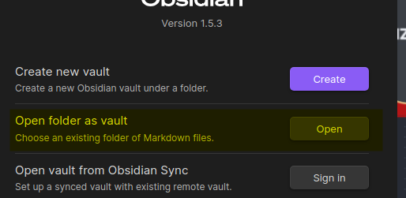

# KOY-LivingWordBible - Collaborative Obsidian Bible Study

<video src="https://github.com/dahliyah/KOY-LivingWordBible/raw/main/koylwb.mp4" controls title="Title"></video>


- Welcome to our collaborative Bible study notes project! This repository is dedicated to hosting Obsidian notes and files creating a shared space for individuals to contribute and share their insights, thoughts, and study notes on the Bible. Whether you are a scholar, student, or simply passionate about the Bible, we invite you to join us in creating a comprehensive resource for Bible study.

### Description from Docs
```
- This is a Living Bible in the sense that it’s commentary, context inserts, notes, photos, links, and even the translation itself is made by this community
- Make Notes while reading like you would in your own paper Bible, but all can learn and question by your input.
- Make Comments on words or sentences and even have other replay to your comments to resolve or input on you insight.
- Suggest edits, typos, notes, cross references, photos, charts, maps, etc.
- Comments on history, definitions, etymology, and interpretations are welcome, regardless of doctrinal bias or knowledge.
```


## How to Contribute / Collaborate

We welcome contributions from anyone interested in the study of the Bible. 

Here's how you can get involved:

### Things you will need

- Obsidian
- Obsidian Vault Files (**How to Set Up Vault** below)


### How to Set Up Vault

1. Fork the repository to your own GitHub account.

2. Clone the repository to your local machine.

`git clone https://github.com/dahliyah/KOY-LivingWordBible.git`

3. Open Obsidian and Add Folder as Vault



4. Make your contributions through **Obsidian**, whether it's adding study notes, insights, reflections, or any relevant content. Ensure that your contributions adhere to our guidelines (**coming soon**).


5. Commit your changes and push to your forked repository.


6. Submit a pull request.

Once your pull request is submitted, it will be reviewed by the project maintainers. Upon approval, your contributions will be merged into the main repository.


## Original Project Link & Files Here
Creator & Maintainer of Docs - **Josh**
https://docs.google.com/document/d/1bLMEcwjYFBcv3yXyJceLF7NdRks2bUqjdyqLf9jRLKE/


#Obsidian #Bible
